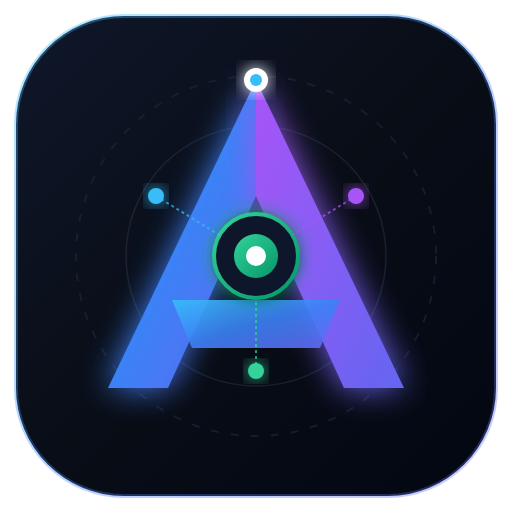
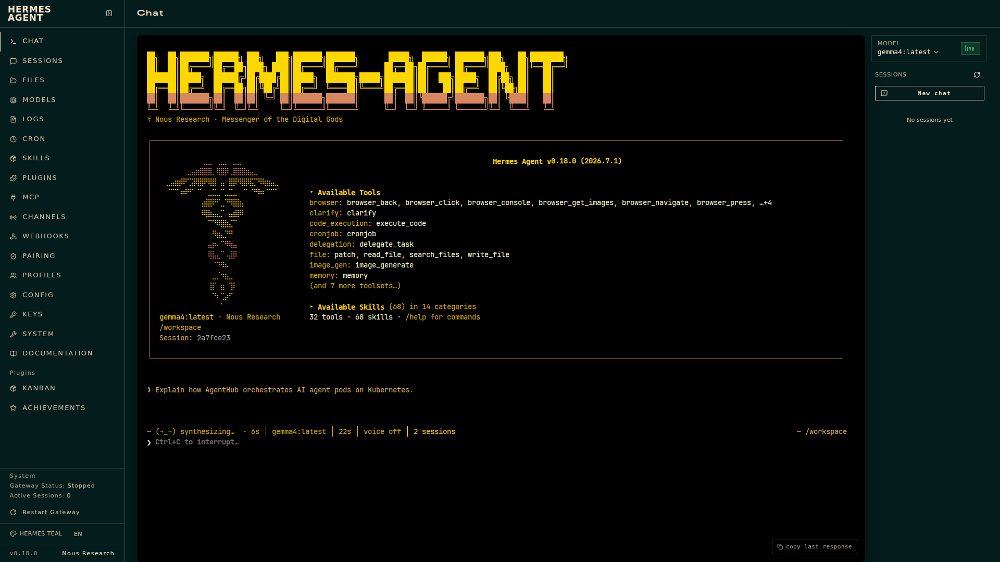
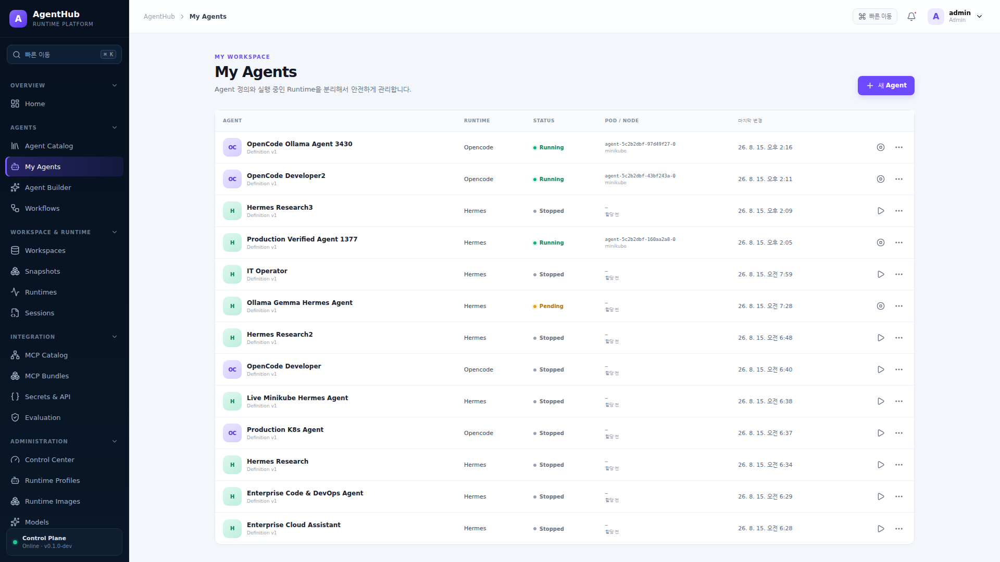
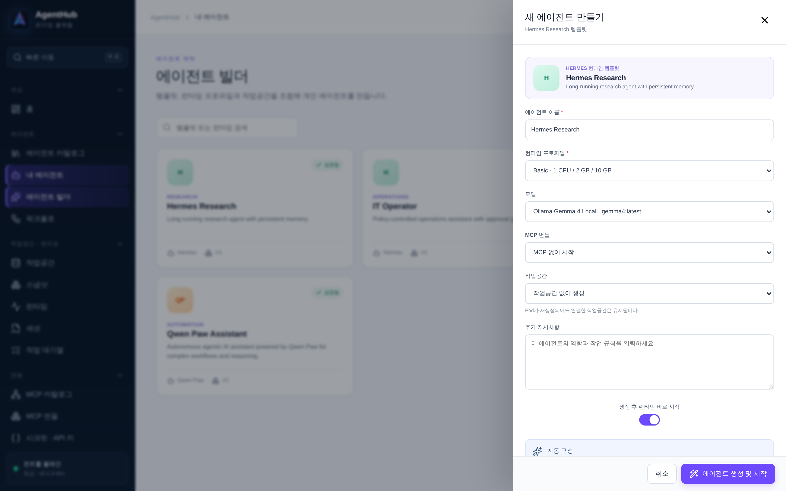
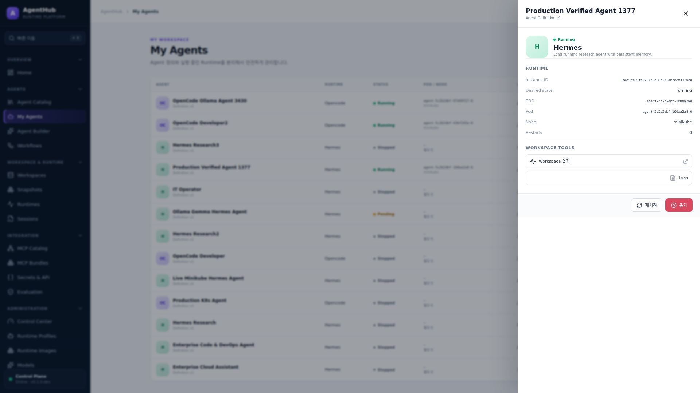
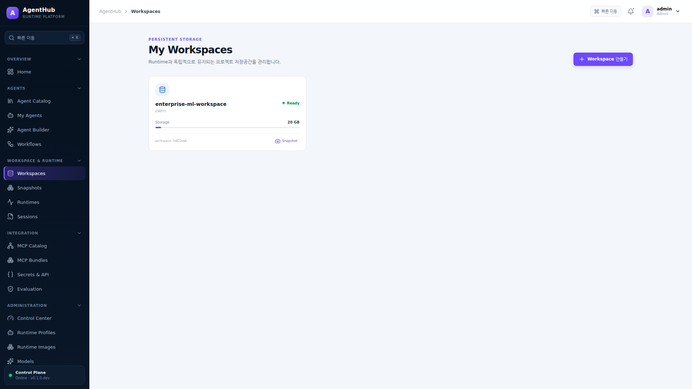
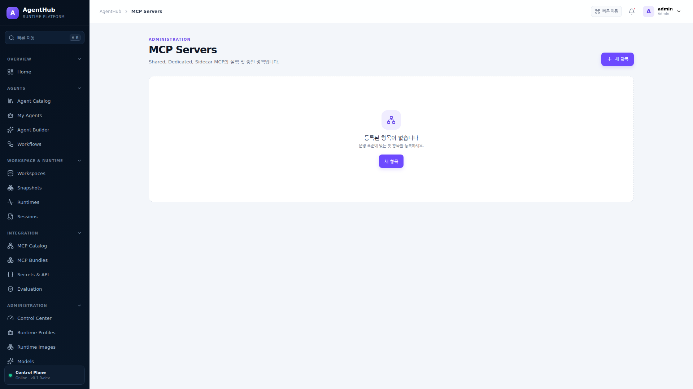
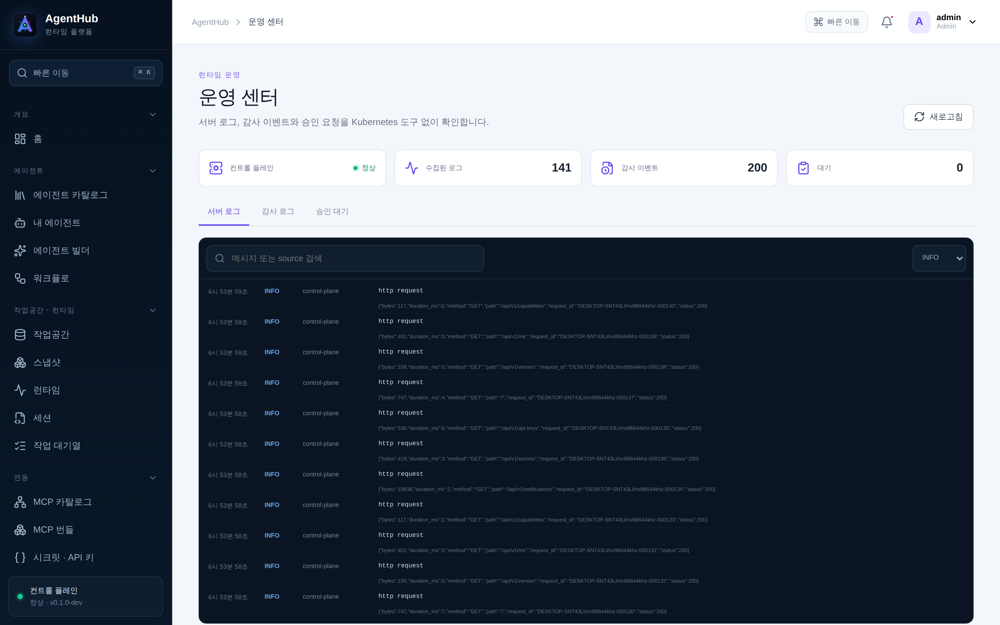

<div align="center">



# AgentHub

### Offline-Ready Enterprise AI Agent Runtime Platform

**JupyterHub처럼 각 사용자와 영속 Workspace마다 격리된 OpenCode 및 Hermes 런타임을 제공하는 엔터프라이즈 제어면**

[](https://golang.org)
[](https://reactjs.org)
[](https://kubernetes.io)
[](https://modelcontextprotocol.io)
[](LICENSE)

[🌐 웹 쇼케이스 둘러보기](docs/index.html) · [📘 공식 사용자 가이드 (PDF)](docs/AgentHub_User_Guide.pdf) · [📗 CRU 매뉴얼 (PDF)](docs/AgentHub_CRU_Operations_Manual.pdf) · [📙 아키텍처 백서 (PDF)](docs/AgentHub_Architecture_and_MCP_Whitepaper.pdf)

</div>

---

## 🌟 핵심 가치 (Core Highlights)

- 🔒 **완전 폐쇄망 (Offline-Ready)**: 외부 인터넷 연결 없이 로컬 Docker 레지스트리와 내부 Kubernetes 클러스터 상에서 100% 결정론적으로 동작합니다.
- 📦 **영속 Workspace & CSI 스냅샷**: Agent Pod가 종료/재생성되어도 사용자의 소스 코드와 데이터는 PVC에 보존되며, CSI VolumeSnapshot을 통해 언제든 원하는 시점으로 복원할 수 있습니다.
- 🤖 **11대 엔터프라이즈 런타임**: 인터랙티브 코딩 워크스페이스(**OpenCode**), 자율 에이전트 어시스턴트(**Hermes** / [**Qwen Paw**](https://qwenpaw.agentscope.io/)), 터미널 코딩 에이전트([**Qwen Code**](https://qwenlm.github.io/qwen-code-docs/)), 프로토콜로 대화하는 에이전트([**Goose**](https://block.github.io/goose/)), 시각적 흐름 빌더([**Langflow**](https://docs.langflow.org/))를 사용자 전용 비루트(Non-root) Pod로 격리 기동합니다.
  - **Qwen Paw (AgentScope)**: 3계층 ReMe 메모리, 커널 샌드박스 보안 가드, 스킬/MCP 확장 및 Qwen/Ollama 모델 자율 추론을 지원하는 개인 에이전트 워크스테이션
  - **OpenCode**: 브라우저 기반 풀스택 코딩 IDE 및 실시간 파일/터미널 워크스페이스
  - **Hermes Agent**: 장기 기억(Long-term Memory) 및 도구 실행 자율 에이전트
  - **Qwen Code**: 터미널에서 사는 코딩 에이전트. 브라우저로 열면 그 터미널이 그대로 열리고, 작업을 맡기면 **같은 도구 루프로 무인 실행**합니다 — 자율 실행이 처음으로 실제 파일을 고칩니다(승인 모드로 범위를 정하고, 토큰 사용량은 실제 값으로 계량됩니다). 전용 `agenthub-qwencode` 이미지로 별도 게시합니다.
  - **Goose**: [Agent Client Protocol](https://agentclientprotocol.com/)을 직접 말하는 오픈소스 에이전트. 이 런타임을 붙이는 데 실행 코드는 한 줄도 필요 없었습니다 — 디스크립터에 시작 명령만 적으면 승인 처리·도구 기록·실행 타임라인은 ACP 백엔드가 이미 해 줍니다. 전용 `agenthub-goose` 이미지로 별도 게시합니다.
  - **BrowserCode**: 진짜 브라우저를 직접 모는 에이전트. 컨테이너 안의 Chromium을 DevTools 프로토콜로 제어하며, 고정된 동작 목록이 아니라 필요한 JavaScript를 그때그때 작성해 실행합니다. 로그인 세션이 담긴 브라우저 프로필은 홈 볼륨에 남습니다. ACP를 직접 지원해 실행 코드 없이 붙었습니다 — 전용 `agenthub-browsercode` 이미지로 별도 게시합니다.
  - **HolmesGPT**: 장애를 조사하는 [CNCF SRE 에이전트](https://holmesgpt.dev/). 알림·메트릭·로그를 스스로 조회해 근본 원인을 찾고, **그 조회 하나하나가 실행 기록의 단계로 남습니다** — 결론만 있는 답과 달리 근거를 나중에 확인할 수 있습니다. 토큰 사용량도 실제 값으로 계량됩니다. 전용 `agenthub-holmes` 이미지로 별도 게시합니다.
  - **JupyterLab (+ Qwen Code)**: 노트북·파일 브라우저·터미널이 한 화면에 있는 데이터 작업대. 같은 작업공간에서 Qwen Code 에이전트를 그대로 쓰고, 자동 실행도 그 에이전트가 수행합니다.
  - **Node-RED / n8n**: 에이전트가 아니라 **배선**입니다 — 이벤트를 받아 변환하고 다른 시스템을 호출하는 자동화가 Runtime 안에서 계속 돌아갑니다. 사내 연동이 필요한 업무는 대개 이쪽입니다.
  - **외부 앱 연결(Dify)**: 사내에 이미 돌고 있는 Dify 앱을 **작업 실행 백엔드**로 씁니다. 플랫폼이 Dify를 대신 운영하지 않고 호출만 하므로(그쪽은 컨테이너 12개짜리 배포입니다) 버전이 올라가도 깨지지 않고, 정책·DLP·쿼터·감사는 그대로 적용됩니다.
  - **Langflow**: 흐름을 그려서 만드는 시각적 빌더. 그린 흐름을 **자동 실행 백엔드로 그대로 사용**할 수 있어(작업 입력 → 흐름 → 결과·산출물), 정책·DLP·쿼터·감사 안에서 무인 실행됩니다. Langflow는 파이썬 트리와 프런트엔드를 함께 담기 때문에 공용 base 이미지와 분리된 `agenthub-langflow` 이미지로 별도 게시합니다 — 쓰지 않는 사이트는 내려받지 않습니다.
  - **custom**: 사내에서 직접 만든 에이전트도 시작 명령과 포트만 지정하면 동일한 격리·정책·실행 플레인 위에서 운영할 수 있습니다.
- 🔌 **ACP 실행 (Agent Client Protocol)**: 에이전트의 출력을 뒤에서 해석하는 대신 [표준 프로토콜](https://agentclientprotocol.com/)로 **대화하며** 작업을 시킵니다. 핵심은 `session/request_permission` 입니다 — 에이전트가 도구를 쓰기 전마다 플랫폼에 묻고, 목표의 승인 모드에 따라 플랫폼이 답한 내용(승인/거절)이 실행 기록에 단계로 남습니다. 무인 실행이 무엇을 바꿔도 되는지가 설정이 아니라 **기록**이 됩니다. Qwen Code·JupyterLab·Goose가 지원하며, 다음 ACP 에이전트를 붙이는 일은 시작 명령 한 줄입니다 — Goose가 그 첫 증명입니다.
- 🔎 **조사 실행 (근거가 남는 자동 실행)**: "왜 죽었는지" 물으면 관측 데이터를 직접 조회해 답합니다. 결론은 완료 판정에 쓰이고, 조회한 내용은 성공·실패까지 함께 단계로 남아 **결론의 근거를 되짚을 수 있습니다.** 조회는 기본 허용, 셸 실행은 승인 모드를 올렸을 때만 — 조사와 조작을 구분합니다.
- 🤖 **자율 실행 플레인**: Agent에 Goal과 Trigger를 주면 예약·Webhook·수동으로 스스로 Task를 수행하고, 완료 조건을 플랫폼이 검증한 뒤 산출물과 실행 타임라인을 남깁니다. 기존 Interactive 방식은 그대로 유지됩니다.
- 📄 **GitOps 정의 내보내기/가져오기**: 에이전트 정의를 YAML로 주고받아 형상 관리와 클러스터 간 이관이 가능합니다. 참조는 이름으로 기록되며, 대상 클러스터에 없는 항목은 이름을 알려주고 거절합니다.
- 🤝 **런타임 인계 (자동 실행 ↔ 사람)**: 자동 실행은 모델과 글로만 주고받는 루프라 파일 편집·명령 실행을 할 수 없습니다. 프롬프트가 이 한계를 명시하고(“하지 않은 일을 했다고 쓰지 마세요”), 남은 일은 에이전트가 **런타임 인계** 상태로 넘깁니다 — 실패가 아니라 대기입니다. 작업 행에서 **같은 작업공간**을 브라우저로 열어(꺼져 있으면 자동 시작) 직접 마무리하고 기록과 함께 완료 처리하면 됩니다.
- 🎛️ **런타임 설정 주입 + 적용 검증**: 런타임 유형별로 로케일(`LANG`)·시간대(`TZ`)·프록시와 제품 설정(JSON 병합)을 정의하면 **기동·재기동마다** 해당 런타임이 읽는 설정 파일에 병합됩니다(OpenCode `opencode.json`, Hermes `config.yaml`, Qwen Paw는 `qwenpaw init` 이후 `config.json`). 플랫폼이 만드는 키(model·mcp·provider)는 덮어쓸 수 없고, **Pod가 자신이 쓴 파일을 되읽어 어떤 키가 들어갔는지 보고**하므로 `적용됨 / 이전 설정으로 실행 중 / 확인 안 됨 / 적용 실패`를 화면에서 구분할 수 있습니다. 키 이름이 제품 버전마다 다른 항목(자동 승인 모드 등)은 임의로 추측하지 않고 "확인 필요"로 안내합니다.
- 🧭 **런타임 유형 비교**: OpenCode·Hermes·Qwen Paw의 작업공간 경로, 편집기·터미널, MCP 도구 전달 여부, 공개 방식과 **하지 못하는 일**까지 플랫폼이 직접 설명해 카탈로그에서 비교하고 고를 수 있습니다.
- 🛡️ **DLP 내용 검사 (개인정보·신용정보 유출 방지)**: 주민등록번호·사업자등록번호(체크섬), 카드번호(Luhn), 계좌·전화·여권·이메일, API 키를 등급별로 `기록만 / 가리고 전송 / 차단` 처리합니다. 모델로 나가는 프롬프트는 컨트롤 플레인이, MCP 도구 호출은 **Pod 안 게이트웨이**가 검사하므로 에이전트가 우회할 수 없습니다. 감사 로그에는 등급·건수·**마스킹된 예시만** 남고 값 자체는 어디에도 저장하지 않습니다. 저장 전 샘플 검사로 무엇이 잡히는지 확인할 수 있습니다.
- 📜 **Policy as Code (중앙 정책 강제)**: 사용자·역할·에이전트·MCP 서버·도구·데이터 등급을 조건으로 한 규칙을 한 문서로 정의하면, 작업 생성·런타임 시작은 API가, MCP 도구 호출은 Pod 안 게이트웨이가 강제합니다. 방화벽처럼 **위에서 아래로 처음 맞는 규칙**이 결정하고, 거절에는 규칙에 적은 사유와 규칙 ID가 함께 표시되며, 저장 전 **시뮬레이터**로 어떤 규칙이 결정하는지 확인할 수 있습니다. 모든 차단은 감사 로그에 남습니다.
- 🛠️ **실행 플레인 운영 제어**: 업그레이드·사고 대응을 위한 **실행 중지/재개**(실행 중 작업은 완주, 등록은 계속, 사유는 사용자 화면에도 표시), 워커 등록·하트비트로 "워커가 없다"를 확정적으로 판별, **죽은 워커가 들고 있던 작업 자동 회수**(리스 만료 30초 주기), 실패·처리 불가 작업 **일괄 재실행**, 배달 실패 이벤트 **재배달**, 기록 **보관 기간 정리**(미리보기 후 적용, 감사 로그 최소 30일).
- 📊 **관리자 운영 현황과 사용 통계**: 실행 성공률·소요(중앙값/p95), 대기열과 워커, 이벤트 배달 적체, 사용자·에이전트·모델별 토큰과 비용을 한 화면에서 보고 CSV로 내려받습니다. 조치가 필요한 상태(승격 대기, 재시도 소진, 워커 없는 대기열, 배달 실패, 단가 미등록)는 처리 화면 링크와 함께 따로 모아 보여 줍니다. 감사 로그는 수행자·동작·결과·기간으로 검색하고 필터 그대로 CSV로 내보낼 수 있습니다.
- 🗂️ **선언형 API 권한·Route·OpenAPI**: 모든 엔드포인트가 하나의 Route 카탈로그(경로·권한 범위·역할·설명)에서 등록되고, API Key scope 검사와 `GET /api/openapi.json`(118개 오퍼레이션, 태그·경로 파라미터 포함)이 같은 정의에서 생성됩니다. 카탈로그에 없는 경로는 서비스되지 않으며, 라우터를 순회해 확인하는 테스트가 이를 강제합니다.
- 🏷️ **Agent 버전 관리와 운영 승격**: 저장할 때마다 그 시점의 정의가 버전으로 남고, 사전검증 결과는 검사한 버전에 기록됩니다. 통과한 버전만 운영 승격할 수 있으며(관리자는 사유를 남겨야 건너뜁니다), *승격된 정의만 실행* 을 켜면 승격되지 않은 편집으로는 작업이 생성되지도 실행되지도 않습니다. 잘못된 편집은 이전 정의를 **새 버전으로 복원** 해 되돌립니다. 게이트에 걸린 예약 작업은 실패가 아니라 보류되었다가 승격 즉시 자동으로 다시 실행됩니다.
- 🧮 **실행 Quota (동시 실행 · 토큰 · 비용)**: 사용자별 동시 실행 수와 최근 30일 토큰·비용 예산, 에이전트별 토큰 예산을 정할 수 있습니다. 동시 실행 한도는 재시도 횟수를 쓰지 않는 **대기**로, 예산 초과는 알림과 함께 **실패**로 처리되며 이미 초과한 상태의 작업 생성은 API가 즉시 거절합니다.
- 🔭 **OpenTelemetry 분산 추적**: 수집기 주소만 넣으면 작업 시도 → 추론 단계 → 모델 호출 → 완료 판정 → 런타임 확보가 하나의 Trace로 남습니다. 단계별 토큰과 소요 시간이 스팬에 붙어 어디서 느려지고 어디서 비용이 나는지 Task 단위로 추적할 수 있고, 화면·로그의 Trace ID가 수집기의 Trace ID와 동일합니다. 수집기가 없으면 추적은 꺼진 채로 아무 비용도 들지 않습니다.
- 💰 **토큰 사용량·비용 가시화**: 실행 기록에 이미 남는 토큰 수를 그대로 집계해 에이전트별 입력·출력 토큰과 금액을 보여줍니다. 단가가 없는 모델은 금액 0이 아니라 '미산정'으로 구분해 합계를 왜곡하지 않습니다.
- 🛡️ **도구 실행 직전 승인 강제**: 승인이 필요한 도구는 호출되는 순간 Pod 안의 게이트웨이가 붙잡아 두고, 검토자가 어떤 인자로 무엇을 실행하려는지 확인한 뒤 승인할 때까지 실행되지 않습니다. 에이전트가 승인을 요청하지 않아도 우회할 수 없고, 승인 경로에 문제가 있으면 실행 대신 차단(fail-closed)됩니다.
- 🛡️ **MCP 도구 정책**: MCP 서버 단위가 아니라 도구 단위로 호출 권한을 제한합니다. Pod 내부 게이트웨이가 강제하므로 에이전트가 우회할 수 없고, 차단된 도구는 목록에서도 숨겨지며, 자격 증명은 에이전트 컨테이너에 들어가지 않습니다.
- 📡 **이벤트 Trigger (전달 보장)**: 작업 실패·런타임 장애·승인 처리·산출물 생성 같은 플랫폼 이벤트에 다른 Agent가 반응해 후속 작업을 시작합니다. 이벤트는 DB 아웃박스에 적재되고 **전달이 끝난 뒤에야 완료로 기록**되므로 워커가 죽어도 유실되지 않습니다. 실패하면 백오프로 재시도하고 5회 후에는 전달 실패로 남겨 알림을 보내며, 구독자별 전달 원장으로 재전달 시 중복 작업이 생기지 않습니다.
- 🧭 **자율 제어(Planner · Approval · Memory · Delegation)**: 실행 전 계획을 수립하고, 상태 변경 작업은 사람의 승인을 받은 뒤 재개하며, 학습한 사실을 Agent 범위로 영속화하고, 권한 밖의 일은 순환·깊이 제한 아래 다른 Agent에게 위임합니다.
- 🧭 **화면 안에 있는 사용법**: 워크플로와 작업 대기열처럼 개념 설명이 필요한 화면은 상단의 *사용법 안내* 에 4단계 절차와 상태·실행 방식의 뜻을 함께 제공하고, 예시 버튼으로 첫 실행을 바로 만들어 볼 수 있습니다. 한 번 닫으면 기억합니다.
- 🇰🇷 **한국어 우선 관리 콘솔**: 메뉴, 상태, 안내 문구를 한국어로 제공하며 빠른 이동(⌘K)은 한글·영문 키워드를 모두 검색합니다. 열려 있는 화면은 항상 현재 메뉴 하나만 강조되고, `ESC`로 드로어·확인창을 닫을 수 있으며 세션이 만료되면 자동으로 로그인 화면으로 돌아갑니다.
- 🔀 **Multi-Agent Workflow DAG**: 복수 에이전트 간의 순차/병렬/Supervisor 협업 그래프를 시각화하고, 실행 전 순환 참조(Cycle) 및 깊이 제한을 자동 검증합니다.
  - **구조화된 판단**: 라우터의 분기 선택과 LLM 완료 판정은 JSON Schema로 제한된 응답으로 받습니다. 문장에 이름이 언급됐다는 이유로 분기가 선택되거나, 설정하지 않은 완료 조건으로 실패 처리되는 일이 없고, 스키마를 지원하지 않는 게이트웨이에서는 프롬프트 방식으로 자동 대체하되 응답을 반드시 검증합니다.
  - **합의(Consensus) 모드**: 같은 질문을 독립적으로 물어 표결로 결론을 냅니다. 집계는 플랫폼이 직접 계산하며 만장일치·다수결·동률을 구분하고, 소수 의견과 기권까지 기록에 남깁니다.
  - **감독자(Supervisor) 모드**: 감독 에이전트가 결과를 검토해 보완이 필요한 에이전트만 다시 실행시키고, 개정된 결과를 재검토해 승인합니다. 검토 횟수는 제한되며 승인 여부가 실행 기록에 남습니다.
- ♻️ **체크포인트 재시도**: 작업이 실패하면 처음부터 다시 하지 않고 이미 완료한 단계 다음부터 이어서 실행합니다. 같은 추론을 두 번 결제하지 않고, 배포·위임처럼 이미 수행된 부수효과를 반복하지도 않으며, 승인 후 재개도 그때까지의 맥락을 그대로 이어받습니다. 앞선 전제가 바뀐 경우에는 *처음부터* 를 선택할 수 있습니다.
- ⚡ **Runtime 예열 & 워커 자동 확장**: 예약 실행 전에 Runtime을 미리 띄워 콜드 스타트를 없애고, 대기열이 밀리면 워커가 동시 실행 수를 스스로 늘렸다가 한가해지면 되돌립니다. 예열된 Runtime은 사람이 손대는 순간 사용자 소유가 됩니다.
- 🧰 **Runtime 공통 환경 & 바이브코딩 툴체인**: `/etc/pip.conf`, `.condarc`, `/etc/npmrc`, 프록시 변수처럼 모든 Runtime에 공통으로 필요한 설정을 관리자 화면에서 한 번만 정의하면 전체 Pod의 모든 컨테이너에 읽기 전용으로 배포됩니다. **저장하면 이미 실행 중인 Runtime에도 즉시 반영**되고(내용이 바뀐 Pod만 재시작), 클러스터 CRD가 오래되어 설정이 유실되는 경우에는 그 사실과 해결 방법을 알려 줍니다. Runtime 이미지에는 `python`·`pip`·`conda`·`mamba`와 ruff·pytest·httpx·pandas·openai·typescript 같은 기본 라이브러리가 포함되어, 별도 설치 없이 바이브코딩 에이전트로 바로 쓸 수 있습니다.
- 🔌 **MCP Fabric (Model Context Protocol)**: 사내 MCP 도구 레지스트리와 번들을 관리하고, Sidecar 또는 전용 StatefulSet 모드로 에이전트에 안전하게 주입합니다.
- 🔐 **Envelope Encryption Vault**: 사용자별 개인 키(AES-256-GCM)로 Credential을 암호화하며, Agent 정의에는 원문 대신 식별 참조값만 주입됩니다.
- 🌐 **Session Gateway**: One-Time Launch Ticket을 발급하여 네이티브 Web UI에 대한 안전한 쿠키 격리 및 감사 추적(Audit Trail)을 보장합니다. Runtime Base Domain을 설정하면 Runtime별 전용 Origin(권장)을 사용하고, 설정하지 않으면 Wildcard DNS 없이도 `포털주소/{runtimeId}/` 경로로 같은 세션을 바로 열 수 있습니다.

---

---

## 🎬 3분 실전 워크플로우 데모 영상

https://github.com/user-attachments/assets/agenthub_demo.mp4

> 💡 **[3분 데모 비디오 파일 직접 다운로드 / 보기](docs/media/agenthub_demo.mp4)**  
> 로그인 → Agent Builder 템플릿 생성 → Kubernetes Pod/Node 즉시 스케줄링 → Hermes TUI 및 Ollama Gemma 4 모델 실시간 추론 대화까지 전 과정을 3분(180초) Full HD 영상으로 확인하실 수 있습니다.

---

## 📸 실제 UI 콘솔 및 라이브 런타임 갤러리

| Hermes Live Workspace (Ollama Gemma 4 실시간 추론) | 실시간 내 에이전트 (Kubernetes Pod / Node 즉시 할당) |
| :---: | :---: |
|  |  |
| **Agent Builder 템플릿 생성 드로어** | **에이전트 상세 스펙 및 CRD 상태** |
|  |  |
| **OpenCode 영속 Workspace** | **Ollama 로컬 모델 카탈로그** |
|  |  |
| **MCP Fabric 도구 카탈로그 & 번들** | **운영 센터 실시간 감사 로그** |
|  |  |

> 📌 **전체 33개 스크린샷과 상세 설명은 [사용자 가이드](docs/user-guide.md) 및 [인터랙티브 쇼케이스 페이지](docs/index.html)에서 확인하실 수 있습니다.**

---

## 🏗️ 시스템 아키텍처

```text
Browser ──> AgentHub Portal / Session Gateway ──> PostgreSQL
                 │
                 ├──> AgentRuntime CRD (Kubernetes)
                 │          │
                 │          v
                 └──> Agent Operator ──> StatefulSet + Service + Persistent PVC
                                                │
                               ┌────────────────┴────────────────┐
                               v                                 v
                      OpenCode :4096 (Web IDE)          Hermes API :8642 + UI :9119
```

- **제어면(Control Plane)과 런타임(Data Plane)의 완전한 분리**: AgentHub 포털 컨테이너 내부에서는 어떠한 사용자 코드나 에이전트 프로세스도 직접 실행되지 않습니다.
- **Agent Definition vs Runtime Instance**: Agent 설정 정의는 PostgreSQL에 안전하게 저장되며, 런타임 종료 시 Pod만 스케일 다운(0)되고 PVC와 설정은 영구 보존됩니다.

---

## ⚡ 5분 빠른 시작 (Quickstart)

### 1. 로컬 개발 환경 기동

AgentHub는 단 4개의 필수 환경변수만으로 동작합니다:

```bash
# 1. 환경 설정 파일 생성
cp .env.example .env

# 2. PostgreSQL 데이터베이스 기동
docker compose up -d postgres

# 3. 프론트엔드 및 백엔드 빌드
cd web && npm ci && npm run build && cd ..
make build

# 4. AgentHub 서버 실행
set -a && . ./.env && set +a
./bin/agenthub
```

웹 브라우저에서 `http://localhost:8080`에 접속합니다.  
- **초기 관리자 ID**: `admin`
- **초기 비밀번호**: `local-development-password` (또는 `.env`에 설정한 값)

---

### 2. Minikube / Kubernetes 클러스터 배포

```bash
# 1. Minikube 클러스터 시작
minikube start --driver=docker

# 2. Kubernetes CRD, RBAC 및 Operator 매니페스트 배포
kubectl apply -k deploy/kubernetes

# 3. AgentHub 런타임 베이스 이미지 빌드 및 로드
make image image-base
# base 이미지는 BASE_VERSION 파일을 따르며, 변경이 없으면 이전 태그를 그대로 사용합니다.
minikube image load agenthub:v0.204.0
minikube image load agenthub-base:v0.13.0

# 4. 파드 상태 확인
kubectl get pods -n agent-platform-system
```

---

## 📚 상세 문서 모음

- 📖 **[사용자 & 관리자 매뉴얼](docs/user-guide.md)**: 33개 스크린샷 기반의 전 메뉴 상세 기능 가이드
- 🚀 **[CRU 실전 운영 워크스루](docs/cru-walkthrough.md)**: Workspace, Agent, Workflow 생성/수정 10단계 튜토리얼
- 🌐 **[인터랙티브 웹 쇼케이스](docs/index.html)**: 반응형 다크 테마 기반의 프로젝트 홍보 랜딩 페이지
- 📐 **[시스템 아키텍처 상세](docs/architecture.md)**: 보안 경계, 세션 게이트웨이, 어댑터 명세
- 📦 **[오프라인 설치 가이드](docs/offline-install.md)**: 에어갭(Air-Gapped) 환경에서의 릴리스 아카이브 및 배포

---

## 📄 라이선스 (License)

Apache License 2.0. Copyright (c) 2026 AgentHub Contributors.
