# AgentHub CRU (Create · Read · Update) 실전 운영 워크스루

본 문서는 AgentHub 플랫폼에서 **영속 워크스페이스**, **AI Agent**, **Multi-Agent 워크플로우**, **개인 보안 Vault**, **CSI 볼륨 스냅샷**을 생성(Create), 조회(Read), 수정(Update)하는 실전 운영 가이드입니다.

---

## 🚀 10단계 실전 워크플로우

```mermaid
flowchart LR
    A[1. Workspace 생성] --> B[2. Agent Builder 생성]
    B --> C[3. 런타임 제어 & 조회]
    C --> D[4. Agent 설정 수정]
    D --> E[5. Workflow DAG 빌드]
    E --> F[6. Secret Vault 등록]
    F --> G[7. Scoped API Key 발급]
    G --> H[8. CSI Snapshot 복구]
    H --> I[9. MCP 번들 바인딩]
    I --> J[10. Audit Trail 감사]
```

---

### Step 1: 영속 Workspace 생성 (Create)
런타임 Pod가 중지되거나 재생성되어도 소스 코드와 데이터를 보존하는 영속 워크스페이스를 생성합니다.

1. 좌측 메뉴 **Workspace & Runtime → Workspaces**로 이동합니다.
2. 우측 상단 `+ Workspace 만들기` 버튼을 클릭합니다.
3. **이름**: `enterprise-ml-workspace`
4. **초기화 방식**: `Empty` (빈 작업공간) 또는 `Git Clone`
5. **용량**: `20 GB` (5GB ~ 200GB 선택 가능)
6. `Workspace 생성`을 클릭하여 Kubernetes CSI PVC를 프로비저닝합니다.

---

### Step 2: Agent 생성 (Create via Builder)
템플릿 기반으로 런타임, 리소스 프로필, 워크스페이스를 조합하여 새 에이전트를 정의합니다.

1. **Agents → Agent Builder**로 이동하거나 **Agent Catalog**에서 템플릿을 선택합니다.
2. **Agent 이름**: `Enterprise Code & DevOps Agent`
3. **Runtime Profile**: `Default · 2 CPU / 4 GB RAM`
4. **Model Endpoint**: `vLLM Local Server` 또는 사내 LLM
5. **Workspace**: 앞서 생성한 `enterprise-ml-workspace` 연결
6. **추가 지시사항 (System Prompt)**: 오프라인 인프라 자동화 규칙 입력
7. `Agent 생성`을 클릭합니다.

---

### Step 3: Agent 목록 및 상태 조회 (Read)
등록된 에이전트들의 런타임 상태, 연결된 워크스페이스 및 바인딩 정보를 확인합니다.

1. **Agents → My Agents**로 이동합니다.
2. 생성된 에이전트 카드에서 런타임 타입(`OpenCode`, `Hermes`), 상태(`Stopped`, `Running`), 모델 정보를 한눈에 파악합니다.
3. 에이전트 카드를 클릭하면 상세 제어 드로어가 열립니다.

---

### Step 4: 에이전트 설정 수정 (Update)
에이전트의 시스템 프롬프트, 런타임 리소스 사양, 또는 MCP 바인딩을 실시간으로 갱신합니다.

1. 에이전트 상세 드로어에서 `설정 수정`을 선택합니다.
2. 리소스 프로필을 상위 사양(예: `High Memory · 4 CPU / 16 GB`)으로 변경합니다.
3. `저장`을 클릭하면 Kubernetes Operator가 무중단으로 설정을 반영합니다.

---

### Step 5: Multi-Agent Workflow DAG 생성 및 가드레일 검증 (Create & Validate)
여러 에이전트가 협업하는 실행 파이프라인(DAG)을 구성하고 안전성을 검증합니다.

1. **Agents → Workflows**로 이동합니다.
2. `+ Workflow 만들기`를 클릭합니다.
3. **이름**: `Automated CI/CD Verification Workflow`
4. **실행 방식**: `Sequential` (순차) / `Parallel` (병렬) / `Supervisor`
5. **Agent Steps**: 1단계 개발 에이전트 → 2단계 리뷰 에이전트 선택
6. **Execution Guardrails**:
   - Max Depth: `4`
   - Max Agent Calls: `12`
   - Max Tool Calls: `50`
   - Max Duration: `900초`
7. `저장 및 검증`을 클릭하여 순환 참조 및 정책 검사를 통과시킵니다.

---

### Step 6: Personal Secret Vault 등록 (Create)
개인 데이터 암호화 키(AES-256-GCM Envelope Encryption)로 안전하게 비밀값을 보관합니다.

1. **Integration → Secrets & API**로 이동합니다.
2. `+ Secret 추가`를 클릭합니다.
3. **이름**: `ENTERPRISE_API_SECRET`
4. **종류**: `API Key`, `Git Credential`, `Database` 중 선택
5. **비밀값**: Credential 원문 입력
6. `안전하게 저장`을 클릭합니다. (원문은 저장 후 즉시 마스킹 처리됨)

---

### Step 7: Scoped API Key 발급 (Create)
외부 도구(Cursor, CLI, CI/CD)에서 호출할 수 있는 최소 권한 API 토큰을 발급합니다.

1. **Secrets & API** 페이지에서 `API Keys` 탭을 선택합니다.
2. `+ API Key 추가`를 클릭합니다.
3. **이름**: `AgentHub Operator Token`
4. **Scope**: `api:read`, `mcp:read`, `runtime:manage` 선택
5. `안전하게 저장`을 누르면 1회성 토큰이 즉시 발급됩니다.

---

### Step 8: CSI VolumeSnapshot 생성 및 시점 복구 (Create & Restore)
작업 중인 워크스페이스의 스냅샷을 생성하여 언제든 원하는 상태로 롤백하거나 복제합니다.

1. **Workspaces → Snapshots**로 이동합니다.
2. 워크스페이스 카드에서 `Snapshot` 버튼을 클릭합니다.
3. 스냅샷 이름을 입력하고 생성하면 Kubernetes VolumeSnapshot CR이 생성됩니다.
4. 필요 시 `Restore` 버튼으로 새 워크스페이스에 스냅샷을 즉시 마운트합니다.

---

### Step 9: MCP Fabric 도구 및 번들 바인딩 (Read & Update)
엔터프라이즈 도구들을 묶어 에이전트의 역량을 확장합니다.

1. **MCP Catalog**에서 등록된 전사 도구(Git, Kubernetes, DB Query 등)의 스키마를 확인합니다.
2. **MCP Bundles**에서 DevOps Pack, Security Pack을 구성하여 에이전트에 바인딩합니다.

---

### Step 10: Control Center 실시간 운영 & 감사 추적 (Read)
시스템 전체 링버퍼 로그와 모든 사용자의 CRU 활동을 불변 감사 로그로 확인합니다.

1. **Administration → Control Center**로 이동합니다.
2. 실시간 엔진 로그 스트림(Level, Trace, Error)을 확인합니다.
3. 사용자별 리소스 생성/수정/삭제 이벤트와 타임스탬프를 감사 추적(Audit Trail)합니다.
