# AgentHub 사용자 및 관리자 가이드

AgentHub는 폐쇄망(Offline-Ready) 환경에 최적화된 **엔터프라이즈 AI Agent 런타임 플랫폼**입니다.  
사용자별 영속 워크스페이스(PVC)와 격리된 Kubernetes Agent Pod(OpenCode, Hermes)를 손쉽게 배포하고, MCP(Model Context Protocol) 도구 및 LLM 모델을 중앙에서 통제합니다.

---

## 📑 목차
1. [시스템 접근 및 인증](#1-시스템-접근-및-인증)
2. [운영 대시보드 & 커맨드 팔레트](#2-운영-대시보드--커맨드-팔레트)
3. [Agent 마켓플레이스 & Builder](#3-agent-마켓플레이스--builder)
4. [영속 Workspace & CSI 스냅샷](#4-영속-workspace--csi-스냅샷)
5. [Agent 런타임 라이프사이클 & 세션 게이트웨이](#5-agent-런타임-라이프사이클--세션-게이트웨이)
6. [Multi-Agent 워크플로우 DAG](#6-multi-agent-워크플로우-dag)
7. [MCP Fabric & 번들 바인딩](#7-mcp-fabric--번들-바인딩)
8. [평가 및 벤치마크 (Evaluation)](#8-평가-및-벤치마크-evaluation)
9. [개인 보안 Vault & API 토큰](#9-개인-보안-vault--api-토큰)
10. [자율 실행 & 작업 승인](#10-자율-실행--작업-승인)
11. [관리자 콘솔 & Control Center](#11-관리자-콘솔--control-center)

---

## 1. 시스템 접근 및 인증

AgentHub는 오프라인 로컬 관리자 인증 및 Keycloak OIDC SSO 엔터프라이즈 인증을 지원합니다.

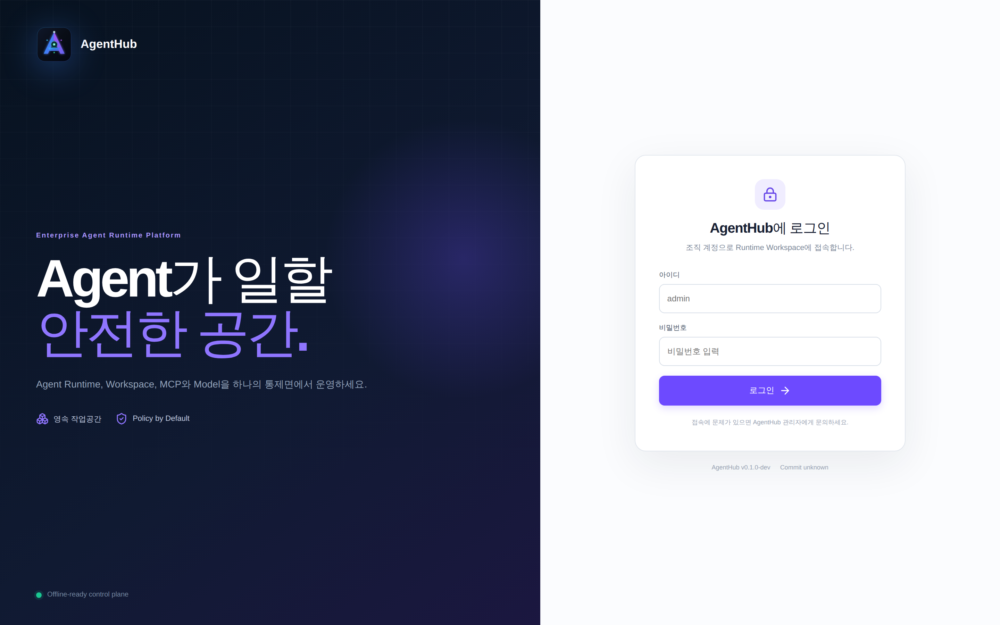

- **보안 세션**: HTTP-Only, SameSite=Lax 쿠키 및 CSRF 토큰 기반 보호
- **OIDC SSO**: Keycloak 연동 시 PKCE 및 State 검증을 통한 안전한 싱글 사인온
- **비밀번호 변경**: 오른쪽 위 프로필 메뉴의 **비밀번호 바꾸기**. 12자 이상이어야 하고, 바꾸면 **다른 기기의 로그인이 모두 해제**됩니다(지금 쓰는 창은 유지). SSO 계정은 여기서 바꾸지 않고 SSO 쪽에서 바꿉니다.

> **첫 기동 때 넣은 관리자 비밀번호는 이전에는 바꿀 방법이 없었습니다.** `AGENTHUB_BOOTSTRAP_ADMIN_PASSWORD` 로 한 번 만들어진 뒤에는 제품에도 경로가 없었고, 값을 바꿔 다시 기동해도 반영되지 않았습니다(관리자가 이미 있으면 부트스트랩은 아무 일도 하지 않습니다). 그 값은 배포 매니페스트에 적혀 있고 매니페스트는 git 이력·CI 로그·공유 문서로 흘러가므로, **설치 직후 한 번 바꿔 두는 것을 권합니다.**

- **비밀번호 추측 차단**: 같은 곳에서 한 계정에 5회 틀리면 그 조합만 잠시 막습니다(1분부터 시작해 반복하면 늘어나고, 최대 15분). 거절에는 `몇 초 후에 다시 시도해 주세요` 가 함께 표시되고, 감사 로그에 `auth.throttled` 로 남습니다.

> **계정 자체는 잠기지 않습니다.** 아이디만으로 잠그면 누구든 남의 아이디로 몇 번 틀려서 그 사람을 못 들어오게 만들 수 있기 때문입니다. 그래서 촘촘한 제한은 **(접속 출처, 계정)** 조합에만 걸고, 출처별·아이디별 제한은 무차별 대입을 막는 안전망으로 느슨하게 둡니다.
>
> 다만 **리버스 프록시가 실제 접속 IP를 넘겨주지 않으면 모든 사용자가 한 출처로 보입니다.** 그런 배포에서는 여러 사람의 오타가 한 곳에 쌓이므로, 프록시에 `X-Forwarded-For` 를 설정해 두는 편이 좋습니다.

---

## 2. 운영 대시보드 & 커맨드 팔레트

로그인 후 접속하는 대시보드에서는 현재 활성화된 에이전트 Pod, 스토리지 사용량, 런타임 상태 메트릭을 실시간으로 확인합니다.

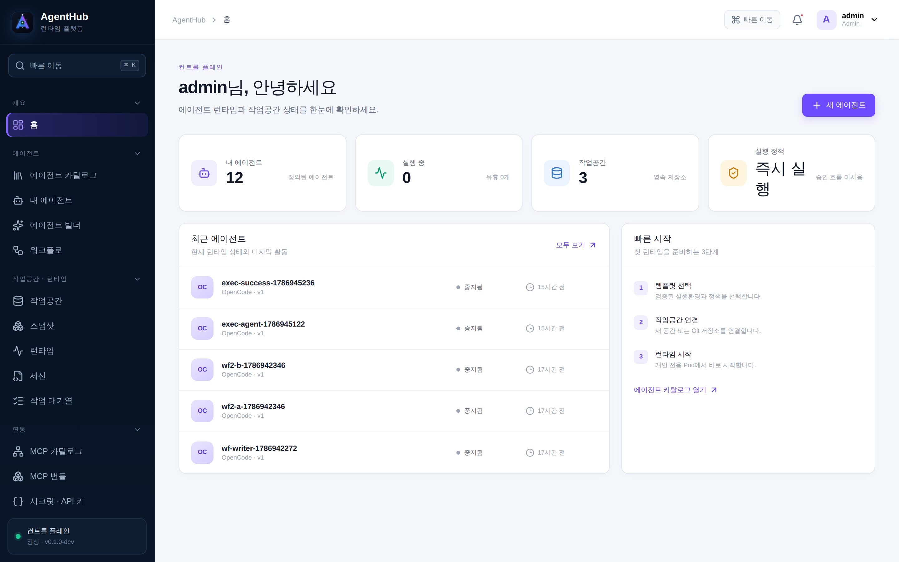

키보드 단축키 `⌘ K` (또는 `Ctrl + K`)를 누르면 언제 어디서나 원하는 메뉴나 에이전트로 즉시 이동할 수 있는 **커맨드 팔레트**가 열립니다.

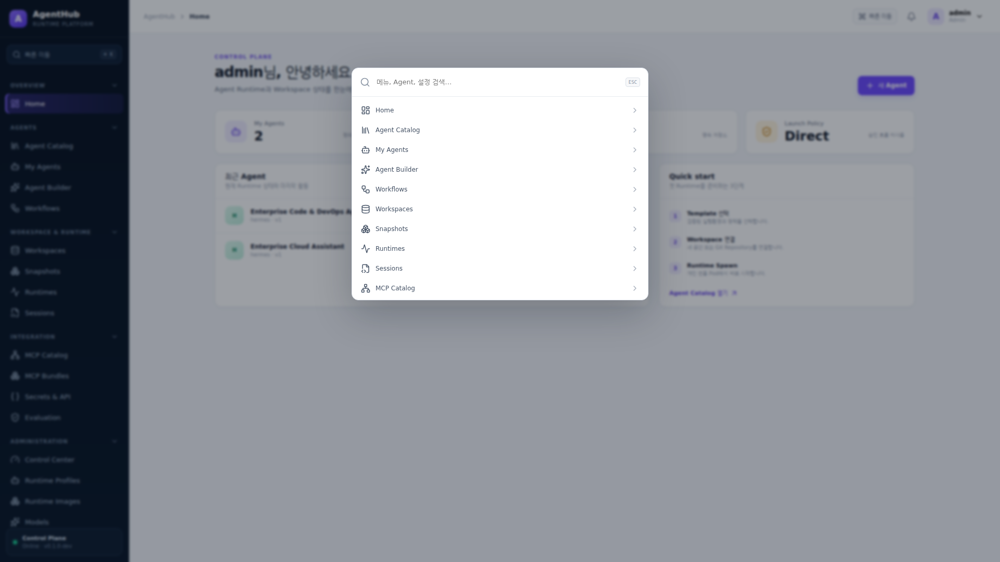

---

## 3. Agent 마켓플레이스 & Builder

### 3.1 Agent Catalog
사전 검증된 템플릿(Verified Templates)을 탐색하여 원클릭으로 나만의 AI 에이전트를 구성할 수 있습니다.

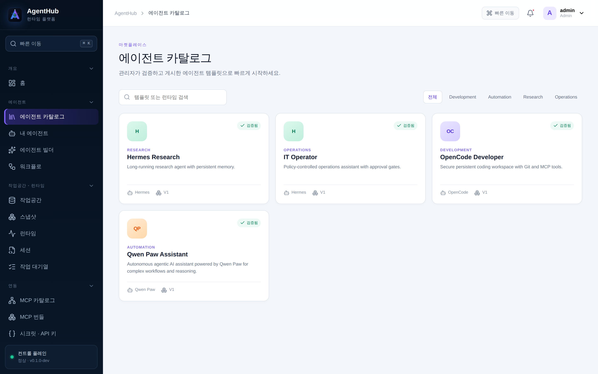

### 3.2 Agent Builder 드로어
템플릿을 기반으로 에이전트 이름, 런타임 프로필(CPU/메모리 사양), 영속 워크스페이스, LLM 모델 및 MCP 번들을 연결합니다.


### 3.3 내 에이전트 목록 및 상세 제어
등록된 에이전트의 런타임 상태를 확인하고, 디테일 드로어를 통해 시작/중지 및 설정을 변경할 수 있습니다.

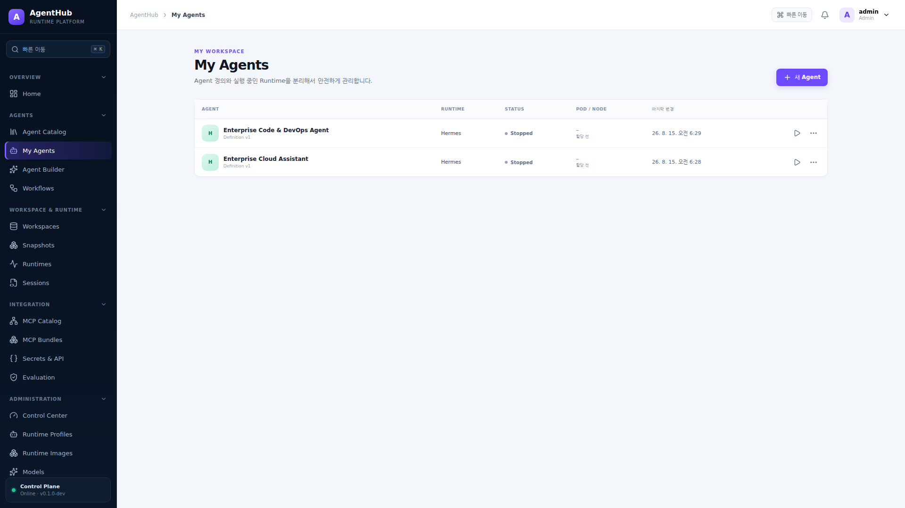


- **삭제는 정의만 지우는 것이 아닙니다.** 에이전트를 지우면 그 에이전트의 **작업·실행 기록과 전사, 산출물, 기억, 사전검증 결과, 정의 버전, Trigger** 가 모두 함께 사라집니다(되돌릴 수 없습니다). 실행 중인 Runtime의 Pod·Service·NetworkPolicy도 정리되지만 **작업공간 볼륨은 보존** 됩니다.
- **진행 중인 작업이 있으면 삭제가 거절됩니다** — 실행 중·도구 대기·승인 대기·런타임 인계 상태의 작업이 몇 건인지 알려 주므로, 끝나기를 기다리거나 그 작업을 취소한 뒤 다시 삭제하면 됩니다. 기록을 지우는 것은 삭제를 누른 사람의 의도이지만, 지금 돌아가고 있는 일까지 같이 지우는 것은 대개 그렇지 않기 때문입니다.

---

### 정의 내보내기 / 가져오기 (GitOps)

에이전트 정의는 YAML 파일로 내보내고 다시 가져올 수 있습니다. 형상 관리 저장소에 넣어 리뷰하거나, 개발 클러스터의 정의를 운영 클러스터로 옮길 때 사용합니다.

- **내보내기**: `내 에이전트` 목록의 내려받기 아이콘을 누르면 `<이름>.yaml` 로 저장됩니다.
- **가져오기**: 목록 상단의 *정의 가져오기* 로 YAML 파일을 선택합니다.
- 참조(런타임 프로파일·작업공간·모델·MCP 번들)는 **이름** 으로 기록됩니다. 가져오는 클러스터에 같은 이름이 없으면 무엇이 없는지 알려주고 가져오기를 중단합니다. 조용히 비워둔 채 만들지 않습니다.
- 같은 이름의 정의를 다시 가져오면 **갱신** 되고, 이름을 바꾸면 **새 에이전트** 로 만들어집니다.
- **실행 설정(Goal)은 정의에 포함되지 않습니다.** YAML에는 런타임 유형·모델·프로파일·지시문만 담기고, **실행기(runner)·승인 모드·한도·도구 정책** 은 담기지 않습니다. 그래서 문서로 **새로 만든** 에이전트는 기본값(prose 실행기·기본 승인 모드·기본 한도)으로 시작합니다 — dev에서 CLI 실행기로 돌던 에이전트가 운영에서는 prose로 도착한다는 뜻이므로, 가져온 뒤 `목표` 화면을 확인하세요. 반대로 **같은 이름의 기존 에이전트를 갱신** 하는 경우에는 그 에이전트의 실행 설정을 건드리지 않습니다. 가져오기 결과 메시지가 둘 중 어느 쪽인지 알려 줍니다.
- **참조는 모두 이름으로 오갑니다** — 런타임 프로파일·작업공간·모델 엔드포인트·MCP 번들·보안 프로파일·네트워크 프로파일. 가져오는 클러스터에 그 이름이 없으면 `이 클러스터에 없는 항목을 참조합니다: …` 로 무엇이 없는지 알려 줍니다. 예전에는 보안·네트워크 프로파일만 내부 식별자로 나가서, 직접 만든 프로파일(무작위 uuid)을 쓰는 정의는 다른 클러스터에서 데이터베이스 오류로 실패했습니다. 예전에 내보낸 파일(식별자가 적힌)도 그대로 가져올 수 있습니다.
- 소유자·버전·시각과 모든 비밀값은 파일에 포함되지 않습니다. 런타임 유형은 파일에 다르게 적어도 변경되지 않습니다.
- **거절당하면 무엇이 잘못됐는지 말합니다.** API가 받지 않는 항목이면 `받지 않는 항목입니다: "kind"`, 값의 형식이 다르면 `quota.perMember.maxRuntimes 항목의 형식이 올바르지 않습니다(문자열 값을 받았습니다)` 처럼 **항목 이름과 함께** 답합니다. 문서를 반씩 지워 가며 원인을 찾지 않아도 됩니다.

---

## 4. 영속 Workspace & CSI 스냅샷

AgentHub의 핵심 가치는 **런타임 Pod가 재시작되거나 삭제되어도 작업 코드와 파일이 영구히 보존**되는 데 있습니다.

### 4.1 워크스페이스 목록 & 생성
빈 작업공간(Empty) 또는 사내 Git Repository를 자동 복제하는 영속 PVC 워크스페이스를 생성합니다.

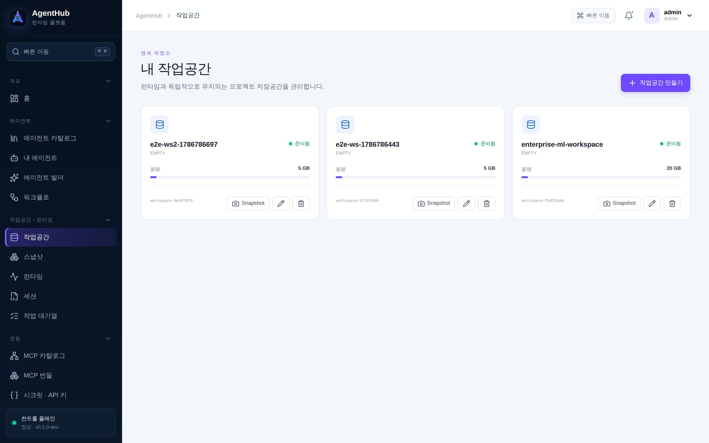

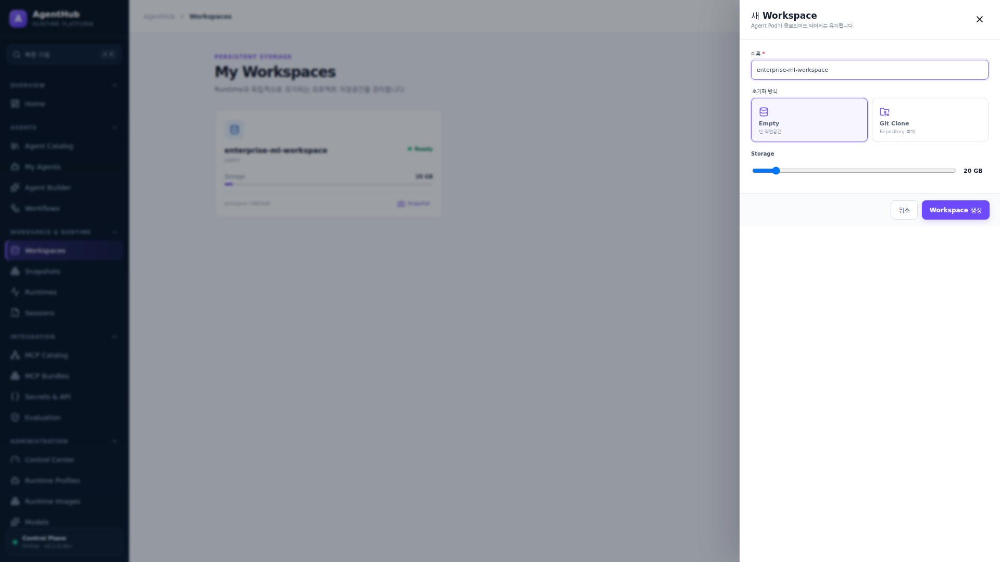

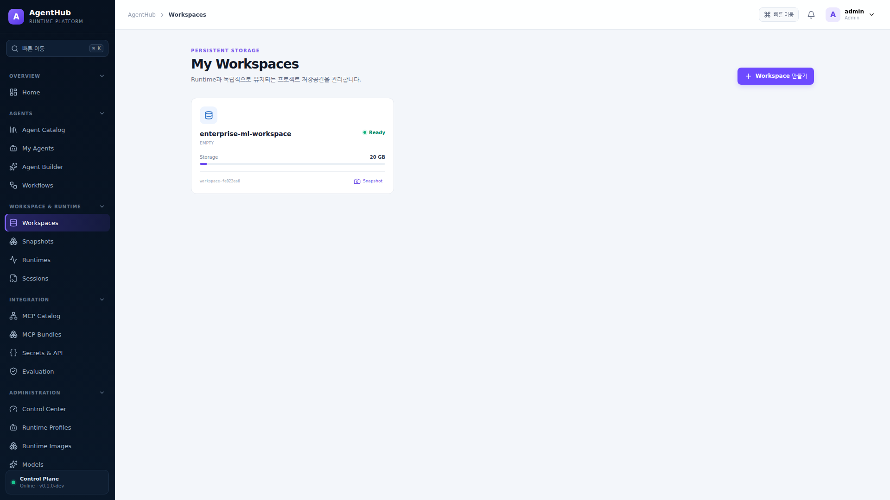

### 4.2 CSI 볼륨 스냅샷 & 복구
작업 상태를 특정 시점으로 동결하는 CSI VolumeSnapshot을 생성하고, 필요 시 언제든 새 워크스페이스로 복원할 수 있습니다.

- **목록에 있다고 복원되는 것은 아닙니다.** Snapshot 행은 *남이 보관하는 것에 대한 이 플랫폼의 기억* 입니다. 예전에는 한 번 `ready` 가 되면 다시 묻지 않아서, 클러스터에서 삭제된 스냅샷도 화면에서는 계속 복원 가능해 보였습니다 — 그리고 그 사실을 알게 되는 순간은 **복원을 눌렀을 때**, 즉 되돌리려던 것을 이미 지운 뒤였습니다. 지금은 목록을 볼 때 `ready` 상태도 다시 확인하고, 없어졌으면 **없음** 으로 표시합니다. 복원도 만들기 전에 먼저 클러스터에 물어봅니다.
- **"이 스냅샷이 없다" 와 "이 클러스터는 스냅샷을 못 한다" 는 다른 말입니다.** 둘 다 404로 돌아오기 때문에 예전에는 같은 답으로 뭉뚱그렸고, 그래서 *이미 설치돼 있는 CRD를 설치하라* 고 안내했습니다. 지금은 쿠버네티스가 **어떤 객체를 지목했는지** 로 구분합니다 — 이름이 있으면 그 스냅샷이 없는 것이고, 없으면 그 종류를 아예 모르는 클러스터입니다.

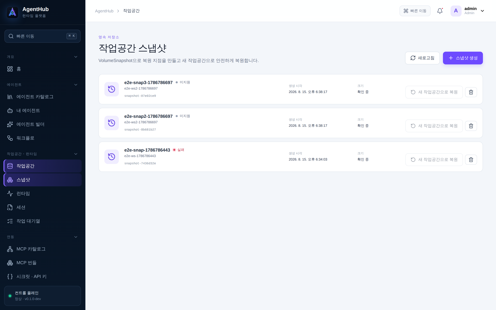

---

## 5. Agent 런타임 라이프사이클 & 세션 게이트웨이

### 5.1 Runtimes 관리
Kubernetes 클러스터 상에서 구동되는 각 에이전트 Pod의 파드 상태, CPU/메모리 점유율, 헬스체크를 통합 모니터링합니다.

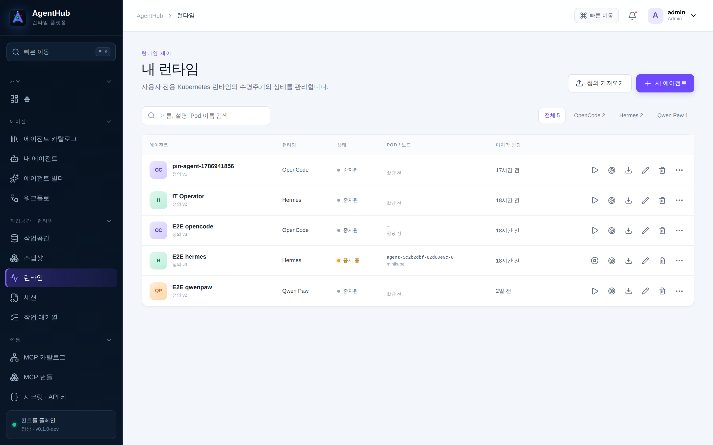

### 5.2 Session Gateway
OpenCode나 Hermes와 같은 네이티브 Web UI에 접근할 때 1회용 런치 티켓(One-Time Launch Ticket)을 발급하여 안전한 격리 세션을 생성합니다.

세션이 열리는 주소는 관리자 설정에 따라 두 가지입니다.

- **Runtime Base Domain을 설정한 경우(권장)**: `https://<runtimeId>.agents.company.local/` 처럼 Runtime마다 전용 Origin을 사용합니다. Wildcard DNS와 인증서가 필요하지만 Runtime UI가 Portal과 Origin을 공유하지 않습니다.
- **설정하지 않은 경우**: `https://<포털주소>/<runtimeId>/` 경로로 같은 세션이 열립니다. 별도 DNS 준비 없이 바로 쓸 수 있으며 런치 티켓·세션 만료·감사 로그는 동일하게 적용됩니다.

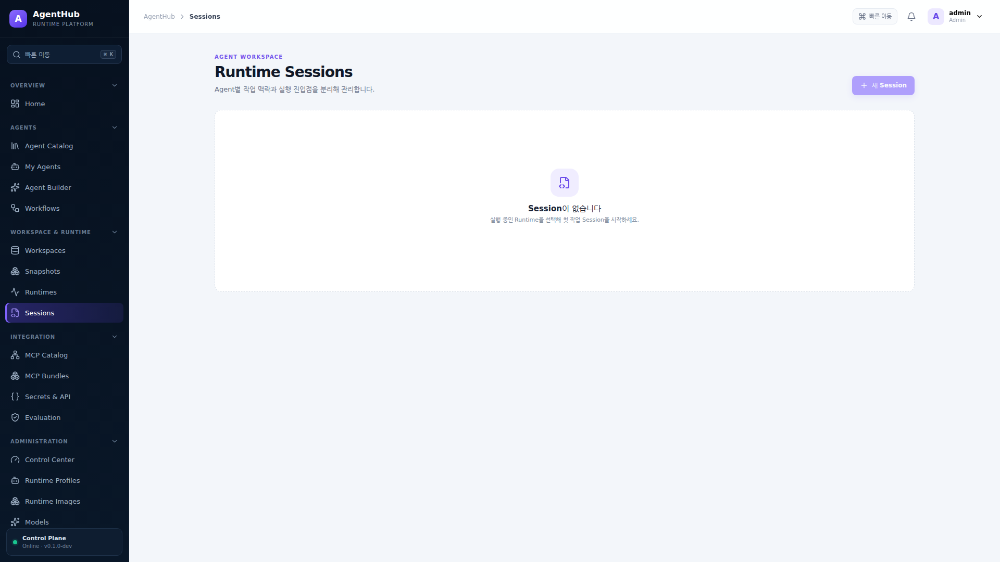

---

## 6. Multi-Agent 워크플로우 DAG

복수의 전문 에이전트(개발, 리뷰, 배포, 데이터분석 등) 간의 협업 그래프(DAG)를 설계합니다. `워크플로` 화면 상단의 **사용법 안내**에 아래 절차가 요약되어 있으므로, 화면을 보면서 그대로 따라 할 수 있습니다.

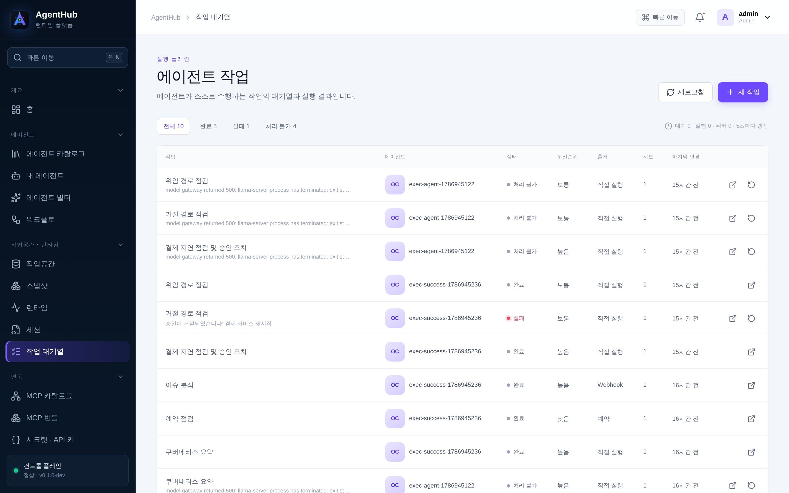

### 4단계로 시작하기

1. **에이전트를 준비합니다.** 단계 하나가 에이전트 하나이며, 각 단계는 그 에이전트의 지시문과 **연결된 모델**로 실행됩니다. 모델이 연결된 에이전트가 2개 이상 있어야 협업이 됩니다.
2. **실행 방식을 고릅니다.** 만들기 화면의 카드에 각 방식이 무엇을 하고 언제 쓰는지 적혀 있습니다. `예시로 시작` 버튼을 누르면 이름·방식·단계 수가 미리 채워집니다.
3. **단계와 한도를 정합니다.** 실행 순서대로 에이전트를 넣고 호출·시간 한도를 정합니다. 저장 시 소유권·순환 참조·깊이·병렬 한도를 서버가 다시 검사하므로 잘못된 그래프는 저장되지 않습니다.
4. **실행하고 기록을 봅니다.** `실행` 을 누르면 이번에 처리할 요청 내용을 입력받고(예시 요청 넣기 버튼 제공), 끝나면 단계별 출력·소요 시간과 표결·검토 결과를 그대로 보여줍니다.

> **워크플로도 작업 대기열과 똑같은 규칙 아래 있습니다.** 정책 엔진, 승격 게이트, 모델 연결 여부, 그리고 소유자·부서 예산까지 — 실행 전에 **그래프가 실제로 부를 에이전트마다** 확인합니다. 예산을 다 쓴 사람이 작업 대기열에서는 거절당하고 워크플로 화면에서는 환영받는다면 그 예산은 권고사항일 뿐이기 때문입니다.
>
> ```
> goose-mt1j3357: 사용자 토큰 예산(10)을 모두 사용했습니다. 최근 사용량 11,490 토큰.
> ```
>
> 워크플로가 쓴 토큰도 **같은 합계에 들어갑니다.** 예전에는 실행 결과 JSON 안에만 기록돼 사용량 보고서에도, 어떤 예산에도 잡히지 않았습니다. **금액도 함께 잡습니다.** 워크플로의 단계마다 모델 엔드포인트가 다를 수 있어서 실행이 끝난 뒤에는 적용할 단가가 하나로 정해지지 않는데, 이제 각 단계를 **응답한 엔드포인트의 그 시점 단가로** 계산해 실행 기록에 저장합니다. 나중에 단가를 고쳐도 지난 실행의 금액은 바뀌지 않습니다. 단계들이 서로 다른 통화를 썼다면 `KRW+USD` 처럼 섞였다는 사실을 그대로 남깁니다 — 환율로 대신 환산하지 않습니다. 단가가 없는 엔드포인트는 금액에 0을 더하고 통화도 남기지 않지만, 토큰은 그대로 셉니다.

> 워크플로는 에이전트의 런타임 Pod가 아니라 **각 에이전트에 연결된 모델 API로 직접 실행**됩니다. 런타임을 켜 두지 않아도 실행되지만, 작업공간 파일이나 MCP 도구는 사용하지 않습니다. 파일을 다루거나 도구가 필요한 일은 `작업 대기열` 로 맡기세요.

### 실행 방식 선택 기준

| 방식 | 하는 일 | 이럴 때 |
| --- | --- | --- |
| 순차 실행 (Sequential) | 앞 단계의 답을 다음 단계가 이어받고, 마지막 단계의 결과가 최종 답 | 조사 → 초안 → 검토처럼 순서가 있는 일 |
| 병렬 실행 (Parallel) | 모든 단계가 같은 요청을 동시에 받고, 각자의 답을 모아 보여줌 | 같은 자료를 여러 관점에서 동시에 볼 때 |
| 라우터 (Router) | 첫 단계가 분기를 고르고, 선택되지 않은 분기는 건너뜀 | 요청 종류에 따라 담당이 갈릴 때 |

| 감독 검토 (Supervisor) | 마지막 단계가 결과를 검토해 승인하거나 지목한 에이전트에게 보완 요청(최대 2회) | 결과 품질을 한 번 걸러야 할 때. 모든 단계가 하나의 마지막 단계로 모여야 동작 |
| 리뷰 (Reviewer) | 감독 검토와 동일한 동작(이전 이름) | 기존 워크플로 유지용. 새로 만들 때는 감독 검토 사용 |
| 합의 표결 (Consensus) | 같은 질문을 각자 독립적으로 받고 `VOTE` 로 표결 | 판단이 갈리는 문제를 표로 정할 때. 단계 연결은 무시됨 |

- **가드레일 검증**: 최대 깊이(Max Depth), 최대 호출 횟수(Max Calls), 순환 참조(Cycle)를 자동 검사합니다.
- **라우터 결정 방식**: 라우터에게는 선택 가능한 분기 id 목록이 주어지고, 모델은 그 id 중에서만 고른 JSON으로 답합니다(스키마 강제). 이름이 문장에 언급되었다는 이유로 분기가 선택되는 일은 없으며, 선택 결과·이유·검증 여부는 실행 기록의 *분기 결정* 에 남습니다. 읽을 수 없는 답이 오면 모든 분기를 실행하고 그 사실을 기록에 남깁니다.
- **완료 판정도 같은 방식**: LLM 판정은 `{passed, reason, unmet}` JSON으로만 답하도록 스키마로 제한되며, `unmet` 에는 실제로 설정된 완료 조건만 넣을 수 있습니다. 설정되지 않은 조건을 지적하면 판정에서 제외되고 사유에 명시됩니다. 판정 결과를 해석할 수 없으면 통과가 아니라 실패로 처리합니다.

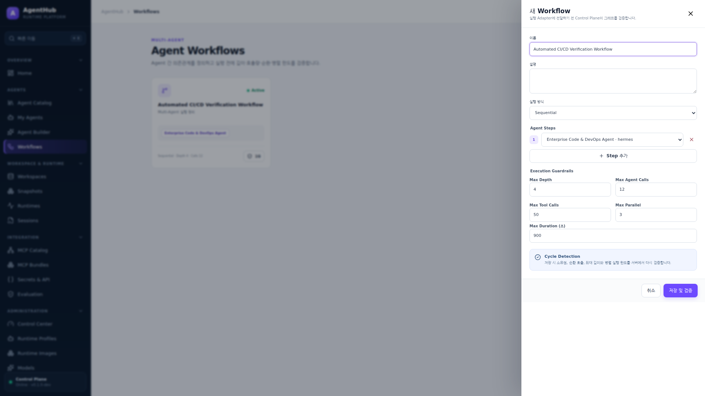

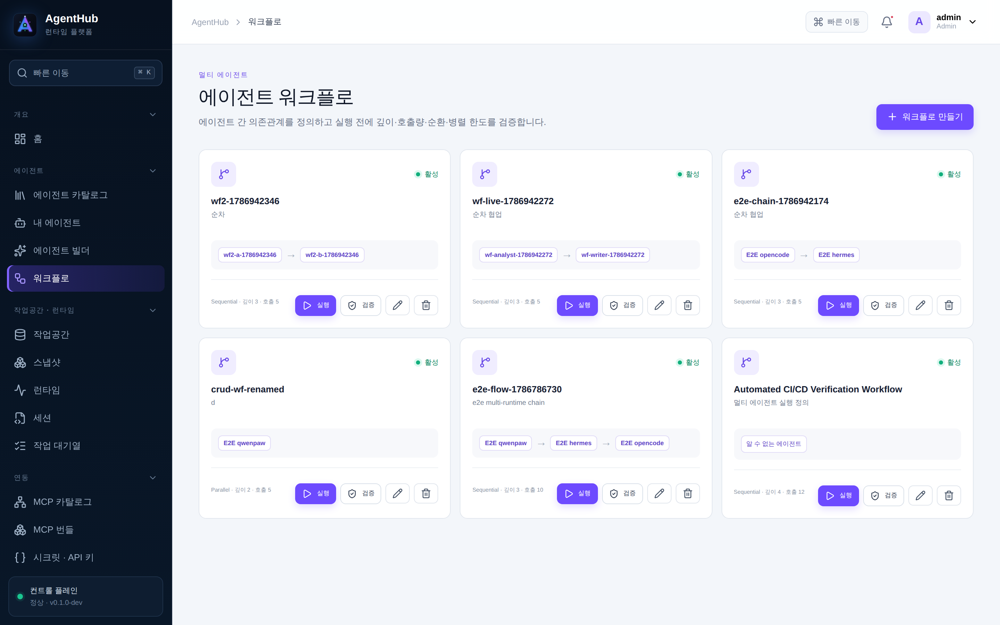

---

### 감독자(Supervisor) 모드

한 에이전트가 다른 에이전트들의 결과를 검토합니다. 모든 단계가 하나의 마지막 단계로 모이는 그래프일 때만 동작하며, 그 마지막 단계가 감독자가 됩니다.

- 감독자는 결과가 충분하면 `APPROVE`, 보완이 필요하면 `REVISE: <에이전트> — <요청>` 을 적습니다. 이 안내는 플랫폼이 자동으로 붙입니다.
- 지목된 에이전트만 그 요청을 받아 다시 실행하고, 감독자가 새 결과를 다시 검토합니다. 개정된 답변이 실행 기록에 남습니다.
- 검토는 최대 2회로 제한됩니다. 끝내 합의되지 않으면 **보완 요청 남음** 으로 종료되며, 승인으로 처리하지 않습니다.
- 재실행도 최대 에이전트 호출 수에 포함됩니다.

### 합의(Consensus) 모드

여러 에이전트에게 **같은 질문**을 독립적으로 던지고 표결로 결론을 내립니다. 다른 모드와 달리 단계 간 연결은 무시되므로, 어떤 에이전트도 다른 에이전트의 답을 먼저 보지 않습니다.

- 각 참여자는 근거를 설명한 뒤 마지막 줄에 `VOTE: <결론>` 을 적습니다. 이 안내는 플랫폼이 자동으로 붙입니다.
- 집계는 모델이 아니라 플랫폼이 직접 계산하므로 결과가 재현 가능합니다. 대소문자·띄어쓰기·문장부호 차이는 같은 표로 봅니다.
- 결과는 **만장일치 / 다수결 / 동률 / 합의 없음** 중 하나로 표시되며, 소수 의견과 기권도 그대로 남습니다. 동률은 합의로 처리하지 않습니다.
- `VOTE` 를 적지 않은 참여자는 기권으로 기록되고 분모에서 빠집니다.

---

## 7. MCP Fabric & 번들 바인딩

Model Context Protocol(MCP)을 엔터프라이즈 환경에 맞게 중앙 집중형으로 관리합니다.

### 7.1 MCP Catalog
사내 DB 조회, Git 조작, K8s 배포 등 등록된 MCP 도구들의 스키마와 기능을 탐색합니다.

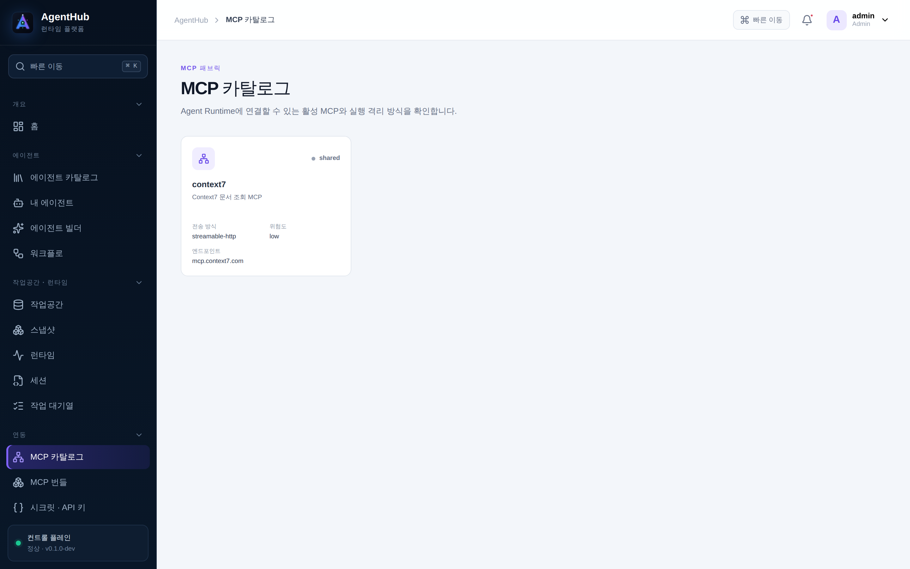

### 7.2 MCP Bundles
도구들을 역할별(예: DevOps Pack, QA Tester Pack)로 묶어 에이전트에 일괄 바인딩합니다.

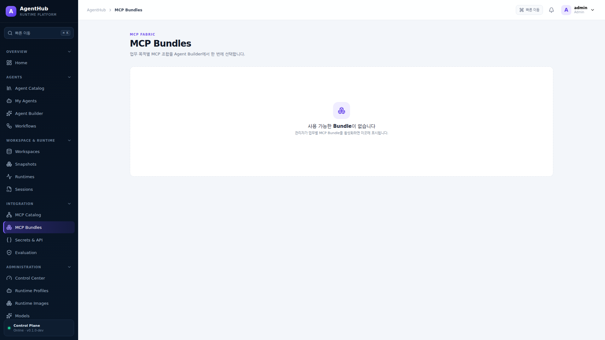

---

### 7.9 런타임 유형 고르기와 "런타임에서 이어받기"

에이전트를 만들 때 어떤 런타임을 고를지는 *카탈로그 ▸ 런타임 유형 비교* 에서 확인할 수 있습니다. 각 런타임의 작업공간 경로, 브라우저 편집기·터미널 유무, MCP 도구 전달 여부, 그리고 **하지 못하는 일**까지 함께 표시됩니다(설명은 플랫폼이 직접 제공하므로 화면과 실제 배포가 어긋나지 않습니다).

| | OpenCode | Hermes | Qwen Paw | Qwen Code | Langflow |
|---|---|---|---|---|---|
| 잘하는 일 | 코드 수정·테스트·스크립트 | 여러 단계 자율 조사, 장기 기억 | 개인 업무 자동화, 스킬 실험 | 터미널에서 코드를 직접 고치는 일 | 흐름을 그려서 만드는 파이프라인 |
| 브라우저 작업 | 편집기 + 터미널 | 대시보드 + 터미널 | 앱 화면 | 터미널(에이전트 TUI) | 흐름 편집기 (터미널 없음) |
| MCP 도구 | 런타임 설정에 자동 등록 | 런타임 설정에 자동 등록 | 전달되지 않음 | 런타임 설정에 자동 등록 | 전달되지 않음 (흐름 안에서 직접 연결) |
| 공개 방식 | 자체 인증 | 플랫폼 프록시 | 플랫폼 프록시 | 플랫폼 프록시 | 플랫폼 프록시 (Runtime 전용 도메인 필요) |
| 자동 실행 | 추론 루프 + 인계 | 추론 루프 + 인계 | 추론 루프 + 인계 | **런타임의 에이전트가 직접 수행** | **저장한 흐름을 그대로 실행** |

> **JupyterLab 은 Qwen Code 를 품고 있습니다.** 노트북·파일 브라우저·터미널이 한 화면에 있고, 그 터미널에서 `qwen` 이 바로 실행됩니다. 자동 실행도 같은 에이전트를 사용하므로 목표 설정에서 *에이전트 실행* 을 고를 수 있습니다. pandas·matplotlib·scikit-learn 등이 기본 포함이고, 추가 `pip install` 은 홈 볼륨에 남습니다.

> **Node-RED · n8n 은 에이전트가 아니라 배선입니다.** 사람이 만든 흐름이 Runtime 안에서 계속 돌아가는 형태이고, 자동 실행(작업 대기열)이 대신 실행해 주지는 않습니다. n8n 은 **Runtime Base Domain 이 필요**하고(하위 경로 서비스가 동작하지 않습니다), 첫 접속에서 소유자 계정을 만들어야 합니다.

> **Qwen Code 전제.** 별도 이미지입니다 — Qwen Code Agent를 쓰려면 `agenthub-qwencode` 이미지를 적재해야 합니다. 브라우저로 열면 에이전트의 터미널이 그대로 열리고, `pip install`·`npm install -g` 는 홈 볼륨의 환경에 설치되므로 Pod를 다시 만들어도 남습니다(기본 보안 프로파일이 루트 파일시스템을 읽기 전용으로 두기 때문에 이렇게 구성했습니다).

> **Langflow 두 가지 전제.** ① 이미지가 다릅니다 — Langflow Agent를 쓰려면 `agenthub-langflow` 이미지를 별도로 적재해야 합니다(오프라인 설치 문서 참조). ② 하위 경로로 서비스할 수 없습니다 — *관리자 ▸ 설정 ▸ Runtime 세션* 에서 **Runtime Base Domain** 을 설정한 사이트에서만 흐름 편집기를 열 수 있고, 설정되지 않은 사이트에서는 이유를 표시하며 열기를 거부합니다(빈 화면을 보여주지 않기 위해서입니다).

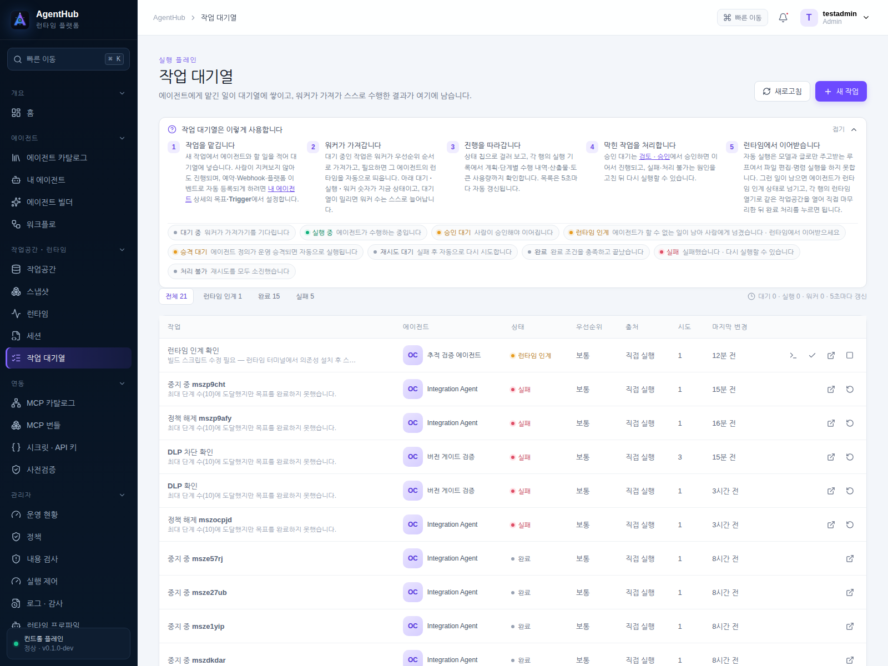

**자동 실행과 런타임은 다릅니다.** `작업 대기열`의 자동 실행은 모델과 글로만 주고받는 루프여서 파일을 직접 편집하거나 명령을 실행하지 못합니다. 그래서 자동 실행 프롬프트에는 이 사실이 명시되고("하지 않은 일을 했다고 쓰지 마세요"), 그런 일이 남으면 에이전트가 **런타임 인계**로 넘깁니다.

- **취소는 위임한 작업까지 함께 멈춥니다.** 이 작업이 다른 에이전트에게 넘긴 하위 작업 중 아직 끝나지 않은 것은 몇 단계 아래에 있든 함께 취소되고, 몇 건이 멈췄는지 화면에 알려 줍니다. 이미 완료·실패한 하위 작업은 기록이므로 그대로 둡니다.
- **취소는 실행 중인 작업도 실제로 멈춥니다.** 취소를 누르면 몇 초 안에 워커가 알아채고 실행을 중단하며, 그 뒤 어떤 경로로도 작업이 다시 큐에 들어가지 않습니다(재시도·대기·보류·인계 모두 취소된 작업은 건드리지 않습니다). 이미 시작된 모델 호출이나 도구 실행은 그 호출이 끝나는 시점까지 진행될 수 있습니다.
- 인계된 작업은 **실패가 아니라 대기** 상태이며 재시도 횟수를 쓰지 않습니다. 소유자에게 알림이 가고, `task.handoff` 이벤트로 Trigger를 걸 수도 있습니다.
- 작업 행의 **런타임 열기**(터미널 아이콘)를 누르면 에이전트가 작업하던 **같은 작업공간**이 브라우저로 열립니다. 런타임이 꺼져 있으면 자동으로 시작합니다.
- 직접 마무리한 뒤 **완료 처리**(체크 아이콘)에서 완료/취소와 기록을 남깁니다. 그 기록이 작업의 마지막 설명이 되고, 감사 로그(`task.resolve`)에도 남습니다.
- 인계는 **영속 작업공간이 연결된 에이전트**에만 제안됩니다. 작업공간이 없으면 넘겨도 이어받을 곳이 없기 때문입니다.

---

## 8. 평가 및 벤치마크 (Evaluation)

에이전트의 응답 정확도, 지연 시간, 가드레일 준수율을 벤치마크 데이터셋으로 정량 평가합니다.

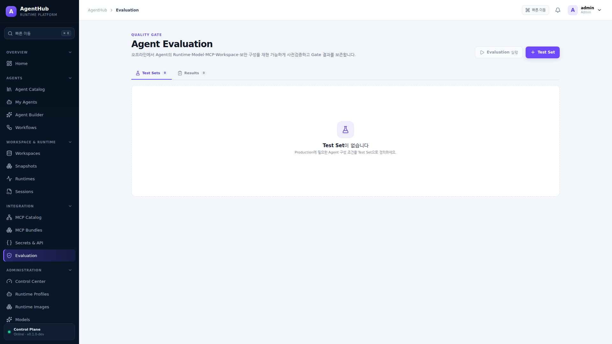

### 8.1 버전 기록과 운영 승격
저장은 곧 배포였습니다. 18시에 고친 정의가 02시 예약 실행에 그대로 쓰였고, 잘못 고쳤을 때 되돌릴 방법은 예전 내용을 기억하는 것뿐이었습니다. 이제 저장할 때마다 그 시점의 정의가 버전으로 남고, 그중 하나를 **운영 승격** 할 수 있습니다.

에이전트 목록의 **버전 · 운영 승격**(시계 아이콘) 버튼에서 사용합니다.

1. **저장하면 버전이 남습니다** — 생성·수정·YAML 가져오기 모두 그 시점의 정의(지시문, 모델, MCP 번들, 보안·네트워크 프로파일, 작업공간)를 함께 보관합니다.
2. **사전검증은 버전에 붙습니다** — `사전검증` 화면에서 실행한 결과는 검사한 정의 버전에 기록됩니다. 결과 카드와 버전 목록 모두에 버전 번호가 표시됩니다.
3. **통과한 버전을 승격합니다** — 통과 결과가 없는 버전은 승격이 거절됩니다. 관리자는 **사유를 적어야** 건너뛸 수 있고, 그 사유는 `검증 생략 승격: …` 으로 승격 기록과 감사 로그에 남습니다.
4. **게이트를 켜면 승격본만 실행됩니다** — *승격된 정의만 실행* 을 켜 두면 현재 정의가 승격본과 다를 때 작업 생성이 409로 즉시 거절되고, 이미 예약돼 있던 작업은 실패가 아니라 **승격 대기** 상태로 보류됩니다. 보류된 작업은 재시도 횟수를 쓰지 않고 워커 자리도 차지하지 않으며, 승격하거나 이전 버전을 복원하는 순간 자동으로 큐에 돌아갑니다(승격 결과에 “대기 중이던 작업 N건이 다시 실행됩니다”로 표시됩니다). 게이트는 **기본값이 꺼짐** 이므로 켜지 않은 에이전트는 지금까지와 똑같이 동작합니다.
5. **문제가 생기면 복원합니다** — *이 정의로 복원* 은 과거 정의를 **새 버전** 으로 다시 씁니다. 카운터를 되감지 않으므로 v4로 남은 실행 기록은 계속 v4를 가리킵니다. 승격돼 있던 버전을 복원하면 그 자리에서 다시 승격되어 운영이 바로 열립니다.

> 실행 중인 Runtime Pod는 복원 직후가 아니라 **재시작한 뒤** 새 정의로 뜹니다. 게이트는 정의가 승격됐는지만 보고, 승격본을 대신 실행해 주지는 않습니다. Pod·도구·작업공간은 모두 현재 정의로 만들어지므로, 옛 지시문을 새 Pod에 물려 실행하면 아무도 설명할 수 없는 실행이 되기 때문입니다.

---

## 9. 개인 보안 Vault & API 토큰

### 9.1 Personal Secret Vault
각 사용자별 Envelope Encryption 키로 암호화되는 개인 시크릿 저장소입니다. 에이전트 정의에는 평문 대신 참조 ID만 저장됩니다.


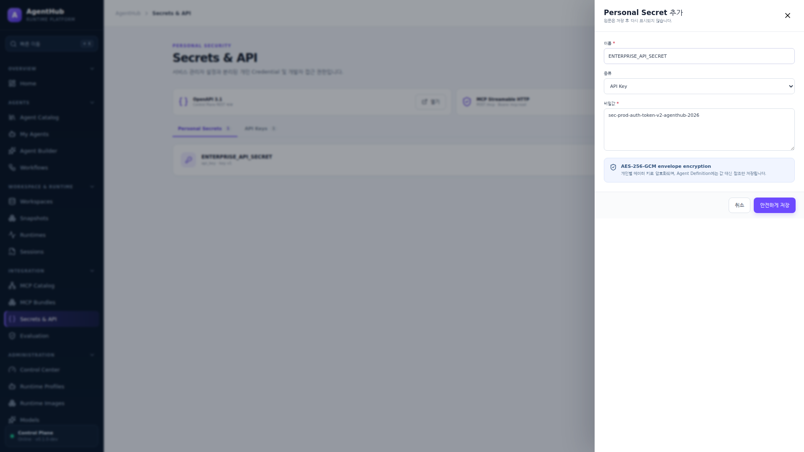

### 9.2 Scoped API Keys

**AgentHub 자신도 MCP 서버입니다.** 외부 에이전트(예: IDE의 Claude)가 API 키로 접속해 이 플랫폼을 도구처럼 쓸 수 있습니다. 제공하는 도구는 **키가 가진 스코프에 따라 목록에서부터 달라집니다** — 부를 수 없는 도구를 목록에 보여 주는 것은 막는 문제가 아니라 **읽는 쪽에게 거짓말**이기 때문입니다(불러 보고 실패해도 그게 구조적 거절인지 알 방법이 없습니다).

| 도구 | 필요한 스코프 | 하는 일 |
| --- | --- | --- |
| `agenthub_list_agents` | `mcp:read` | 내 에이전트와 런타임 상태 |
| `agenthub_list_workspaces` | `mcp:read` | 내 작업공간 |
| `agenthub_task_status` | `mcp:read` | 작업 하나의 상태·시도 횟수·대기 사유·실패 이유 |
| `agenthub_queue_task` | `agent:write` | 내 에이전트에게 일 맡기기 |
| `agenthub_runtime_action` | `runtime:manage` | 런타임 시작·중지 |

`agenthub_queue_task` 로 들어온 작업에도 **콘솔과 똑같은 규칙**이 적용됩니다 — 정책 엔진, 승격 게이트, 모델 연결 여부, 소유자와 부서의 예산. 규칙을 다시 구현하지 않고 콘솔이 쓰는 경로를 그대로 통과시키기 때문입니다(입구마다 규칙 사본을 두면 사본 쪽이 낡습니다). 이렇게 등록된 작업은 목록에서 출처가 **외부 에이전트 (MCP)** 로 표시됩니다.

Cursor, Claude Desktop, Antigravity CLI 등 외부 AI 도구와 연동할 수 있는 최소 권한 API 토큰을 발급합니다.

발급 화면에서 권한 범위를 **여러 개 선택** 할 수 있고, 각 범위가 실제로 호출할 수 있는 REST 엔드포인트 수와 예시가 함께 표시됩니다. 이 숫자는 서버가 실제로 강제하는 경로 목록에서 그대로 계산되므로 화면 설명과 실제 권한이 어긋나지 않습니다.

- `api:read` — 모든 읽기. 새 키의 기본값입니다.
- `agent:write` — Agent·워크플로·작업·작업공간 생성과 수정. **조회를 포함합니다** (쓰는 자동화는 거의 항상 결과를 다시 읽습니다).
- `runtime:manage` — Runtime 시작·중지·재시작과 브라우저 세션 열기. 마찬가지로 조회를 포함합니다.
- `mcp:read` — MCP 엔드포인트(`/mcp`) 전용입니다. REST 경로는 하나도 열리지 않습니다.
- 개인 시크릿, API Key 관리, 개인 키 회전, `/admin/**` 관리자 설정은 **어떤 키로도 호출할 수 없습니다**(`api_key_forbidden`). 스스로 새 키를 만들 수 있는 키는 권한 범위를 무의미하게 만들기 때문입니다.

권한이 모자라면 `insufficient_scope`, 키로는 아예 열 수 없는 경로면 `api_key_forbidden` 으로 구분해 응답합니다. 전체 엔드포인트 목록과 각 경로에 필요한 권한은 `GET /api/openapi.json` 에서 확인할 수 있습니다(태그별로 묶여 있고, 서버가 실제로 등록한 경로에서 생성됩니다).

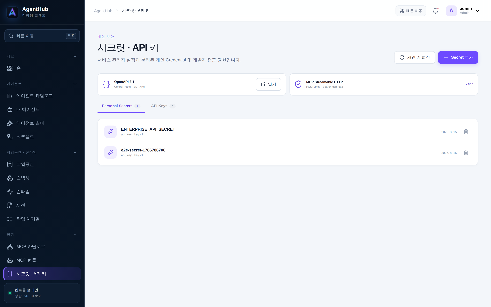

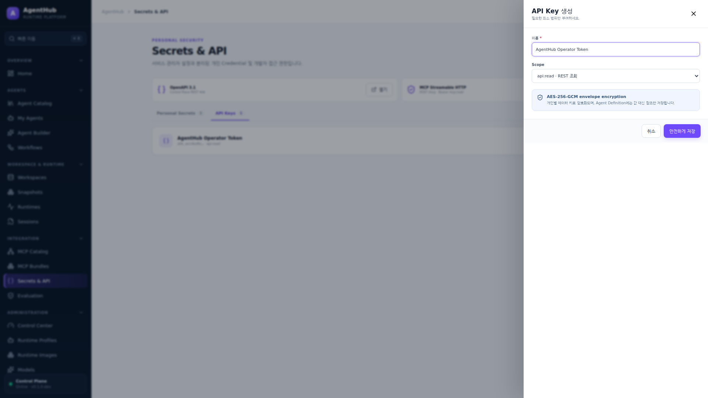

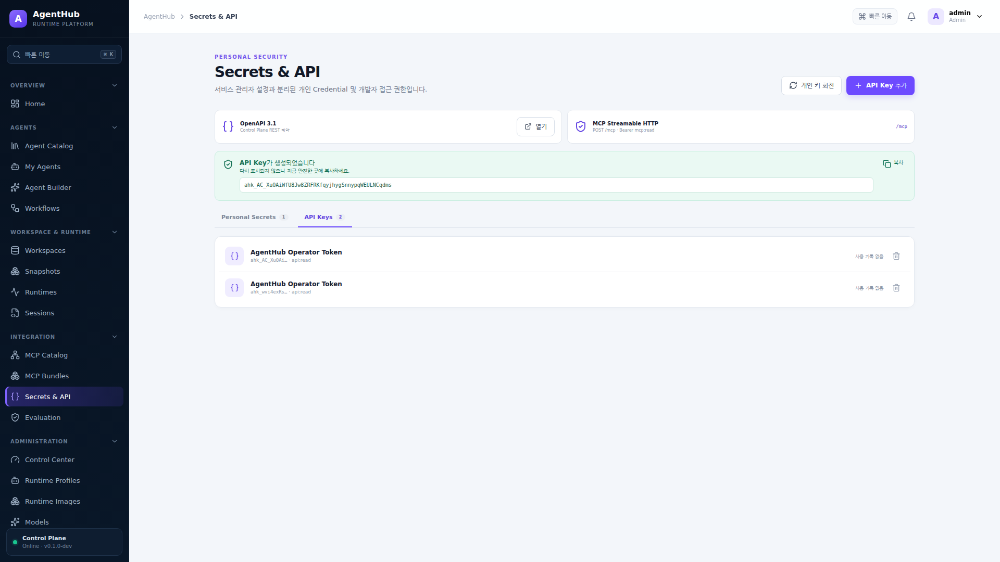

---

## 10. 자율 실행 & 작업 승인

Agent에 **목표(Goal)** 를 설정하면 사람이 지켜보지 않아도 스스로 작업을 수행합니다. 대화형 사용 방식은 그대로 유지되며, 두 방식을 동시에 사용할 수 있습니다.

> **이름이 바뀐 설정**: 목표의 승인 모드 필드가 `cliApprovalMode` → `approvalMode` 로 바뀌었습니다. 세 가지 실행 방식(에이전트 실행·ACP 실행·조사 실행)이 같은 설정을 쓰는데 이름만 한 쪽을 가리키고 있었기 때문입니다. **예전 이름도 계속 받습니다** — GitOps YAML을 고치지 않아도 되고, API 응답에는 두 이름이 모두 들어갑니다.

- **보기 방식(일반 모드 / 공방 모드)**: 오른쪽 위 프로필 메뉴에서 고릅니다. 콘솔이 쓰는 **말**만 바뀝니다.
  - `일반 모드` 는 문서와 API에서 쓰는 이름 그대로입니다 — 에이전트, 작업 대기열, MCP 카탈로그.
  - `공방 모드` 는 같은 화면을 공방의 말로 읽습니다 — **내 작업대**, **일감 대기열**, **공구 카탈로그**, **자료 서랍**. 처음 보는 사람에게 "에이전트가 무엇이고 왜 작업공간이 붙어 있는지"를 설명하기 쉬워집니다.
  - **상태는 바뀌지 않습니다.** 실패는 어느 모드에서도 실패, 거절은 거절입니다. 이름은 바꿔도 결과는 바꾸지 않는다는 것이 이 기능의 규칙입니다.
  - 선택은 **사용자별로** 저장되므로, 공용 PC에서 다른 사람이 로그인해도 그 사람 설정으로 열립니다. 빠른 이동(⌘K) 검색은 두 이름 모두로 찾습니다.

- **목표 설정**: 에이전트 상세 화면의 *목표* 패널에서 성공/실패 조건, 최대 단계 수, 완료 판정 방식(에이전트 선언 · 규칙 · 심판 모델 · 복합)을 정의합니다.
- **실행 계획**: 계획 수립 방식을 `플랫폼`으로 두면 작업 시작 전에 단계별 계획을 세우고, 실행 기록 화면에서 계획과 실제 수행 내역을 나란히 확인할 수 있습니다. `런타임 위임`은 OpenCode·Hermes 자체 에이전트 루프에 계획을 맡깁니다.
- **실행 방식(추론 루프 / 에이전트 실행 / ACP 실행 / 프로토콜 실행 / 조사 실행 / 코드 리뷰 / 실행 패브릭 / 에이전트 서버 / 흐름 실행 / 외부 앱 실행)**: 런타임이 자체 실행 능력을 가진 경우, 목표 설정에 *실행 방식* 이 하나 더 생깁니다. 어떤 방식을 고를 수 있는지는 런타임 유형이 정하며, 목록에 없는 방식은 그 런타임이 지원하지 않는다는 뜻입니다.
  - **Qwen Code — `에이전트 실행`**: 작업을 런타임의 코딩 에이전트에게 헤드리스로 맡깁니다. 추론 루프와 달리 **파일을 실제로 고치고 명령을 실행합니다.**
    - 목표의 최대 단계 수·최대 도구 호출 수·최대 실행 시간이 에이전트 자체 예산으로 전달되므로, 콘솔에서 정한 한도를 일하는 쪽이 스스로 지킵니다. 한도에 걸려 멈춘 실행은 **재시도하지 않습니다** — 같은 한도로 다시 돌리면 같은 자리에서 멈추기 때문입니다. 한도를 올리거나 작업을 좁혀 주세요.
    - **승인 모드(`approvalMode`)가 가장 중요한 설정입니다.** `plan`(바꾸지 않음) · `default`(변경 전마다 확인 — 무인 실행에서는 사실상 멈춤) · `auto-edit`(파일 편집만 자동) · `auto`(편집과 안전한 명령) · `yolo`(모두 자동). 비워 두면 `default` 로 저장되고, *상태 변경 시 승인 필요* 를 켠 목표에서는 `yolo` 를 저장할 수 없습니다.
    - 토큰 사용량은 에이전트가 보고한 **실제 값**이 실행 기록과 사용량 집계에 들어갑니다(흐름 실행과 다른 점입니다).
    - 이 방식은 워커가 Pod 안에서 명령을 실행하므로 `pods/exec` 권한이 필요합니다. 쓰지 않는 배포는 `deploy/kubernetes/rbac.yaml` 에서 해당 규칙을 지워도 되고, 그 경우 이 방식의 작업은 권한 오류로 실패합니다.
  - **Qwen Code · JupyterLab — `ACP 실행`**: 같은 에이전트를 [Agent Client Protocol](https://agentclientprotocol.com/) 로 실행합니다. 출력을 뒤에서 해석하는 대신 **에이전트와 대화하며** 진행합니다.
    - **`에이전트 실행` 과 무엇이 다른가.** 에이전트 실행은 승인 모드를 에이전트에게 넘기고 결과만 받습니다. ACP 실행은 에이전트가 도구를 쓰기 전마다 플랫폼에 묻고, **플랫폼이 답합니다.** 무엇을 승인하고 무엇을 거절했는지가 실행 기록에 단계로 남으므로, 파일을 바꾼 실행에 대해 "무엇이 허용됐는지"를 뒤에서 확인할 수 있습니다.
    - **승인 요구를 켜면 사람이 답합니다.** 아래 *자율성* 의 *상태 변경 시 승인 필요* 를 켜면, 읽기가 아닌 도구 요청은 승인 모드와 상관없이 **승인 대기 목록으로 넘어갑니다.** 에이전트는 그동안 기다리고, 목표의 최대 실행 시간 안에 아무도 답하지 않으면 거절로 처리됩니다. 그래서 이 백엔드에서는 `yolo` 와 승인 요구를 함께 켤 수 있습니다 — 사람이 답하는 쪽이 이깁니다. (헤드리스 `에이전트 실행` 은 플랫폼이 중간에 물어볼 수 없어 여전히 함께 쓸 수 없습니다.)
    - 에이전트는 **항상 묻도록** 시작합니다. 승인 모드가 관대해도 묻는 것 자체는 그대로이고, 플랫폼이 무엇을 승인했는지가 기록에 남습니다.
    - **도구 이름으로 정하는 규칙**: 승인 모드는 도구의 *종류* 로 판단하는데, 종류를 구분해 알려주지 않는 에이전트가 있습니다. 그래서 목표에 두 개의 이름 목록을 둘 수 있습니다.
      - **항상 거절할 도구**: 도구 이름에 이 문구가 들어 있으면 **승인 모드와 상관없이** 거절합니다. `yolo` 로도 풀리지 않습니다 — 드롭다운 하나로 풀리는 금지는 금지가 아니기 때문입니다.
      - **묻지 않고 허용할 도구**: 거절 목록에 걸리지 않았다면, 승인 모드를 보기 전에 먼저 허용합니다. `default` 로 두고 `npm test` 만 열어 주는 식의 설정이 이것으로 가능합니다.
      - 두 목록 모두 **대소문자를 가리지 않는 부분 일치** 이고, **도구 이름과 인자를 함께** 봅니다. 실제 에이전트가 보내는 이름은 문장이 아니라 도구 이름인 경우가 많고(`browser_execute`, `developer__shell`), 정작 막거나 허용하고 싶은 명령은 인자 안에 들어 있기 때문입니다 — 이름만 봤다면 `rm -rf` 규칙은 한 번도 걸리지 않았을 것입니다. 그만큼 규칙은 **구체적으로** 쓰세요(`rm -rf` ○, `rm` △). 두 글자 미만의 규칙은 거의 모든 것에 걸리므로 저장할 때 거절합니다.
      - 어떤 규칙이 답했는지는 실행 기록의 승인 이벤트에 `answeredBy: toolPolicy` 로 남습니다.
    - 승인 모드는 같은 설정을 씁니다. ACP에서는 사람이 아니라 플랫폼이 답하므로 뜻이 조금 더 단호합니다 — `plan`·`default` 는 읽기·검색만 승인하고 **바꾸는 요청은 모두 거절**, `auto-edit` 은 작업공간 파일 편집까지 승인, `auto`·`yolo` 는 전부 승인합니다. 처음 보는 종류의 도구 요청은 `auto`·`yolo` 가 아닌 한 거절합니다.
    - 최대 도구 호출 수는 플랫폼이 직접 셉니다. 한도를 넘으면 세션을 취소하고 **어느 한도에 걸렸는지** 를 실패 사유로 남깁니다.
    - **토큰 사용량은 에이전트가 알려줄 때만 집계합니다.** 프로토콜 자체에는 사용량을 담는 자리가 없어서 에이전트가 자체 확장 필드로 알려주며, Qwen Code는 알려줍니다. 값이 오면 다른 작업과 똑같이 계량하고, 오지 않으면 실행 기록에 계량하지 않았다고 남깁니다(없는 값을 지어내지 않습니다).
    - 에이전트 실행과 마찬가지로 Pod 안에서 명령을 실행하므로 `pods/exec` 권한이 필요하고, *작업 시 Runtime 시작* 이 켜져 있어야 저장됩니다.
  - **Goose — `ACP 실행`**: 프로토콜을 직접 말하는 에이전트라 자동 실행 방식이 ACP 하나뿐입니다. 사용법은 위 Qwen Code의 ACP 실행과 같지만 두 가지가 다릅니다.
    - **승인 모드는 `auto` 를 쓰세요.** Goose는 도구 종류를 모두 `other` 로 알려주기 때문에, 종류로 판단하는 `plan`·`default`·`auto-edit` 에서는 읽기까지 포함해 **전부 거절**됩니다. 플랫폼이 도구 이름을 보고 종류를 추측하지는 않습니다 — 에이전트가 밝히지 않은 사실을 플랫폼이 지어내는 셈이기 때문입니다. `auto` 로 두면 동작하며, **무엇을 승인했는지는 그대로 기록에 남습니다.**
    - **`auto` 가 너무 넓다면 도구 이름 규칙을 쓰세요.** 종류를 알려주지 않는 에이전트에게는 위의 *항상 거절할 도구* 목록이 유일하게 세밀한 통제 수단입니다. `auto` + 거절 목록이 실질적으로 가장 쓸 만한 조합입니다.
    - **토큰 사용량을 알려주지 않습니다.** 그래서 Goose의 ACP 실행은 계량되지 않습니다. 사용량 집계가 필요하면 Qwen Code를 쓰세요.
  - **BrowserCode — `ACP 실행`**: 브라우저로 해야 하는 일을 맡깁니다. 런타임 안에서 Chromium이 함께 떠 있고, 에이전트가 그 브라우저를 DevTools 프로토콜로 직접 몹니다.
    - **승인 모드는 `auto` 를 쓰세요.** 브라우저 도구를 `other` 종류로 알려주기 때문에, 종류로 판단하는 `plan`·`default`·`auto-edit` 에서는 정작 브라우저 사용이 거절됩니다. 목표 화면에서도 이 경고가 뜹니다.
    - **셸·파일 편집·웹 요청·브라우저 조작은 모두 플랫폼에 먼저 묻습니다.** 이 에이전트는 그렇게 하라고 설정해 주지 않으면 **묻지 않고 실행합니다** — 실제로 확인했습니다. 그래서 플랫폼이 만들어 주는 설정에 승인 요청 항목이 들어 있고, 그 덕분에 목표의 승인 모드와 도구 규칙이 실제로 적용됩니다. 사람이 터미널에서 직접 여는 세션은 대상이 아닙니다(옆에 답할 사람이 있으니까요).
    - **화면 캡처는 산출물로 남습니다.** 에이전트가 스크린샷을 찍으면 그 이미지가 실행 기록의 *산출물* 에 저장되고, 목록이 아니라 **그림으로 바로 보입니다.** "페이지에 오류가 보입니다"는 주장이고 캡처가 그 근거이므로, 열어 봐야 하는 링크로 두면 아무도 보지 않기 때문입니다.
      - 한 실행당 최대 12장, 한 장당 180KB까지 보관합니다. 넘어간 것은 조용히 버리지 않고 실행 기록에 "이미지 N개를 보관하지 않았습니다" 로 남깁니다.
      - PNG·JPEG·WebP·GIF만 보관하고 화면에 표시합니다. SVG는 스크립트를 담을 수 있는 문서라 이미지로 취급하지 않습니다.
    - 로그인 세션(쿠키)은 홈 볼륨의 브라우저 프로필에 남아 **재기동 후에도 유지**됩니다. 반대로 말하면, 에이전트가 남긴 자격증명도 그대로 남습니다.
    - **컨테이너 안에서는 Chromium 자체 샌드박스를 켤 수 없어 끄고 실행합니다.** 격리는 Pod가 담당하므로, 신뢰할 수 없는 페이지를 여는 용도라면 이 런타임의 네트워크 정책을 좁게 잡으세요.
  - **Pi — `프로토콜 실행`**: 에이전트를 프로세스로 **띄워 두고 대화하는** 방식입니다. 시작하고 기다리는 대신, 일하는 도중의 상태가 그대로 들어옵니다.
    - **에이전트 자신의 이벤트가 기록됩니다.** 명령을 받아들였는지, 어떤 턴이 끝났는지, 무엇을 답했는지, 언제 완전히 끝났는지. 특히 **끝났다고 말하는 시점** 을 따로 봅니다 — 턴이 끝난 것과 일이 끝난 것은 다르고, 에이전트가 다시 시도하려던 것을 중간에 자르지 않기 위해서입니다.
    - **토큰이 실제 값으로 계량됩니다.** 메시지마다 입력·출력·캐시 사용량이 함께 오므로 그대로 집계합니다. 에이전트가 알려주지 않으면 0이 아니라 *계량 안 됨* 으로 남깁니다.
    - **모델 호출은 이 배포의 게이트웨이를 지납니다** — 환경변수가 아니라 에이전트 설정 파일로 강제합니다(이 에이전트도 환경변수는 무시하고 벤더로 갑니다). 게다가 대화가 끝나면 **에이전트에게 실제로 어디를 보고 있었는지 물어** 확인하고, 다르면 실행 기록에 남깁니다.
    - **프로젝트 안의 설정·스킬은 신뢰하지 않습니다.** 저장소가 스스로 확장을 켤 수 있다면 그 Pod 안에서 무엇이든 돌릴 수 있다는 뜻이라, 그 판단은 플랫폼이 합니다.
    - **일하는 중에 말을 걸 수 있습니다.** 실행 기록 화면에서 *방향 수정* 이나 *이어서 할 일* 을 보내면, 에이전트가 지금 하는 일이 끝나는 지점에서 전달됩니다(문장 중간에 끼어들면 대화가 깨지기 때문입니다).
      - **보낸 것과 전달된 것을 구분해서 보여 줍니다.** 브라우저는 대화를 직접 붙잡고 있지 않고 워커 프로세스가 갖고 있으므로, 워커가 집어갈 때까지는 `전달 대기` 입니다. 보낸 즉시 전달됐다고 표시하면 에이전트가 들었다고 거짓말하는 셈입니다.
      - **에이전트가 거절하면 그것도 남습니다.** 전달 시각만 찍고 넘어가면, 거절당한 지시가 전달된 것처럼 보입니다.
      - 이미 끝난 실행에는 보낼 수 없습니다.
    - 세션이 파일로 남아 Pod를 다시 띄워도 이어집니다. 최대 실행 시간이 대화의 제한 시간으로 전달됩니다.
  - **Runtime이 안 뜬 채로 시간이 지나면, 클러스터가 말한 이유를 그대로 옮깁니다.** 승인된 이미지 태그가 실제로 없으면 Pod는 `ErrImagePull` 로 멈춰 서는데, 작업에는 *Runtime이 준비되기를 기다리다 시간이 초과되었습니다* 만 남아 느린 클러스터를 의심하게 됐습니다. 이유는 이미 Runtime 기록에 적혀 있었습니다 — 이제 작업 실패 메시지에도 `런타임 이미지를 가져오지 못했습니다 … ErrImagePull: pull access denied` 처럼 함께 적힙니다. 없는 태그를 승인해 실제 클러스터에서 확인했습니다.
  - **Pod가 죽어서 끝난 것도 그렇게 말합니다 — 어떤 실행 방식이든.** 컨테이너가 강제 종료되면 종료 코드 137(SIGKILL)이나 143(SIGTERM)이 돌아오는데, 예전에는 둘 다 *에이전트 출력을 읽지 못했습니다(종료 코드 137)* 로 적혔습니다 — 출력 형식을 들여다보게 만드는 문장입니다. 137은 대개 **메모리 한도 초과(OOMKilled)** 이거나 실행 중 Pod가 삭제된 경우이고, 143은 노드 정리·Runtime 중지처럼 **종료 요청** 을 받은 경우라, 이제 각각 무엇을 확인하면 되는지까지 적습니다. 실제 클러스터에서 실행 중인 Pod를 지워 확인했으며, CLI·리뷰·조사 세 가지 실행 방식이 같은 설명을 씁니다.
  - **시간 제한에 걸린 것과 런타임이 안 뜬 것을 구분해서 말합니다.** Pod 안에서 도는 실행 방식은 어떤 이유로 끝나든 *Runtime에서 …을 실행하지 못했습니다: context deadline exceeded* 라고만 적었습니다 — Kubernetes를 들여다보게 만드는 문장인데, 실제로는 **Goal에 적어 둔 최대 실행 시간** 에 도달한 것이었습니다. 이제 `리뷰가 최대 실행 시간(60초)에 도달해 중단됐습니다. Goal의 최대 실행 시간을 늘리거나, 대상 범위를 줄여 주세요.` 처럼 무엇을 바꾸면 되는지까지 적습니다. 실제 클러스터에서 응답하지 않는 게이트웨이로 확인했습니다.
  - **리뷰가 아무것도 못 읽었으면 왜 못 읽었는지 말합니다.** 예전에는 *1 of 1 selected item(s) failed* 라는 숫자만 남았습니다 — 키가 취소된 것인지, 파일을 못 읽은 것인지, 시간이 모자란 것인지 알 수 없었습니다. 엔진은 답에 그 이유를 담아 보내고 있었는데(파일별 사유와, 실패한 모델 호출의 종류·상태 코드) 플랫폼이 버리고 있었습니다. 이제 실행 기록에 `provider or subtask request failed — 모델 호출: authentication (401)` 처럼 함께 적습니다.
  - **ACP 실행 실패 메시지가 `}` 로 끝나지 않습니다.** 에이전트는 실패를 여러 줄 JSON으로 찍는데, 그 마지막 줄만 가져오면 `— }` 가 됩니다. 모델 자격 증명이 거절됐을 때 실제로 그렇게 보였습니다. 이제 로그의 **끝부분** 을 한 줄로 이어 붙여 남깁니다.
  - **에이전트가 "모델을 못 불렀다"고 답하면 그건 답이 아니라 실패입니다.** 헤드리스 에이전트는 모델 호출이 실패해도 **정상 종료** 하면서 답변 자리에 `[API Error: …]` 를 적어 놓습니다. 예전에는 그 문장이 작업의 결과로 저장되고 작업은 **완료** 로 남았습니다 — 아무 일도 안 한 실행이 성공한 실행의 표식을 달고 있었던 셈입니다. 실제 클러스터에서 그렇게 만났습니다. 이제 답변 전체가 그 오류 보고이면 실패로 판정하고, 에이전트가 쓴 문장을 그대로 남깁니다.
    - 답변 *안에서* 그 문구를 인용한 경우(로그를 설명하는 작업 등)는 정상으로 둡니다. 멀쩡한 실행을 실패로 만드는 것은 반대 방향의 같은 실수입니다.
  - **Orca — `실행 패브릭`**: 한 가지 일을 **여러 코딩 에이전트에게 동시에** 시키는 실행 계층입니다.
    - **에이전트마다 자기 git 작업 사본** 이 생깁니다. 서로의 변경을 밟지 않고, 어느 작업이 어느 사본·어느 브랜치에서 돌았는지가 실행 기록에 남습니다.
    - **AgentHub가 계속 위입니다.** 사용자·권한·모델 권한·MCP 권한·DLP·쿼터·감사·작업 최종 판정은 전부 AgentHub가 갖습니다. 패브릭은 한 작업 **안에서의** 워커 조정만 맡습니다.
    - **워커의 모델 호출도 게이트웨이를 지나갑니다 — 다만 방법은 에이전트마다 다릅니다.** 환경을 물려받는 것과 그 값을 따르는 것은 다른 문제입니다. 확인해 보니 codex는 `OPENAI_BASE_URL` 을 무시하고 벤더로 직접 나갔고, **자기 설정 파일의 공급자** 만 따릅니다. 그래서 런타임이 시작할 때 그 설정을 게이트웨이로 써 둡니다 — 실제로 게이트웨이가 `POST /v1/responses` 를 플랫폼이 발급한 키와 함께 받는 것까지 확인했습니다. 새 에이전트를 붙일 때는 **그 에이전트가 실제로 무엇을 읽는지 확인한 뒤에** 게이트웨이를 지난다고 말할 수 있습니다.
    - **`codex` 는 바로 쓸 수 있습니다.** 이미지에 들어 있고, 벤더 계정 없이 이 배포의 게이트웨이만으로 동작합니다 — 격리된 작업 사본에서 실제로 떠서 게이트웨이를 호출하고 답을 받는 것까지 확인했습니다. 다른 에이전트(`claude` 등)는 그 호스트에 설치·로그인돼 있어야 합니다.
    - **설치되지 않은 에이전트를 지정하면,** 패브릭은 요청을 **받아들이고 나서** 실패합니다 — 작업 사본과 디스패치는 만들어지고, 워커는 자기 터미널에서 죽습니다. AgentHub는 요청이 접수됐다는 사실이 아니라 **패브릭이 기록한 실제 결과** 를 확인해 알려 줍니다(`agent_prompt_stalled` 처럼). 그래서 "워커 4개 시작"이라고 해 놓고 아무것도 안 도는 일은 없습니다.
    - 토큰은 그 에이전트들의 런타임에서 계량되므로, 이 실행 자체는 계량되지 않은 것으로 남습니다 — 0으로 적으면 공짜처럼 보이기 때문입니다.
    - 브라우저 터미널을 열면 `orca status --json`·`orca worktree list` 로 손으로 확인할 수 있고, 그 대상은 예약된 작업이 쓰는 것과 **같은 런타임** 입니다.
  - **에이전트 서버 — `에이전트 서버`**: 작업을 에이전트 서버에 맡깁니다. 남이 운영하는 기계에 맡길 수도 있고, **이 플랫폼이 런타임으로 직접 띄운 서버** 에 맡길 수도 있습니다.
    - **OpenHands는 런타임 유형이기도 합니다.** 예전에는 누군가 설치해 두고 주소로 등록한 서버에만 맡길 수 있었습니다 — 그래서 시험해 보려면 먼저 기계를 하나 마련해야 했습니다. 이제 에이전트의 런타임 유형을 **OpenHands** 로 고르면 다른 런타임과 똑같이 Pod로 뜨고, 그 에이전트의 작업은 **자기 런타임에서** 돕니다.
      - 자기 런타임이 있는 에이전트는 등록된 서버 풀을 쓰지 않습니다. 사람이 고른 런타임을 두고 남의 기계로 보내는 것은 고른 것을 무시하는 일이기 때문입니다.
      - 런타임의 동시 실행 수는 자기 Pod가 정합니다. 등록 서버의 한도는 여러 에이전트가 나눠 쓰는 기계에 대한 것이라 여기에는 적용하지 않습니다.
      - 서버는 자체 인증이 없는 API라 플랫폼 프록시로만 공개됩니다. 사람이 브라우저로 쓰는 화면은 아닙니다.
    - **남의 서버에 맡길 때는 런타임을 띄우지 않습니다.** Pod가 생기지 않습니다 — 대신 *어떤 모델을 부를지, 무엇을 허용할지, 작업이 끝났는지* 는 그대로 플랫폼이 정합니다. 즉 AgentHub = 통제 평면, 에이전트 서버 = 실행 백엔드입니다.
    - **모델 이름은 서버가 요구하는 형식으로 보냅니다.** 이 서버는 LiteLLM을 거치는데, LiteLLM은 제공자가 앞에 붙지 않은 모델 이름을 거절합니다 — `LLM Provider NOT provided. You passed model=qwen`. 배포에서 붙인 이름(`qwen`·`stub`)을 그대로 보내면 멀쩡한 엔드포인트로도 **모든 대화가 실패** 했습니다. 이제 제공자가 없으면 `openai/` 를 붙여 보냅니다(같이 실려 가는 주소가 OpenAI API를 말하는 이 플랫폼의 게이트웨이이기 때문입니다). `anthropic/claude-…` 처럼 이미 적어 둔 이름은 그대로 둡니다.
    - **실패하면 서버가 남긴 이유를 그대로 옮깁니다.** 예전에는 *실행이 실패했습니다* 한 줄이 전부였습니다 — 대화 기록에는 이유가 적혀 있는데도요. 이제 그 문장이 실행 기록에 함께 남습니다(예: `litellm.InternalServerError: … Missing credentials`). 읽을 수 없거나 오류가 없으면 아무것도 지어내지 않습니다.
    - **모델 호출은 대화를 시작할 때 지정합니다.** 서버의 환경 변수에 기대지 않습니다 — 그 값은 남이 설정한 기계가 시작할 때 읽은 것이라, 작업이 어디로 나갈지 이 배포가 알 수 없기 때문입니다. 대화마다 게이트웨이 주소와 이 배포가 발급한 키를 실어 보냅니다. 실제 서버로 확인했습니다: 호출은 게이트웨이로 들어오고, 이 지정을 빼면 실행이 **조용히 벤더로 가지 않고 실패** 합니다.
    - **어디서 돌릴지 고릅니다.** 관리자가 등록한 서버를 **직접 지정** 하거나, **네트워크 구역** (개발망·보안망·GPU 등)을 고르면 그 안에서 연결이 확인된 서버로 보냅니다.
      - 서버를 직접 지정했는데 그 서버가 꺼져 있으면 **다른 곳으로 돌리지 않고 실패합니다.** 지정에는 대개 칸에 적을 수 없는 이유가 있기 때문입니다.
      - 구역을 골랐을 때는 꺼진 서버와 **마지막 확인에 실패한 서버** 를 빼고 고르며, 확인된 서버를 확인되지 않은 서버보다 먼저 씁니다. 그 구역에 쓸 수 있는 서버가 없으면 다른 구역으로 넘어가지 않고 그 사실을 알려 줍니다.
      - **연결 상태는 플랫폼이 알아서 다시 확인합니다.** 5분마다 등록된 서버에 다시 물어봅니다 — 누가 버튼을 눌렀을 때 한 번 적어 두고 그대로 두면, *3월에 확인한 기계* 와 *한 시간 전에 확인한 기계* 가 화면에서도 배치에서도 똑같아 보이기 때문입니다. 꺼 둔 서버에는 묻지 않습니다.
      - **오래된 답은 답으로 치지 않습니다.** 마지막 확인이 30분보다 오래됐으면 *모른다* 로 봅니다 — 그래서 한 달 전에 한 번 실패했다는 이유로 이미 복구된 기계를 영원히 빼지도 않고, 석 달 전의 "정상" 때문에 방금 확인된 기계보다 먼저 고르지도 않습니다. 등록만 하고 아직 확인하지 않은 서버도 같습니다: 보내기는 하되 먼저 고르지는 않습니다.
      - **일감은 한가한 기계로 퍼집니다.** 같은 조건이면 지금 돌고 있는 작업이 적은 서버를 고릅니다. 서버 넷을 등록해 두고 전부 1호기에서만 도는 상황을 막기 위해서입니다.
      - **동시 실행 수는 실제로 지킵니다.** 한도에 도달한 서버에는 더 보내지 않고, 자리는 *세어 보고 나서 쓰는* 것이 아니라 **한 번에 차지합니다** — 3밀리초 차이로 들어온 작업 둘이 각자 "지금 0개"를 읽고 같은 기계로 몰리는 일을 실제로 확인했기 때문입니다. 0은 *정하지 않았다* 는 뜻이고 제한 없음으로 봅니다.
      - **모두 한도에 도달했으면 "없다"가 아니라 "바쁘다"** 고 알려 줍니다. 앞의 말은 기계를 등록하라는 뜻이고, 뒤의 말은 기다리라는 뜻이라 대응이 다릅니다.
      - **어떤 Goal이 지정해 둔 서버는 지울 수 없습니다.** 다른 플랫폼 리소스와 같은 규칙입니다 — 지워지면 그 Goal은 *아무 기계나 받는 Goal* 이 되고, 지정에는 칸에 적을 수 없는 이유가 있기 때문입니다. 먼저 그 Goal의 실행 위치를 바꾸면 지울 수 있습니다.
      - 어느 기계에서 돌았는지는 **실행 기록에 남습니다.** 풀 구성이 나중에 바뀌어도 "이 작업은 어디서 실행됐나" 를 답할 수 있어야 하기 때문입니다 — 서버를 나중에 정리해도 지난 기록은 그대로 남습니다.
    - **한 일이 이쪽 실행 기록에도 남습니다.** 서버가 가진 기록을 대체하지는 않지만, 몇 번 행동했고 어떤 도구를 썼는지는 이 콘솔만 보는 사람도 확인할 수 있어야 하기 때문입니다. 기록이 너무 길어 일부만 가져왔다면 그 사실도 함께 적습니다.
    - **사용량은 서버가 보고한 값** 을 그대로 계량합니다. 입력·출력을 나눠서 **실행 단계에 기록** 하므로 사용량 보고서와 비용에 그대로 잡힙니다. 모르면 계량하지 않은 것으로 둡니다 — 0으로 적으면 공짜로 한 일처럼 보이기 때문입니다.
    - **단계마다 사람이 승인할 수 있습니다.** 목표에서 *사람 승인 요구* 를 켜면, 서버는 행동하기 **전에** 멈추고 이 플랫폼이 그 물음에 답합니다. 서버에도 자체 승인 관문이 있지만 최종 권한은 하나여야 하고, 그것은 이 플랫폼입니다.
      - 승인 요청에는 **어떤 도구로 무엇을 하려는지** 가 그대로 담깁니다. 무엇을 허용하는지 모르는 승인은 승인이 아니기 때문입니다. 대기·결정·감사는 다른 도구 승인과 같은 대기열을 씁니다.
      - **거부하면 그 명령은 실행되지 않고** 작업은 거기서 멈춥니다. 실제 서버로 확인했습니다 — 거부한 명령의 출력은 돌아오지 않고, 실행 기록은 시간 초과가 아니라 *승인되지 않았다* 고 적습니다.
      - 승인을 기다리는 시간은 그 작업에 주어진 **최대 실행 시간** 안입니다. 아무도 답하지 않는 작업이 남의 기계를 무한정 붙잡고 있지 않게 하기 위해서입니다.
    - **작업을 취소하면 그쪽에서도 멈춥니다.** 취소는 이 배포의 데이터베이스에 쓰는 일이고, 대화는 남의 기계에서 돌고 있어서 아무 말도 전해지지 않습니다 — 그래서 실행 중에 주기적으로 *아직 이 작업을 원하는지* 확인하고, 취소됐으면 그 서버의 대화를 멈춥니다. 실제 서버로 확인했습니다: 멈춘 뒤에는 모델 호출이 더 일어나지 않습니다.
    - **에이전트가 쓸 도구는 플랫폼이 정합니다.** 터미널·파일 편집·작업 목록을 줍니다. 아무것도 지정하지 않으면 그 서버의 에이전트는 *말하고 끝내기* 만 할 수 있어서 일을 하지 못하고, 반대로 브라우저 도구는 일부러 주지 않습니다 — 이 배포가 운영하지 않는 샌드박스 안의 브라우저는 셸보다 넓은 표면이라 따로 켜야 할 것이기 때문입니다.
    - 등록은 *관리자 ▸ 에이전트 서버* 에서 합니다. 주소를 넣은 뒤 **연결 확인** 을 누르면 그 주소가 실제로 대화를 시작할 수 있는 서버인지 물어봅니다 — 응답이 온다는 것과 에이전트 서버라는 것은 다른 이야기입니다.
  - **Open Code Review — `코드 리뷰`**: "이 변경에 문제가 있는가" 를 묻는 작업입니다. 리뷰 엔진이 변경분을 읽고, **파일·줄 단위 지적** 을 남깁니다.
    - **요약이 아니라 목록이 남습니다.** 각 지적은 파일·줄·심각도(심각/높음/보통/낮음)·분류(버그/보안/성능/유지보수/테스트/스타일/문서/기타)를 갖고, 실행 기록 안에서 **인정** 또는 **오탐** 으로 처리할 수 있습니다. 심각도와 분류는 엔진이 쓰는 값을 그대로 저장합니다 — 양쪽에서 같은 뜻이어야 하기 때문입니다.
    - **줄 번호는 엔진이 정합니다.** 모델이 인용한 코드를 diff에 맞춰 찾아 실제 줄에 붙이므로, 모델이 줄을 세는 것에 기대지 않습니다.
    - **대상은 네 가지** 입니다 — 작업공간의 변경분, 브랜치 비교(공통 조상부터), 커밋 하나, 저장소 전체 점검. 브랜치 비교는 그 사이에 기준 브랜치에 들어간 남의 변경을 지적하지 않습니다.
    - **품질 게이트**: *작업을 실패로 볼 심각도* 를 고르면 그 이상 지적이 있을 때 작업이 실패합니다. 비워 두면 리뷰는 보고만 하고 아무것도 막지 않습니다 — 아무도 고르지 않은 게이트가 어느 날 갑자기 일을 막지 않도록 하기 위해서입니다.
    - **리뷰 전에 무엇을 볼지 먼저 볼 수 있습니다.** 리뷰 엔진은 *어떤 파일을 볼지* 와 *각 파일을 어떤 기준으로 볼지* 를 모델 없이 정합니다. 그래서 `리뷰 계획` 은 **토큰을 쓰기 전에** 대상 파일·제외된 파일과 그 사유·파일별로 적용될 기준 문서를 그대로 보여 줍니다.
      - **"내 파일은 왜 리뷰가 안 됐나"** 에 답이 됩니다 — 제외된 파일마다 사유(`unsupported_ext` 등)가 함께 나옵니다.
      - 적용될 **기준 문서 전문** 이 함께 옵니다. 기준의 *이름* 만으로는 내 코드가 무엇으로 판정될지 확인할 수 없기 때문입니다.
      - 계획은 Runtime 안에서 확인합니다(저장소가 거기 있으므로). Runtime이 꺼져 있으면 *무엇을 먼저 해야 하는지* 를 알려 줍니다 — 리뷰를 못 하는 런타임 유형을 골랐을 때도 마찬가지입니다.
      - 목표 설정의 *리뷰 대상* 아래 **리뷰 계획 보기** 버튼에 있습니다. 기준 문서는 길어서 접어 두고, 눌러서 펼쳐 읽습니다.
    - **무엇을 봤는지도 남습니다.** 대상 파일 수·리뷰한 파일 수·리뷰하지 못한 파일 수가 함께 기록됩니다. 지적이 없는 리뷰와 아무것도 읽지 못한 리뷰는 둘 다 빈 목록이지만 뜻이 정반대이기 때문입니다.
    - 모델 호출은 **AgentHub 게이트웨이를 지나갑니다.** 리뷰 런타임은 공급자 키를 알지 못하고, 정책·내용 검사·쿼터·감사가 다른 실행과 똑같이 적용됩니다. 토큰 사용량은 실제 값이 기록됩니다.
    - **코드를 고치지는 않습니다.** 찾기만 합니다 — 수정은 코딩 에이전트 런타임의 몫입니다. 지적 하나를 코딩 에이전트에게 **수정 작업으로 넘길** 수 있고, 그때 파일·줄·문제·제안이 함께 갑니다(다시 찾게 하면 다른 것을 고칠 수 있으므로).
    - **수정이 끝나면 리뷰가 다시 봅니다.** 수정을 부탁한 것과 고쳐진 것은 다른 일이라, 지적은 *나중 리뷰가 더 이상 보고하지 않을 때* 닫힙니다 — 그런데 그 *나중 리뷰* 를 아무도 시작하지 않았습니다. 그래서 잘 고친 수정과 아무것도 바꾸지 못한 수정이 영원히 똑같아 보였습니다. 이제 수정 작업이 완료되면 **그 지적을 찾아낸 리뷰 에이전트에게 재리뷰 작업이 자동으로 들어갑니다.**
      - 재리뷰는 평범한 작업이라 **정책·쿼터·감사** 를 똑같이 지납니다.
      - 재리뷰 자신이 남긴 지적은 또 다른 재리뷰를 부르지 않습니다 — *수정 작업* 만 이 경로를 탑니다.
      - 한 수정이 같은 리뷰의 지적 넷을 덮었다면 재리뷰는 **한 번** 입니다. 리뷰는 어차피 변경분 전체를 보기 때문입니다. 리뷰 에이전트가 둘이면 둘 다 다시 봅니다.
      - **사람이 이미 판단한 지적** (인정·오탐)은 다시 보지 않습니다. 그건 사람의 답이고, 다시 리뷰하는 것은 그 답과 다투는 일입니다.
    - **PR 하나마다 에이전트를 만들 필요는 없습니다.** 리뷰 대상을 *트리거가 지정* 으로 두면, 이 에이전트의 **웹훅 트리거** 로 들어온 본문이 리뷰할 변경분을 알려 줍니다:
      ```
      {"from":"main","to":"feature/login"}      또는  {"base":..., "head":...}
      {"commit":"9f2c1ab"}                       또는  {"sha":...}
      ```
      CI 잡(GitHub Actions·GitLab CI·Jenkins·사내 Git 무엇이든)이 PR이 열릴 때 이 본문을 보내면 됩니다. 본문에 대상이 없으면 그 작업은 **무엇이 빠졌는지 알려 주며 실패합니다** — 엉뚱한 것을 리뷰해 놓고 PR을 리뷰했다고 하지 않습니다.
      > 브랜치를 직접 적어 둔 리뷰는 웹훅 본문으로 **바뀌지 않습니다.** 그렇지 않으면 웹훅 주소를 아는 누구나 그 리뷰의 대상을 바꿀 수 있게 됩니다.
    - **같은 지적은 한 줄입니다.** 같은 브랜치를 다시 리뷰해도 지적이 늘어나지 않습니다 — 지적은 "문제 하나"이지 "목격 한 번"이 아니기 때문입니다. 같은 문제인지는 **지적이 가리키는 코드** 로 판단합니다(모델이 쓴 문장이 아니라). 줄 번호가 밀리거나 표현이 달라져도 같은 지적으로 봅니다. 그 코드가 실제로 바뀌면 다른 문제로 봅니다.
    - **다음 리뷰가 해결을 확인합니다.** 리뷰가 **그 파일을 실제로 읽었는데** 더 이상 그 지적을 보고하지 않으면 해결로 표시합니다. 읽지 않은 파일(제외했거나 리뷰에 실패한 파일)의 지적은 그대로 둡니다 — 아무도 보지 않아서 사라진 것과 고쳐져서 사라진 것은 다릅니다.
    - **오탐 처리는 기억됩니다.** 오탐으로 표시한 지적은 다음 리뷰에서 다시 올라오지 않습니다.
    - **수정을 맡길 수 있습니다.** 지적 옆의 *수정 맡기기* 로 코딩 에이전트에게 작업을 만들어 줍니다. 파일·줄·지적 내용·제안 코드가 그대로 작업 입력에 담기고, 작업은 그 지적 하나만 다루도록 지시합니다. 파일을 고칠 수 없는 런타임(리뷰 엔진 자신 포함)은 고르면 거절합니다 — 돌긴 돌고 아무것도 바뀌지 않는 작업이 생기기 때문입니다.
    - **맡겼다고 해결된 것은 아닙니다.** 지적은 계속 *처리 전* 으로 남습니다. 수정을 요청한 것과 수정된 것은 다르고, 확인은 다음 리뷰가 합니다. 같은 지적을 두 번 맡길 수는 없습니다.
    - **`코드 리뷰` 화면에 모입니다.** 실행 기록을 하나씩 열지 않아도, 지금까지의 리뷰가 찾은 것 중 **아직 처리하지 않은 지적** 을 한자리에서 봅니다. 심각도·분류·처리 상태로 좁힐 수 있고, 화면 위의 건수는 보이는 목록이 아니라 **조건에 맞는 전체** 건수입니다.
  - **HolmesGPT — `조사 실행`**: "왜 이런 일이 생겼는지" 를 묻는 작업입니다. 에이전트가 알림·메트릭·로그를 **직접 조회해** 근본 원인을 찾습니다.
    - **근거가 남습니다.** 조회 하나하나가 실행 기록의 단계로 남고, 실패한 조회도 실패로 남습니다. 결론만 보고 믿는 대신, 무엇을 보고 그렇게 판단했는지 되짚을 수 있습니다.
    - **셸 실행은 기본으로 꺼져 있습니다.** 조회만으로 대부분의 조사는 끝납니다. 정말 필요할 때만 승인 모드를 `auto` 로 올리세요 — *상태 변경 시 승인 필요* 를 켠 목표에서는 저장할 수 없습니다.
    - 최대 단계 수가 조사 단계 수로 전달되고, **토큰 사용량은 실제 값**이 기록·집계됩니다.
    - **클러스터를 조회하려면 권한을 켜야 합니다.** *관리자 ▸ 정책 ▸ 보안 프로파일* 에서 `clusterRead` 를 켠 프로파일을 만들어 Agent에 지정하면, 그 런타임만 클러스터를 **읽기 전용**으로 조회합니다(쿠버네티스 기본 `view` 역할이라 Secret은 볼 수 없습니다). 켜지 않으면 Kubernetes 툴셋은 아예 제공되지 않습니다 — 켜져 있는데 동작하지 않는 것보다 낫기 때문입니다.
    - 권한을 켜도 **ServiceAccount 토큰을 마운트하지는 않습니다.** 수명 1시간짜리 토큰이 별도 볼륨으로 주입되고 kubelet이 갱신하며, 런타임을 지우면 권한도 함께 사라집니다.
    - 사내 Prometheus·Grafana·Loki 는 *관리자 ▸ 런타임 설정* 에서 `toolsets` 로 연결하면 그쪽을 조회합니다.
  - **Langflow — `흐름 실행`**: 아래 설명과 같습니다.
  - **외부 앱 — `외부 앱 실행`**: 사내에 이미 돌고 있는 애플리케이션(현재 Dify)에 작업을 맡깁니다. *관리자 ▸ 리소스 ▸ 외부 앱* 에 주소와 API 키를 등록해 두면 목표 설정에서 고를 수 있습니다.
    - **Runtime을 띄우지 않습니다.** 일이 플랫폼 밖에서 일어나므로 Pod가 필요 없고, Agent의 런타임 유형과도 무관합니다.
    - Workflow 앱은 이름 붙은 입력을 받으므로 *입력 변수 이름* 에 앱에서 정의한 변수명을 넣으세요(비우면 `input`). Chat 앱은 작업 내용이 질문으로 들어갑니다.
    - 앱이 보고한 토큰 수는 **그대로 실행 기록에 남기되 플랫폼 토큰 집계에는 넣지 않습니다** — 그 토큰은 그 배포의 모델 계약으로 쓴 것이기 때문입니다.
    - 워크플로가 실패로 끝나면 HTTP 200이라도 실패로 기록하고, API 키가 거절되면 재시도하지 않습니다.
  - `추론 루프` — 기존 방식입니다. 모델과 글로 주고받으며 진행하고, 파일 편집이나 명령 실행이 필요하면 사람에게 인계합니다.
  - `흐름 실행` — Runtime에 저장된 Langflow 흐름을 그대로 실행합니다. 작업의 제목·입력과 목표·제약이 흐름의 입력으로 들어가고, 흐름의 출력이 실행 기록의 단계와 완료 판정에 사용됩니다. 산출물(`<<<ARTIFACT …>>>`)과 기억(`<<<MEMORY …>>>`)도 흐름 출력에서 그대로 인식합니다.
  - 실행할 흐름은 **목록에서 고릅니다** — Runtime이 실행 중이면 *목록 불러오기* 로 그 Runtime에 저장된 흐름을 가져옵니다. Runtime이 꺼져 있으면 흐름 ID를 직접 입력해도 됩니다. 출력이 여러 개인 흐름은 *출력 컴포넌트* 로 어느 결과를 답으로 볼지 지정합니다.
  - 흐름은 Runtime 안에서 실행되므로 *작업 시 Runtime 시작* 이 켜져 있어야 저장됩니다. 대기열에 들어간 뒤 Pod가 없어서 실패하는 일을 미리 막기 위해 저장 시점에 확인합니다.
  - **흐름 안에서 일어나는 모델 호출은 플랫폼이 계량하지 않습니다.** 흐름의 컴포넌트가 직접 모델을 부르기 때문입니다. Runtime이 토큰 사용량을 보고하면 실행 기록 이벤트에 **보고된 값 그대로** 남기고, 플랫폼의 토큰 집계에는 넣지 않습니다.
  - 입력과 출력은 DLP 검사를 통과해야 합니다. 검사에서 막히면 흐름에 보내지 않고 작업이 실패하며(재시도하지 않습니다), 감사 로그에는 `dlp.flow` 로 남습니다.
- **승인 게이트**: *상태 변경 시 승인 필요* 를 켜면, 에이전트가 재시작·배포 같은 조치를 수행하기 전에 작업이 **승인 대기** 상태로 멈추고 검토자에게 알림이 갑니다. `검토` 화면에서 승인하면 승인 사유와 함께 작업이 이어서 진행되고, 거절하면 그 사유가 기록된 채 작업이 종료됩니다. 승인을 기다린 시간은 재시도 횟수로 계산되지 않습니다. 검토자는 요청자의 관리자이며, 관리자가 지정돼 있지 않으면 **관리자(admin) 계정 전원** 에게 알림이 갑니다 — 승인 대기 중인 작업이 아무에게도 전달되지 않은 채 멈춰 있지 않도록 하기 위해서입니다.
- **기억(Memory)**: 에이전트가 학습한 사실은 Pod가 재생성되어도 유지되며, 에이전트 상세 화면에서 확인하고 삭제할 수 있습니다.
- **위임(Delegation)**: 권한 밖의 일은 다른 에이전트에게 위임할 수 있습니다. 위임은 항상 작업 대기열을 거치므로 권한·쿼터·감사 기록이 그대로 적용되며, *최대 위임 깊이* 로 연쇄를 제한하고 순환 위임(A → B → A)은 자동으로 차단됩니다.
- **Trigger가 실제로 무엇을 만들어냈는지 함께 보입니다.** Trigger는 *언제 마지막으로 발화했는지* 만 기록해 왔습니다. 그래서 매시간 발화해서 매시간 실패하는 예약과, 매시간 잘 도는 예약이 화면에서 똑같이 보였습니다 — 알아내려면 작업 목록을 열어 제목을 알아보는 수밖에 없었습니다. 이제 각 Trigger 아래에 **최근 7일 동안 만든 작업 수와 그중 실패 수**, 전부 실패했다면 마지막 오류가 함께 적힙니다.
  - **웹훅과 이벤트 트리거도 이제 "발화했다"고 기록합니다.** 예전에는 예약 실행만 그 기록을 남겨서, 천 번을 정상 접수한 웹훅도 화면에는 *아직 한 번도 실행되지 않았습니다* 로 보였습니다.
  - **아무것도 만들지 않았다고 해서 실패는 아닙니다.** 주간 예약은 아직 차례가 아닐 수 있어서, 그럴 때는 아무 말도 하지 않습니다. 다만 **한 번도 발화한 적이 없으면** 그건 말해 줍니다 — 자동화가 돌고 있다고 생각하는데 실제로는 돌지 않는 상태이기 때문입니다.
  - 사람이 손으로 실행한 작업은 세지 않습니다. 손으로 돌린 것 때문에 자동화가 멀쩡해 보이면 안 되기 때문입니다.
- **Webhook Trigger**: 외부 시스템이 `POST /api/v1/triggers/{id}/webhook` 으로 작업을 시작할 수 있습니다. 본문 전체에 대한 HMAC-SHA256 서명을 `X-AgentHub-Signature: sha256=…` 헤더로 보내야 하며, 서명이 맞지 않으면 401 입니다.
  - **같은 요청을 두 번 보내면 두 번째는 409 입니다.** 서명은 본문의 함수라서, 한 번 가로챈 요청은 영원히 유효한 서명을 갖습니다 — 그대로 다시 보내면 작업이 또 하나 만들어졌습니다. 이제 전달은 서명으로 한 번만 접수되며, 배달 ID·타임스탬프·이벤트 ID처럼 매번 달라지는 값이 본문에 있으면(대부분의 발신자가 넣습니다) 아무 영향이 없습니다. 발신자가 응답을 못 받아 같은 요청을 재전송한 경우에도 작업은 하나만 남습니다.
  - **거절당한 요청도 트리거 주인에게 보입니다.** 서명이 틀렸거나, 서명 헤더가 없거나, 같은 요청을 다시 보냈거나, 꺼 둔 트리거를 불렀거나 — 지금까지 이 사실들은 **서버 로그에만** 남았습니다. 보낸 쪽은 401을 받고 주인은 텅 빈 트리거를 보니, 서로의 절반씩만 알고 있는 상태였습니다. 이제 트리거 아래에 **거절 횟수와 마지막 사유·시각** 이 적힙니다.
    - 요청자에게 돌아가는 답은 예전과 똑같습니다. 사유는 **트리거 주인을 위한 것** 이지 두드리는 쪽을 위한 것이 아닙니다.
    - 기록은 트리거 행의 숫자로만 남깁니다. 아무나 부를 수 있는 주소가 만들어내는 기록을 표로 쌓으면, 낯선 사람이 디스크를 채울 수 있기 때문입니다.
  - 접수 기록은 48시간 뒤 자동으로 정리됩니다. 그 시점을 넘긴 기록은 아무것도 막지 못하기 때문입니다.
  - **GitHub·GitLab·Gitea의 주소창에 이 주소를 그대로 붙여 넣으면 됩니다.** 지금까지는 `X-AgentHub-Signature` 헤더 하나만 받았기 때문에, 포지의 웹훅을 그대로 걸면 401이었습니다 — 헤더 이름을 바꿔 주는 것 말고는 하는 일이 없는 중계 서버를 하나 두어야 했습니다. 이제 각 포지가 실제로 보내는 방식을 그대로 받습니다.
    - GitHub `X-Hub-Signature-256`, Gitea·Forgejo `X-Gitea-Signature` — 본문 전체에 대한 HMAC-SHA256으로, 기존 헤더와 같은 방식입니다.
    - GitLab `X-Gitlab-Token` — 공유 토큰을 그대로 보내는 방식입니다. 본문에 묶여 있지 않아 더 약한 증명이므로 마지막에 확인합니다.
    - 서명이 없거나 맞지 않으면 예전과 똑같이 401 입니다. 추측하지 않습니다.
    - **GitLab에서 두 번째 요청이 중복으로 거절되지 않습니다.** GitLab은 모든 전달에 같은 토큰을 보냅니다. 보낸 값으로 전달을 접수했다면 첫 번째 MR만 리뷰되고 그 뒤로는 전부 409 — 트리거가 한 번 동작하고 조용히 멈추는 모습이었을 것입니다. 접수 열쇠는 언제나 **본문에서 계산** 하므로, 다른 MR은 다른 전달이고 같은 본문의 재전송만 409 입니다.
  - **포지가 보내는 본문을 그대로 읽습니다.** 리뷰 Trigger에 무엇을 볼지 알려 주려면 `{"from":"main","to":"feature/login"}` 처럼 손으로 쓴 본문이 필요했습니다. 포지는 이미 그 사실을 자기 본문에 담아 보내는데도요 — 게다가 GitHub 본문은 `base`·`head`가 객체라서 **읽히지 않고 조용히 넘어갔고**, 대상을 분명히 담은 요청에 대해 *무엇을 리뷰할지 못 찾았다* 고 실패했습니다.
    - GitHub·Gitea `pull_request.base.ref` → `head.ref`, GitLab `object_attributes.target_branch` → `source_branch`, Bitbucket `destination` → `source` 를 각각 읽습니다. **방향** 이 핵심입니다: 반대로 읽으면 반대 diff를 리뷰하고도 멀쩡한 리뷰처럼 보입니다.
    - Push 본문은 `after` 커밋 하나를 봅니다. `before` 는 기준으로 쓰지 않습니다 — 강제 푸시나 첫 푸시에서는 없는 커밋이거나 0으로 가득 찬 값이라, 리뷰가 고장 난 것처럼 실패하기 때문입니다.
    - 손으로 쓰던 본문은 그대로 동작합니다.
  - **리뷰가 어디서 온 것인지 화면에서 되짚을 수 있습니다.** 웹훅이 만든 작업은 브랜치 이름만 남기고 정작 *어떤 Pull Request 때문에 도는지* 는 버렸습니다 — 끝난 리뷰를 보는 사람은 그 변경을 손으로 찾아야 했습니다. 이제 본문이 주소를 담고 있으면 작업 목록에 `github.com acme/store #42` 처럼 원래 페이지로 가는 링크가 함께 보입니다.
    - GitHub·Gitea `pull_request.html_url`, GitLab `object_attributes.url`, Bitbucket `links.html.href`, GitHub push의 `compare` 를 읽습니다.
    - **`http`·`https` 만 받습니다.** 본문은 서명으로 확인된 것이지 신뢰하는 것이 아닙니다 — 주소는 링크로 그려지므로, `javascript:` 주소가 담겨 있으면 작업을 열어 본 사람의 브라우저에서 스크립트가 도는 셈이 됩니다.
  - **리뷰 결과를 그 Pull Request에 그대로 남깁니다.** 리뷰는 AgentHub 안에만 기록을 남겨서, 정작 변경을 보고 있는 사람들은 누가 열어 보기 전까지 아무것도 못 봤습니다. `시크릿 · API 키` 화면의 **코드 호스트** 탭에서 토큰을 저장해 두면, 그 호스트에서 시작된 리뷰가 끝날 때 원래 Pull Request에 요약과 지적 목록을 댓글로 남깁니다.
    - GitHub·GitHub Enterprise·Gitea·Forgejo·GitLab·Bitbucket을 지원하며, 각 포지가 요구하는 방식 그대로 인증합니다(GitLab은 `PRIVATE-TOKEN`, Gitea는 `token …`, 나머지는 Bearer). 자체 호스팅은 API 주소를 직접 지정할 수 있습니다.
    - **토큰은 그 호스트로만 나갑니다.** 리뷰 대상 주소는 웹훅 본문이 정하는 값이므로, 저장한 호스트와 다르면 아무것도 보내지 않습니다 — `github.com.evil.example` 처럼 이름이 겹쳐 보이는 주소도 마찬가지입니다.
    - **토큰을 저장하지 않았으면 아무 일도 일어나지 않습니다.** 되돌려 쓰는 것은 토큰을 저장하는 행위로 선택하는 것이지, 웹훅으로 리뷰를 시작했다고 자동으로 켜지지 않습니다.
    - **실패는 조용히 지나가지 않습니다.** 취소된 토큰과 지적할 게 없던 리뷰는 둘 다 아무 댓글도 남기지 않습니다 — 이제 연결 목록에 **마지막 사용 시각과 마지막 오류** 가 포지가 답한 그대로(예: `401 … Bad credentials`) 적히고, 실행 이벤트에도 남습니다.
    - 댓글에는 지적을 최대 10건까지 싣고, 그보다 많으면 몇 건이 남았는지 함께 적습니다.
    - **댓글은 Pull Request마다 하나입니다.** 리뷰는 누가 고쳐서 푸시할 때마다 다시 도는데, 그때마다 댓글을 새로 달면 가장 최근 판단이 예전 것들 아래로 밀리고 사람들은 그 페이지를 음소거하게 됩니다. 두 번째부터는 **지난 댓글을 그 자리에서 고쳐 씁니다.**
      - 자기 댓글은 본문에 남긴 표식으로 알아봅니다. 표식이 없는 댓글은 남의 것이므로 절대 건드리지 않습니다.
      - 댓글 목록을 읽지 못하면(권한 없음 등) 고쳐 쓰는 대신 새로 답니다. 못 읽은 것을 "없다"로 넘겨짚어 남의 댓글을 덮어쓰지는 않습니다.
    - **토큰은 저장하는 그 자리에서 확인합니다.** 토큰은 한 번 붙여 넣고 몇 주 뒤 한밤중에 리뷰가 씁니다 — 잘못된 토큰의 첫 소식이 *아무 말도 없는 리뷰* 여서는 안 됩니다. 저장과 동시에 포지에 물어보고, 어떤 계정의 토큰인지 또는 포지가 답한 그대로의 거절 사유(예: `401 … Bad credentials`)를 바로 알려 줍니다.
      - **끊어진 연결은 배포 준비 상태 점검에도 나옵니다.** 관리자 ▸ 준비 상태에서 클러스터·모델·워커와 나란히 **코드 호스트** 줄로 보이며, 마지막 오류와 고칠 화면을 함께 알려 줍니다. 여기서는 저장된 기록만 읽습니다 — 점검 버튼이 남의 토큰을 빌려 그 사람의 포지에 접속하는 것은 관리자가 누른 그 버튼이 아니기 때문입니다.
      - 확인에 실패해도 연결은 저장합니다. 컨트롤 플레인에서 포지에 닿지 않는 배포도 실제로 있고, 그런 배포에서 저장 자체를 막으면 설정할 방법이 사라지기 때문입니다 — 저장 여부를 판정하는 것이 아니라 *답을 남기는* 것입니다.
- **이벤트 Trigger**: 플랫폼에서 일어난 일에 반응해 작업을 시작할 수 있습니다. 구독 가능한 이벤트는 작업 완료·작업 실패·재시도 소진·**작업 인계**·승인 처리·런타임 장애·산출물 생성입니다. 이벤트 필터에 `{"agentId":"…"}` 같은 JSON 객체를 넣으면 해당 값이 일치하는 이벤트에만 반응하므로, 특정 에이전트나 런타임만 감시할 수 있습니다. 어떤 이벤트가 실제로 발행되고 있는지는 `작업` 화면의 *최근 플랫폼 이벤트* 에서 확인할 수 있습니다.
  - 산출물 생성 이벤트는 에이전트가 남긴 산출물과 ACP 에이전트가 찍은 화면 캡처 모두에서 발생합니다.
  - 승인 처리 이벤트에는 어떤 승인이었는지(`approvalId`·`resourceType`·`resourceId`)와 대상 에이전트·작업·실행(`agentId`·`taskId`·`runId`)이 함께 담기므로, `{"agentId":"…"}` 필터로 특정 에이전트의 승인만 감시할 수 있습니다.
  - **필터가 아무것도 못 맞히고 있으면 그렇게 보입니다.** 필터가 틀린 트리거와 그 이벤트가 아예 안 일어나는 트리거는 화면에서 똑같이 *아무 일도 없음* 입니다 — 고치는 방법은 정반대인데도요. 이제 트리거 아래에 **최근 7일 그 종류의 이벤트가 몇 건 발생했고 그중 몇 건이 이 트리거까지 왔는지** 가 적힙니다. 발생은 있는데 도달이 0이면 필터 값을 확인하라는 뜻입니다.
  - **없는 필드로 거르면 저장할 때 알려 줍니다.** 필터는 포함 관계로 맞춰 보기 때문에, 이름을 잘못 적으면 어떤 이벤트에도 반응하지 않습니다 — 조용히, 영원히. 저장은 그대로 되지만 *이 배포가 이 이벤트에서 본 적 없는 필드* 라고 알려 줍니다. 거절하지는 않습니다: 최근 이벤트에 안 보였다는 것이 그 필드가 없다는 증거는 아니고, 새 배포에서 맞는 필터를 막는 편이 더 나쁘기 때문입니다.
  - 이 Trigger가 만든 작업이 다시 같은 Trigger를 깨우지는 않으므로, 무한 반복 걱정 없이 연쇄를 구성할 수 있습니다.
  - **전달 보장**: 이벤트는 전달이 끝난 뒤에야 완료로 기록됩니다. 워커가 중간에 죽거나 작업 생성이 실패하면 이벤트는 그대로 남아 다시 시도되고(5초 → 10초 → 20초 …), 5회까지 실패하면 **전달 실패** 로 남기고 소유자에게 알림을 보냅니다. 조용히 사라지지 않습니다.
  - 구독자별로 전달 원장이 남기 때문에, 재전달이 일어나도 같은 Trigger에 같은 작업이 두 번 만들어지지 않습니다. `작업 대기열` 화면의 *최근 플랫폼 이벤트* 에서 `구독 N건 전달` · `재시도 대기` · `전달 실패` 상태와 어떤 Trigger에 전달됐는지 확인할 수 있습니다.
> **Runtime 안의 게이트웨이는 자기 Pod의 토큰으로 컨트롤 플레인에 말을 겁니다.** 그 토큰을 만드는 곳이 둘이라(컨트롤 플레인이 Secret을 만들 때, 오퍼레이터가 Secret이 없을 때) 서로 다른 값이 되면 그 Pod의 요청은 전부 401이 되고 — **승인 요청도, 내용 검사 보고도, 설정 보고도 도달하지 않은 채 런타임은 정상으로 보입니다.** 이제 컨트롤 플레인이 Secret에 실제로 들어 있는 토큰을 읽어 그 값을 기준으로 삼으므로, 어느 쪽이 만들었든 일치합니다.

- **MCP 도구 정책**: 에이전트 상세 화면의 *MCP 도구 정책* 에서, 연결된 MCP 서버마다 호출 가능한 도구를 지정할 수 있습니다. *이 도구만 허용* 또는 *이 도구만 차단* 중에서 고르고 도구 이름을 쉼표로 나열하면 됩니다. 정책이 있는 서버는 Pod 안의 게이트웨이를 거쳐서만 호출되므로 에이전트가 우회할 수 없고, 차단된 도구는 도구 목록에도 나타나지 않으며, 자격 증명도 에이전트가 아닌 게이트웨이가 보관합니다. 게이트웨이는 **JSON-RPC 일괄(batch) 요청을 거절합니다** — 배열로 묶어 보낸 호출은 도구 정책·승인 게이트·DLP 검사를 모두 건너뛰기 때문입니다(현재 MCP 명세에서도 일괄 요청은 제거되었습니다). 도구 호출은 한 번에 하나씩 보내면 됩니다. 정책 변경은 Runtime 재시작 후 적용됩니다.
  - **없는 도구 이름을 적으면 저장할 때 알려 줍니다.** 정책에서 이름은 *유일하게* 효력을 결정하는 값인데, 지금까지 확인하지 않았습니다. 오타 하나가 어떤 결과로 이어지는지는 모드마다 다릅니다 — **차단** 목록의 오타는 *아무것도 차단하지 않으면서 막고 있는 것처럼* 보이고(셋 중 가장 위험합니다), **허용** 목록의 오타는 그 도구를 계속 막고, **승인** 목록의 오타는 아무것도 승인 대기에 걸지 않습니다. 그래서 메시지도 "이 도구가 없습니다"가 아니라 *무슨 일이 일어나는지* 로 적습니다.
  - **비슷한 이름이 있으면 함께 제시합니다**(`execute_command(→ run_command?)`). 다만 충분히 가까울 때만입니다 — 엉뚱한 제안은 없느니만 못하기 때문입니다.
  - **거절하지는 않습니다.** 서버가 잠시 응답하지 않거나 Pod 안에서 도는 서버라 물어볼 수 없을 때, 그 이유로 정책 편집을 막을 수는 없습니다. 도구 목록을 하나도 받지 못했을 때도 *전부 틀렸다* 고 보지 않습니다.
  - *이 도구만 허용* 을 고르고 목록을 비워 두면 해당 서버의 모든 도구가 차단됩니다.
- **도구 실행 직전 승인**: 같은 화면의 *승인 필요 도구* 에 이름을 넣으면, 그 도구는 호출되는 순간 Pod 안의 게이트웨이가 붙잡아 두고 검토자가 승인할 때까지 실행되지 않습니다. 에이전트가 승인을 요청하지 않아도 마찬가지이며, 관리자 카탈로그에서 MCP 서버에 *승인 필요* 를 켜거나 위험도가 `high` 인 서버는(거버넌스의 *고위험 Tool 실행 승인* 이 켜져 있을 때) 모든 도구가 자동으로 대상이 됩니다.
  - 검토자는 `검토 · 승인` 화면에서 어떤 서버의 어떤 도구를 어떤 인자로 호출하려는지 보고 결정합니다. 승인하면 붙잡고 있던 호출이 그대로 진행되고, 거절하면 에이전트에게 거절 사유가 전달됩니다.
  - **대기 목록은 오래 기다린 순서입니다.** 한 번에 200건까지 보여 주는데, 예전에는 최신순이라 200건을 넘어가면 **가장 오래 기다린 요청부터** 목록에서 사라졌고 그런 요청이 있다는 사실조차 어디에도 없었습니다. 지금은 오래 기다린 요청이 맨 위에 오고, 들어가지 못한 건수가 있으면 목록 위에 `대기 N건 중 M건만 표시됩니다` 로 알려 줍니다. 관리자 화면의 `대기` 숫자도 화면에 보이는 것이 아니라 **전체 대기 건수** 입니다.
  - 승인 경로에 문제가 있으면(컨트롤 플레인에 연결할 수 없거나 대기 시간이 지나면) 호출은 **실행되지 않고** 차단됩니다. 승인 대기 기본 시간은 15분이며, 차단된 도구는 승인 대상으로 지정할 수 없습니다.
- **대화 작업을 백그라운드로 전환**: `런타임 세션` 화면에서 *백그라운드로* 를 누르면 지금 하던 일을 에이전트에게 맡길 수 있습니다. 이미 실행 중인 런타임을 그대로 사용하므로 작업이 도는 동안에도 같은 작업공간을 열어 볼 수 있습니다.
- **Runtime 예열**: 목표 설정의 *Runtime 예열* 에서 예약 실행 전에 Runtime을 미리 띄우고, 작업 후 잠시 유지하도록 설정할 수 있습니다. 예약된 작업이 콜드 스타트를 기다리지 않게 되고, 연속된 작업은 기동 비용을 한 번만 냅니다.
  - 예열된 Runtime은 사람이 시작·재시작하거나 작업공간을 열면 그 즉시 사용자 소유가 되어 자동으로 꺼지지 않습니다.
  - 대기 중인 작업이 남아 있으면 유지 시간이 지나도 중지하지 않습니다.
- **워커 자동 확장**: 대기열이 밀리면 워커가 동시 실행 수를 스스로 늘리고, 한가해지면 다시 줄입니다. 범위는 배포의 `AGENTHUB_WORKER_CONCURRENCY`(하한)와 `AGENTHUB_WORKER_MAX_CONCURRENCY`(상한)로 정하며, 두 값이 같으면 기존처럼 고정됩니다. 축소는 실행 중인 작업을 중단하지 않고 끝날 때 반영됩니다. 현재 대기·실행·워커 수는 `작업` 화면 상단에 표시됩니다.
- **작업 추적**: `작업 대기열` 화면에서 대기열·진행 상황·재시도·산출물을 확인하고, 실패한 작업은 다시 실행할 수 있습니다. 화면 상단의 **사용법 안내**에 아래 흐름이 요약되어 있고, 상태 칩에는 각 상태가 무슨 뜻인지 함께 표시됩니다.
  1. **작업을 맡깁니다.** `새 작업` 에서 에이전트와 할 일을 적습니다. 예시 버튼으로 작업 내용을 채워 볼 수 있고, 내용을 비우면 에이전트에 설정된 목표만으로 실행됩니다. 우선순위는 워커가 가져가는 순서만 정합니다.
  2. **워커가 가져갑니다.** 우선순위 순으로 가져가며, 필요하면 그 에이전트의 런타임을 자동으로 띄웁니다. 상단의 `대기 · 실행 · 워커` 숫자가 현재 상태입니다.
  3. **진행을 따라갑니다.** 상태 칩으로 걸러 보고, 각 행의 `실행 기록` 에서 계획·단계별 수행 내역·산출물·토큰 사용량을 확인합니다. 목록은 5초마다 갱신되고, 끝난 실행은 더 이상 조회하지 않습니다.
  4. **막힌 작업을 처리합니다.** `승인 대기` 는 `검토 · 승인` 에서 승인하면 이어서 진행되고, `실패` · `처리 불가` 는 원인을 고친 뒤 다시 실행할 수 있습니다.
- **단계 이어서 재시도(체크포인트)**: 재시도는 처음부터 다시 하지 않고 **이미 완료한 단계 다음부터** 이어서 실행합니다. 같은 추론을 두 번 결제하지 않고, 이미 배포·위임·파일 쓰기 같은 부수효과를 낸 단계를 다시 실행하지도 않습니다. 승인 후 재개도 같은 방식으로 그때까지의 맥락을 그대로 이어받습니다.
  - 실행 기록에는 이어받은 단계 수가 표시되고(`이전 시도 N단계 이어받음`), 단계 번호는 시도가 바뀌어도 이어집니다.
  - 다시 실행 버튼을 누르면 **이어서 실행** 과 **처음부터** 중에서 고를 수 있고, 이어서 실행할 수 있는 단계 수를 함께 보여줍니다. 앞선 추론의 전제가 바뀐 경우에는 처음부터를 고르세요.
  - 에이전트 정의(지시문·목표)가 바뀌면 이전 단계는 이어받지 않습니다. 같은 단계를 다시 실행하면 문제가 되는 에이전트는 목표 설정의 *재시도 시 완료한 단계에서 이어서 실행* 을 끄면 항상 처음부터 실행합니다.
- **토큰 사용량과 비용**: `작업` 화면의 *최근 30일 토큰 사용량* 에서 에이전트별 입력·출력 토큰과 금액을 확인할 수 있습니다. 금액은 `관리자 · 리소스 · 모델 엔드포인트` 에 입력한 100만 토큰당 단가로 계산되며, 단가를 입력하지 않은 모델의 토큰은 금액에 포함하지 않고 **미산정** 으로 따로 표시합니다.
  - **합계가 얼마나 모자란지도 말합니다.** 합계는 실행 *단계* 를 더해서 만듭니다. 그래서 "사용량을 계량했다"고 표시된 실행이 단계에는 아무것도 남기지 않았다면, 그만큼이 조용히 빠집니다 — 계량 안 된 실행처럼 눈에 띄지도 않습니다. 실제로 백엔드 네 개가 동시에 그랬고, 어느 숫자도 그 사실을 말하지 않았습니다. 지금은 **기록 누락 실행 수와 토큰 수** 를 사용량 보고서·관리자 요약·CSV 내려받기에 함께 적습니다. 정상적인 배포에서는 0입니다.
  - **통화는 하나로 맞춰 주세요.** 엔드포인트마다 통화를 따로 적을 수 있지만, 금액 합계·사용자별·에이전트별 집계·비용 예산은 모두 **단일 통화 숫자 하나** 입니다. 서로 다른 통화가 섞이면 그대로 더해집니다(₩10,000 + $7 = 10007). 이제 그런 경우 금액을 `통화 혼재` 로 표시하고 `관리자 · 현황` 의 조치 목록에 어떤 통화가 섞였는지 알려 줍니다 — 환율 개념이 없으므로 플랫폼이 대신 환산하지는 않습니다.
  - **단가는 실행 시점 값으로 고정됩니다.** 각 실행은 시작할 때의 단가를 함께 기록하므로, 나중에 단가를 고치거나 엔드포인트를 삭제해도 **지난 달 청구액이 다시 계산되지 않습니다.** 예전에는 조회 시점의 단가로 매번 다시 계산해서, 단가를 처음 입력하는 것만으로 이미 끝난 작업의 금액이 0에서 다른 값으로 바뀌었고(엔드포인트를 지우면 반대로 0이 됐습니다), 같은 계산식을 쓰는 **비용 예산** 도 소급해서 초과 판정이 뒤집혔습니다. 이 스냅샷이 생기기 전의 실행은 지금까지와 똑같이 엔드포인트 단가로 계산합니다 — 기록에 없는 단가를 지어내지는 않습니다. 자율 실행은 사람이 보고 있지 않을 때 도는 만큼, 수렴하지 못하는 작업이 조용히 비용을 쓰고 있지 않은지 여기서 확인하세요.

### 사내 자체 런타임(custom) 연결

OpenCode·Hermes·Qwen Paw 외에 사내에서 직접 만든 에이전트를 올릴 때는 런타임 유형 `custom` 을 사용합니다. 이 유형에는 내장 어댑터가 없으므로 **시작 명령** 을 반드시 입력해야 합니다.

- **시작 명령**: 컨테이너에서 실행할 명령을 한 줄에 하나씩 입력합니다(예: `/usr/local/bin/my-agent`, `serve`, `--port`, `9000`). 쉘을 거치지 않으므로 따옴표·파이프·환경변수 치환은 동작하지 않습니다. 필요하면 이미지의 진입 스크립트에 넣으세요.
- **서비스 포트**: 런타임이 실제로 듣는 포트를 입력합니다. 비워 두면 기본 포트를 사용하며, 값이 맞지 않으면 Pod는 떠도 준비(Ready) 상태가 되지 않습니다.
- 시작 명령이 없으면 저장 단계에서 거절됩니다. 예전에는 이 경우 Pod가 이미지 기본 진입점으로 떠서 원인 없이 CrashLoopBackOff에 빠졌습니다.

---

## 11. 관리자 콘솔 & Control Center

### 10.1 운영 현황 · 로그 · 감사
*운영 현황* 은 배포 전체 지표를, *로그 · 감사* 는 시스템 링버퍼 로그 스트림과 불변 감사 추적(Audit Trail)을 제공합니다. 자세한 사용법은 아래 10.6 · 10.7을 보세요.

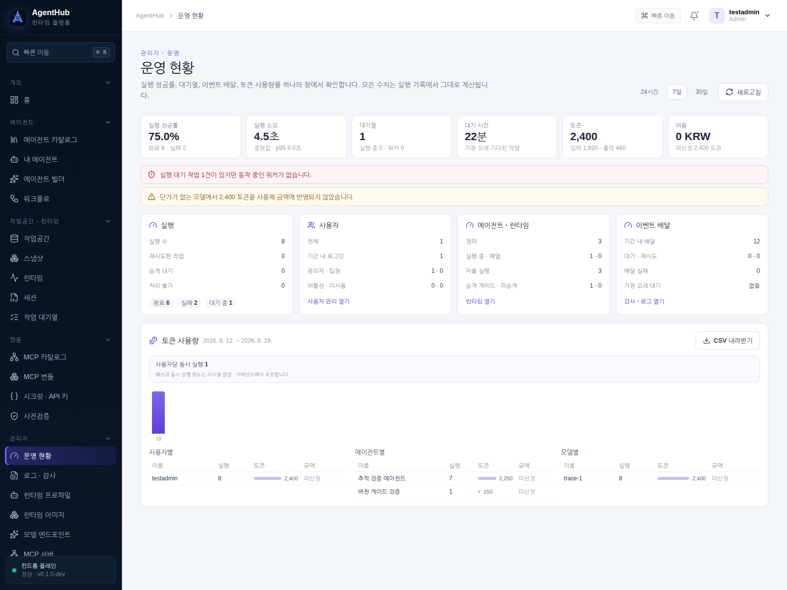

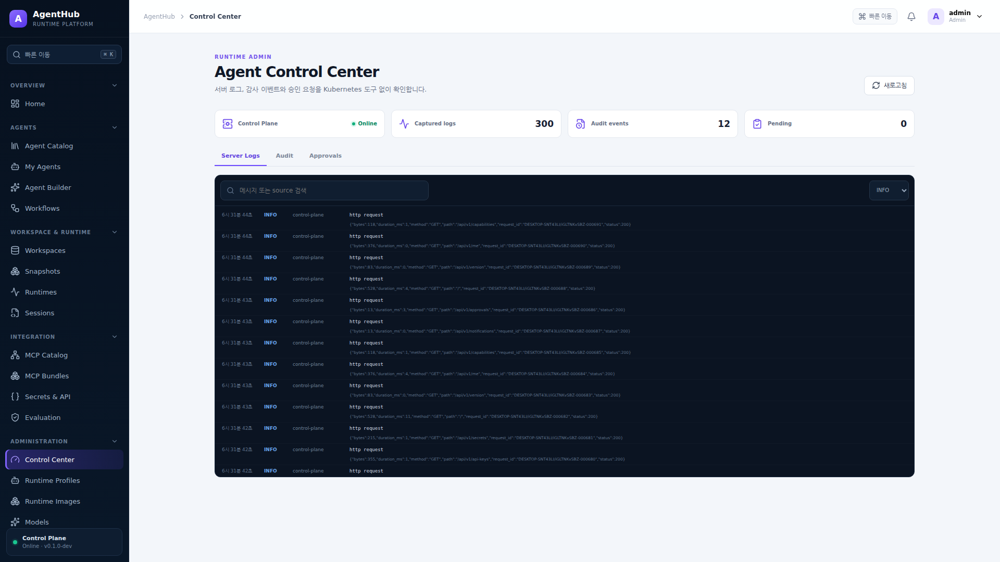

### 10.2 리소스 및 엔드포인트 관리
- **Runtime Profiles**: Pod에 할당할 CPU, Memory, GPU 스펙 정의
  - **GPU에도 Quota가 생겼습니다.** CPU·Memory·Storage에는 사용자당 한도가 있는데 GPU에는 없었습니다 — 아무것도 할당되지 않던 동안에는 제한할 것도 없었기 때문입니다. 이제 실제로 할당되므로, `시스템 설정 ▸ Governance ▸ 기본 Quota` 의 **GPU** 로 한 사람이 잡을 수 있는 카드 수를 정합니다(0은 제한 없음). 부서 총량에도 같이 적용되고, Quota 화면에도 GPU 줄이 나옵니다.
    - 한도 확인은 다른 항목과 **같은 트랜잭션 안** 에서 셉니다. 밖에서 센 숫자로 판단하면 두 사람이 동시에 "한 장 남았습니다"를 듣습니다.
  - **GPU 개수는 이제 실제로 Pod에 요청됩니다.** 프로파일에 GPU를 적으면 저장되고 CRD까지 실려 갔지만 Pod에는 아무것도 요청하지 않았습니다 — GPU가 필요한 에이전트가 CPU에서 느리게 돌면서도 **정상으로 보였습니다.** 이제 `nvidia.com/gpu` 로 요청합니다(확장 리소스는 limits에만 적고 Kubernetes가 requests로 복사합니다).
  - GPU를 0으로 둔 프로파일은 이 리소스를 아예 싣지 않습니다. GPU가 없는 클러스터에서 빈 요청은 Pod를 영원히 Pending으로 만들기 때문입니다.
  - 디바이스 플러그인이 다른 이름을 알리는 클러스터(AMD, MIG 프로파일 등)라면 그 이름으로 바꿔야 합니다. 플랫폼은 둘 사이를 넘겨짚지 않습니다.
- **Runtime Images**: 검증된 오프라인 Base 이미지 등록
- **Models**: 사내 vLLM, Ollama, OpenAI 호환 엔드포인트 등록. 카드의 **연결 확인** 을 누르면 플랫폼이 그 주소에 직접 물어보고, 무엇이 잘못됐는지를 **고칠 항목의 이름으로** 알려 줍니다.

  | 답 | 뜻 |
  | --- | --- |
  | 정상 | 응답했고, 지정한 모델도 목록에 있습니다. |
  | 모델 없음 | 엔드포인트는 살아 있지만 **지정한 모델 이름이 목록에 없습니다** — 오타는 보통 추론 시점까지 드러나지 않습니다. |
  | 인증 거절 | 주소는 맞고 API 키가 틀렸습니다. |
  | 경로 오류 | HTTP 404 — 대개 주소 끝에 `/v1` 이 빠졌거나 하나 더 붙었습니다. |
  | 연결 실패 | 주소·네트워크 경로 문제이거나 서비스가 내려가 있습니다. |

  등록만으로는 맞는지 알 수 없고, 틀렸다는 사실은 **밤중에 남의 에이전트가 실패하는 모습**으로 나타납니다. 실제로 이 플랫폼의 테스트 배포에서 어느 구간의 실패 65건 중 45건이 내려간 게이트웨이로의 동일한 연결 실패였고, 전부 작업 실패로만 보고됐습니다.
- **MCP Servers**: 전사 MCP 서버 레지스트리 관리. 카드의 **연결 확인** 은 실제로 MCP 핸드셰이크를 하고 **그 서버가 제공하는 도구 이름을 그대로 보여 줍니다** — 도구 정책의 허용·차단 목록은 이름으로 쓰는데, 지금까지 그 이름은 공급자 문서에서 옮겨 적거나 추측해야 했습니다.
  - `공유(shared)` 서버만 확인할 수 있습니다. `사이드카`·`전용` 모드는 **런타임 Pod 안에서** 실행되므로 컨트롤 플레인에서 닿을 주소가 없고, 그 사실을 실패가 아니라 *확인 불가* 로 답합니다 — 둘은 필요한 조치가 다르고, 하나만 누군가의 실수이기 때문입니다.
  - 응답은 하지만 MCP가 아닌 주소, 인증 거절, 경로 오류(대개 끝의 `/mcp` 누락)를 각각 구분해 알려 줍니다. Server-Sent Events로 답하는 서버도 그대로 읽습니다 — 절반 정도가 그렇게 답합니다.

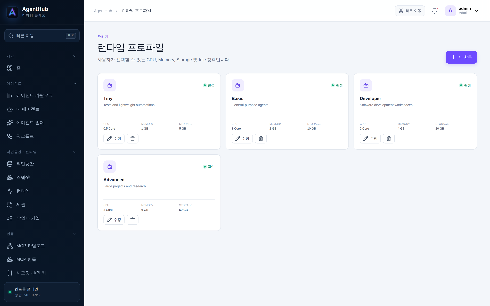

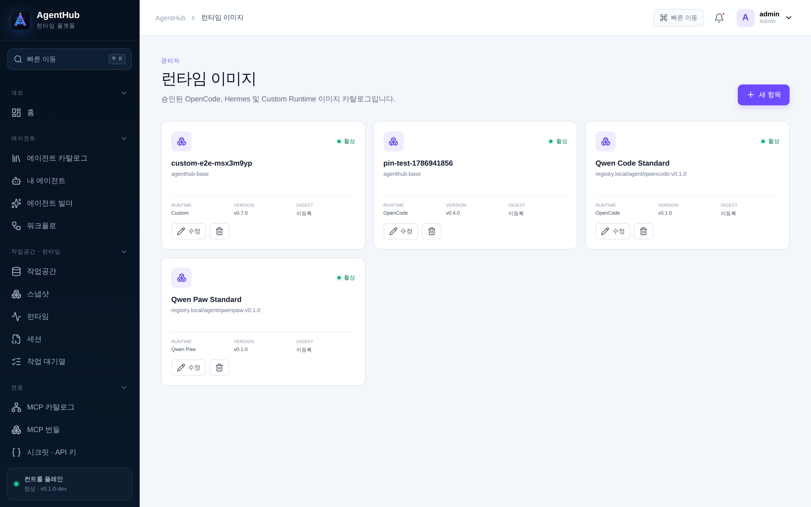

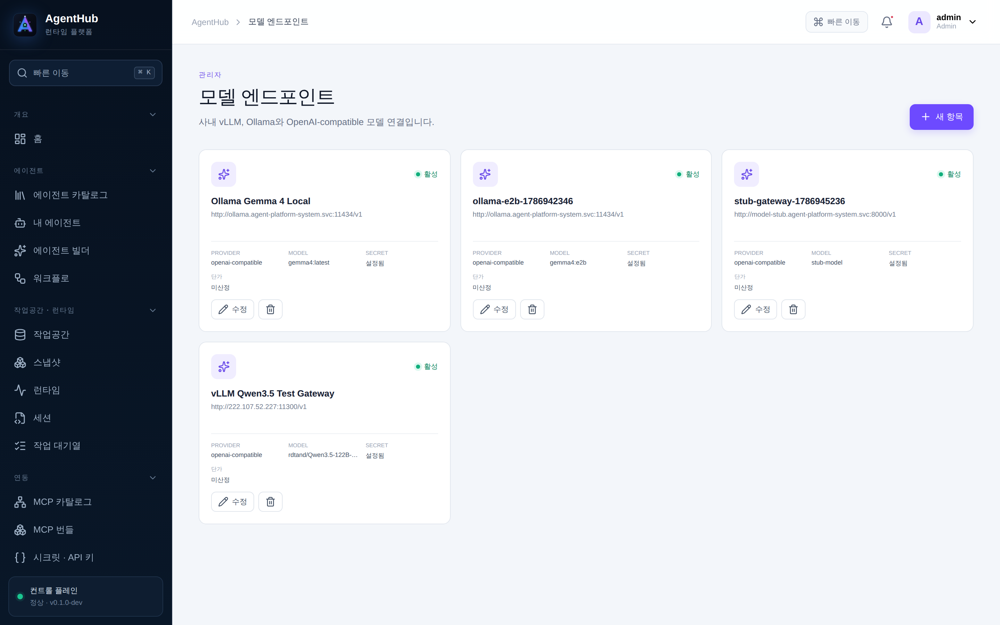

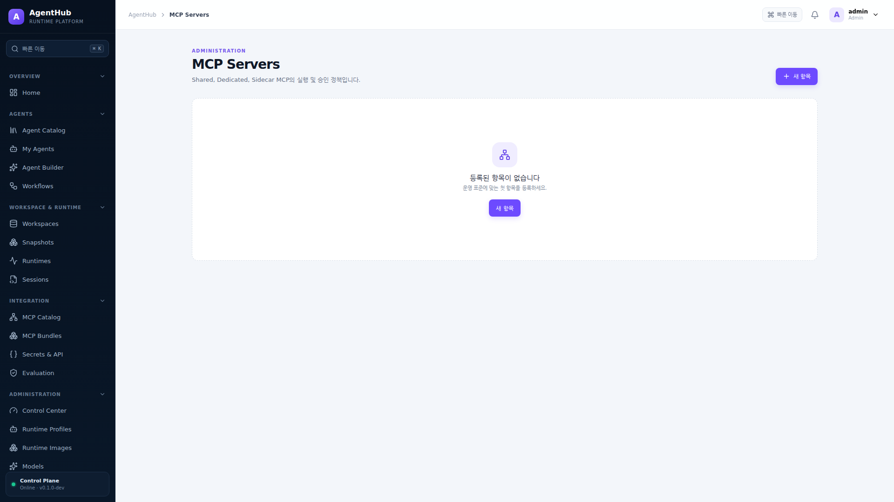

### 10.2.1 실행 기록 (모든 시도를 한 화면에서)

`실행 기록` 화면은 이 배포가 시도한 모든 실행을 한 목록으로 보여 줍니다. 이전에는 실행을 **작업 하나를 열어야** 볼 수 있었는데, 그러면 "이 작업은 어떻게 됐나"만 답할 수 있습니다. 운영하면서 실제로 생기는 질문은 대개 묶음에 대한 것입니다.

- **오늘 실패한 게 뭐지** — 상태 `실패` + 기간 `최근 1일`
- **어느 에이전트가 쓰고 있지** — 에이전트를 고르면 그 에이전트의 시도만 남습니다
- **집계 안 된 실행이 어떤 거지** — 계량 `집계 안 됨` (에이전트가 사용량을 보고하지 않은 실행)
- 관리자는 *모든 사용자* 를 켜서 배포 전체를 볼 수 있습니다. 켜야 보이는 이유는, 남의 작업을 보는 것은 명시적으로 요청해야 하는 일이기 때문입니다.

- **찾기**: 검색창에 로그에서 복사한 Trace ID, 기억나는 실패 문구, 에이전트 이름 중 아무거나 넣으면 됩니다. 도착했을 때 손에 들고 있는 것이 대개 그 셋 중 하나이기 때문입니다.

화면 위의 요약은 **지금 보고 있는 목록**을 그대로 셉니다 — 실행 수, 실패 수, 토큰 합계, 집계 안 된 실행 수, 그리고 **가장 잦은 실패 이유 세 가지**. 목록은 "많은 일이 있었다"만 말하지만, 세어 보면 하나의 고장이 반복되는지가 보입니다. 조건을 바꾸면 요약도 함께 바뀝니다.

실패한 실행에는 **다시 실행** 단추가 붙습니다. 작업 화면과 같은 선택을 묻습니다 — *처음부터* 는 지금까지 완료한 단계를 버리고 새로 시작하고, *이어서 실행* 은 완료한 단계 다음부터 계속합니다. 실패를 찾는 것이 절반이고 다시 돌리는 것이 나머지 절반이라, 찾은 자리에서 바로 할 수 있게 두었습니다.

다시 실행할 수 없는 작업은 **그 이유를 상태로 말합니다** — "이미 완료된 작업은 다시 실행할 수 없습니다", "실행 중인 작업은 다시 실행할 수 없습니다" 처럼요. 예전에는 이런 경우도 "찾을 수 없습니다" 로 답해서, 작업이 사라진 줄 알기 쉬웠습니다.

행을 누르면 작업 화면에서 열리는 것과 **같은 실행 상세** 가 열립니다 — 단계, 타임라인, 산출물, 완료 판정, 그리고 토큰 옆의 계량 출처까지 그대로입니다.

### 10.3 Runtime 공통 환경 (파일 · 환경변수)
*System Settings ▸ Runtime Environment* 에서 **모든 Runtime Pod에 공통으로 들어갈 파일과 환경변수**를 한 번만 정의합니다. 사내 PyPI 미러(`/etc/pip.conf`), conda 채널(`/home/agent/.condarc`), npm 레지스트리(`/etc/npmrc`), 프록시 주소처럼 에이전트마다 반복할 필요가 없는 설정이 대상입니다.

- **파일**: 절대경로, 권한(기본 `0644`), 내용을 입력하면 Pod의 모든 컨테이너에 같은 경로로 **읽기 전용 마운트**됩니다. 자주 쓰는 예시는 버튼 한 번으로 추가할 수 있습니다.
- **환경변수**: `PIP_INDEX_URL`, `HTTPS_PROXY`, `NO_PROXY` 처럼 컨테이너 전체가 공유해야 하는 값을 넣습니다.
- **사용 토글**: 항목을 지우지 않고 잠시 끌 수 있습니다. 저장 후 **다음 Runtime 시작 또는 재시작** 시점에 반영되며, 이미 실행 중인 Runtime은 Pod가 교체될 때 적용됩니다.
- **저장하면 즉시 반영됩니다**: 실행 중인 Runtime의 정의를 다시 써서 바로 적용하고, 내용이 실제로 바뀐 Pod만 새 설정으로 재시작합니다. 중지된 Runtime은 다음 시작 때 적용됩니다. 저장 후 화면에 "런타임 N개에 적용했습니다"처럼 결과가 표시됩니다.
- **"CRD가 오래되었습니다" 라고 나오면**: 클러스터의 `AgentRuntime` 정의가 컨트롤 플레인보다 낮은 버전이라 Kubernetes가 이 설정을 조용히 버리고 있는 상태입니다. `kubectl apply -k deploy/kubernetes` 로 매니페스트를 다시 적용한 뒤 저장하세요. (이미지만 교체하고 매니페스트를 적용하지 않은 업그레이드에서 발생합니다.)
- **비밀값은 넣지 않습니다**: 내용은 ConfigMap으로 전달되므로 토큰·비밀번호는 개인 Secret이나 MCP Credential로 관리하세요. `/etc/agenthub`, `/usr/local/bin`, `HOME`, `PATH`, `OPENAI_*`, `AGENTHUB_*` 등 플랫폼이 쓰는 경로와 변수는 저장 단계에서 거부됩니다.

Runtime 이미지에는 `python`·`pip`(`/opt/agenthub/venv`)과 `conda`·`mamba`(`/opt/conda`)가 기본 포함되어 있고, ruff·pytest·httpx·pandas·openai 같은 코딩 에이전트가 바로 찾는 라이브러리와 typescript·tsx·prettier·pnpm이 함께 설치되어 있습니다. conda 환경과 pip/npm 캐시는 `/home/agent` 볼륨에 생성되므로 Pod가 재시작되어도 유지됩니다. 읽기 전용 루트 파일시스템 프로파일에서는 `python -m venv ~/.venvs/작업이름` 이나 `conda create -n 작업이름` 처럼 홈 또는 작업공간 안에 환경을 만들어 사용하세요.

### 10.4 Quota — 플랫폼 기본 · 부서 · 개인

한도는 세 층으로 정해지고, **항목별로** 아래층이 위층을 덮습니다. 비워 둔(0인) 항목은 위층 값을 그대로 물려받으므로, 부서가 Runtime 수만 정하면 CPU·Memory는 플랫폼 기본값을 계속 따릅니다.

| 층 | 어디서 정하나 | 누구에게 적용되나 |
| --- | --- | --- |
| 플랫폼 기본 | *System Settings ▸ Governance ▸ 기본 Quota* | 모든 사용자 |
| 부서 | *관리자 ▸ 부서 · 개인 Quota ▸ 부서* | 그 부서에 속한 사람 한 명마다 |
| 개인 예외 | *관리자 ▸ 부서 · 개인 Quota ▸ 개인* | 그 사람에게만 |

**부서에는 한도가 둘입니다.** *구성원 1인 기본* 은 부서원 한 사람에게 적용되고, *부서 총량* 은 부서원 전체가 함께 쓰는 상한입니다. 한 사람이 자기 한도 안에 있어도 부서 총량이 차 있으면 새 Runtime을 시작할 수 없고, 거절 메시지가 **어느 쪽 한도인지** 를 밝힙니다.

```
사용자 Runtime Quota(2개)를 초과합니다     ← 내 한도  (개인 예외 또는 부서 1인 기본)
부서 Runtime Quota(2개)를 초과합니다       ← 부서 총량 (동료가 쓰고 있음)
```

**부서 총량은 자원뿐 아니라 실행에도 걸립니다.** 총량에 *동시 실행 작업* · *토큰 예산* · *비용 예산* 을 넣으면 부서원 전체의 합계로 판단합니다(최근 30일). 자기 예산이 남아 있어도 부서 예산이 바닥나면 작업이 거절되고, 이때도 메시지가 어느 쪽인지 밝힙니다.

```
사용자 토큰 예산(50)을 모두 사용했습니다. 최근 사용량 11,490 토큰.
부서 토큰 예산(100)을 모두 사용했습니다. 최근 사용량 11,490 토큰.
```

부서가 총량의 80%를 넘기면 *관리자 ▸ 운영 현황* 의 알림 목록에 "부서가 Storage 총량의 83%를 쓰고 있습니다 (10 / 12)" 처럼 표시되고, 100%를 넘기면 경고 등급이 올라갑니다. 부서 화면의 막대와 같은 숫자지만, 누군가 거절당한 뒤가 아니라 그 전에 눈에 띄도록 관리자가 이미 열어 두는 화면에 함께 올립니다.

부서원은 `작업 대기열` 화면 상단에서 자기 예산과 **부서 예산을 함께** 봅니다. 화면에 보여 준 적 없는 한도로 거절하면 이유를 알 수 없기 때문입니다. 동시 실행 한도는 부서에서도 **대기** 이고(동료의 작업이 끝나면 이어서 실행), 예산 초과는 **실패** 입니다. 대기 중인 작업은 목록에서 *대기 사유* 로 따로 표시되며, 실패 메시지와 색도 자리도 다릅니다 — 기다리는 중인 작업이 실패한 것처럼 보이지 않도록, 그리고 한 번 실패한 뒤 재시도가 대기에 걸려도 **실패 메시지가 지워지지 않도록** 두 값을 따로 보관합니다.

같은 이름의 부서는 두 번 만들 수 없습니다. 부서 id는 이름에서 만들어지므로 `플랫폼 팀` 과 `플랫폼-팀` 은 같은 id가 되는데, 그대로 두면 나중에 만든 쪽이 먼저 만든 부서의 한도를 조용히 덮어쓰게 됩니다. 이름을 바꾸거나 기존 부서를 수정하세요.

- **어느 층이 정한 값인지 봅니다**: 개인 Quota 편집 화면 아래 *실제 적용되는 한도* 표에 항목마다 적용값·출처(개인 예외 / 부서 / 플랫폼 기본)·현재 사용량이 함께 나옵니다. 숫자만으로는 무엇을 고쳐야 할지 알 수 없어서, 고칠 곳을 틀리면 저장은 되지만 아무것도 바뀌지 않습니다.
- **사용자는 자기 한도를 스스로 봅니다**: 홈 화면의 *내 한도* 패널에 사용량 막대와 출처가 표시되고, 부서 총량이 있으면 함께 안내합니다. 한도가 걸린 항목이 하나도 없으면 패널 자체가 나오지 않습니다.
- **부서를 지우면** 구성원은 플랫폼 기본 Quota로 돌아갑니다. 실행 중인 Runtime은 그대로 두고, 다음 시작부터 새 한도가 적용됩니다.
- **개인 예외를 모두 비우고 저장하면** 예외가 삭제되고 부서·플랫폼 설정을 다시 따릅니다. 예외에는 메모를 남길 수 있으니 재검토 시점을 함께 적어 두세요.
- 부서 배정은 *관리자 ▸ 부서 · 개인 Quota ▸ 개인* 에서 사람마다 지정합니다. 부서에 속하지 않은 사람은 플랫폼 기본값만 적용됩니다.
- **자동으로 시작되는 런타임도 같은 잠금을 지납니다.** 작업이 실행하려고 확보하는 것과 예약 전에 미리 띄우는 것 — 사람이 버튼을 누르지 않는 두 경로도 이제 한도를 *물어보고 나서 쓰는* 대신 잡은 채로 씁니다. 사이에 한도가 찼다면 실패가 아니라 대기입니다(다른 런타임이 멈추면 풀립니다).
- **동시 실행 한도는 원래부터 이렇게 돼 있었습니다.** 소유자·부서마다 자문 잠금을 잡고 그 안에서 세고 결정합니다 — 나머지 세 가지를 여기에 맞춘 것입니다.
- **런타임 한도도 마찬가지입니다.** 시작 요청 여섯 개를 동시에 넣고 잠금을 빼 보면 그중 넷이 *마지막 한 자리* 를 가져가, 한도 1개짜리 계정이 4개를 돌리고 있었습니다. 새로 만드는 경로와 멈춰 둔 런타임을 다시 켜는 경로, 콘솔·REST·MCP 모두 같은 잠금을 씁니다.
- **저장소 한도는 세어 보고 나서 쓰는 것이 아니라 한 번에 차지합니다.** 예전에는 한도를 *읽고* 나서 작업공간을 *만들었기 때문에*, 동시에 들어온 요청이 각자 "아직 자리가 있다"를 읽고 둘 다 마지막 자리를 가져갈 수 있었습니다. 실제 데이터베이스에서 확인했습니다 — 잠금을 빼면 여섯 개 요청이 모두 마지막 5GB를 가져가 한도 15GB짜리 계정이 40GB를 들고 있었습니다. 지금은 소유자(부서가 있으면 부서까지) 행을 잠근 채 세고 만들기 때문에 하나만 통과합니다. 스냅샷 복원도 같은 경로를 씁니다.
- **한도가 거절한 것과 확인하지 못한 것을 구분합니다.** 저장소 거절만 다른 종류의 오류로 돌아와서, 호출하는 쪽에서 *한도에 걸림* 이 아니라 *내부 오류* 로 처리되고 있었습니다 — 같은 한도인데 어느 항목에 걸리느냐에 따라 사람이 보는 화면이 달랐습니다.

아래 **실행 Quota**(동시 실행·토큰·비용)도 같은 세 층을 따릅니다. 부서나 개인에 값을 넣으면 그 사람의 자율 실행 한도가 그 값으로 바뀝니다.

### 10.4.1 실행 Quota (동시 실행 · 비용)
*System Settings ▸ Governance ▸ 실행 Quota* 에서 자율 실행이 쓰는 자원과 비용을 제한합니다. 모두 **0이면 제한 없음** 입니다.

- **사용자당 동시 실행 작업**: 한 사용자의 작업이 동시에 몇 개까지 실행될지 정합니다. 한도에 걸린 작업은 **대기**하며, 재시도 횟수를 쓰지 않고 앞선 작업이 끝나면 실행됩니다.
- **사용자당 토큰·비용 예산 (최근 30일)**: 예산을 모두 쓰면 새 작업은 **실패**로 기록되고 소유자에게 알림이 갑니다. 며칠 뒤에야 풀리는 한도를 기다리며 워커 자리를 잡고 있지 않기 위해서입니다. 이미 예산을 초과한 상태에서 작업을 만들면 API가 429로 즉시 거절합니다.
- **작업공간 용량을 늘리면 기존 볼륨도 늘립니다.** 런타임 프로파일이나 작업공간의 Storage 값을 키우면 다음 조정 때 기존 PVC의 요청 용량을 함께 올립니다. 예전에는 이미 만들어진 볼륨은 손대지 않아서, 숫자만 바뀌고 공간은 그대로였습니다. 단 **줄이지는 않습니다** — Kubernetes가 볼륨 축소를 허용하지 않으므로 더 작은 값은 적용되지 않고 로그에 남습니다. 스토리지 클래스가 확장을 지원하지 않는 클러스터에서는 클러스터가 준 사유가 그대로 로그에 남고, 런타임은 기존 볼륨으로 계속 동작합니다(`allowVolumeExpansion: true` 인 스토리지 클래스가 필요합니다).
- **시작되지 못한 Runtime은 한도를 돌려줍니다.** Runtime 기록은 프로파일을 알기 전에 만들어지고, 만들어지는 순간부터 *실행 중* 으로 세어집니다. 그래서 예열이 한도·정책에 막히거나 시작에 실패하면, Pod는 없는데 소유자 한도만 잡고 있는 행이 남았습니다 — 게다가 예열 홀드를 풀어 버리기 때문에 **냉각 대상에서도 빠져** 아무도 그걸 멈추지 못했습니다. 지금은 포기하는 모든 경로가 상태까지 되돌립니다. 단, **실제로 떠 있는 Runtime은 건드리지 않습니다** — 그건 누군가 쓰고 있는 것입니다.
- **예열(Warm-up)도 Runtime 시작입니다.** 예약 실행 전에 미리 띄우는 것도 소유자의 **Runtime Quota** 와 **플랫폼 정책(runtime.start)** 을 확인한 뒤에만 시작합니다. 쿼터에 걸리면 이번 주기를 건너뛰고 다음 주기에 다시 시도하며(트리거 발화까지 아직 시간이 있습니다), 정책에 막히면 콘솔에서 막힌 것과 같은 자리에 감사 기록이 남습니다. 예전에는 이 경로만 아무것도 확인하지 않아서, 예약에 예열을 붙이면 Runtime 한도를 넘겨 들고 있을 수 있었습니다.
- **Idle Timeout**: 아무 활동 없이 이 시간이 지나면 Runtime이 **자동으로 중지**됩니다. 값은 보통 *관리자 ▸ 런타임 프로파일* 에서 프로파일마다 정하고(Tiny 30분, Basic·Developer 1시간, Advanced 2시간), Governance의 값은 **프로파일이 없는 에이전트에만** 적용되는 바닥값입니다. 프로파일에 0을 넣으면 그 프로파일을 쓰는 Runtime은 자동 중지되지 않습니다.
  - Warm Pool의 **냉각** 도 같은 질문을 합니다 — 유지 시간이 끝났어도 사람에게 인계된 작업이 남아 있거나 사람이 세션을 쓰고 있으면 중지하지 않습니다.
  - *작업 완료 후 Runtime 중지* 도 같습니다 — 작업이 그 Runtime을 직접 시작했더라도, **같은 에이전트의 다른 작업이 아직 돌고 있거나** 최근 15분 안에 **사람이 세션을 쓴 흔적** 이 있으면 중지하지 않고 실행 기록에 사유를 남깁니다.
  - **작업이 돌고 있는 Runtime은 중지하지 않습니다.** 에이전트가 그 Runtime에서 일하는 동안에는 단계마다 활동 시각이 갱신되고, 실행 중(`running`·`waiting_tool`)이거나 **사람에게 인계된(`handoff`)** 작업이 있는 Runtime은 유휴 시간이 지나도 후보에서 빠집니다 — 인계된 작업은 바로 그 Runtime을 열어서 마무리해야 하기 때문입니다.
- **에이전트별 토큰 예산**: 에이전트 상세의 *목표 ▸ 실행 한도* 에서 지정합니다. 수렴하지 못하는 에이전트 하나 때문에 사용자의 다른 작업까지 멈추지 않게 합니다.
- **토큰을 누가 셌는지 함께 표시합니다.** 토큰 0은 두 가지 뜻이 될 수 있습니다 — 플랫폼이 모델을 부르지 않았거나, 에이전트가 자기 프로세스에서 일하고 사용량을 알려주지 않았거나. 둘은 필요한 조치가 다르므로 실행 상세에서 숫자 옆에 출처를 함께 보여 줍니다.

  | 표시 | 뜻 |
  | --- | --- |
  | 플랫폼 집계 | 모델 호출이 모두 플랫폼 게이트웨이를 지나 빠짐없이 집계됨 |
  | 에이전트 보고 | 에이전트가 스스로 보고한 사용량을 그대로 기록함 |
  | 컨텍스트만 | 컨텍스트 사용률만 알려주고 실제 소비량은 알려주지 않음 |
  | 집계 안 됨 | 에이전트가 아무것도 알려주지 않음 — 이 실행의 실제 소비량은 어떤 합계에도 없음 |

  사용량 패널과 관리자 운영 현황에는 "실행 N건 중 M건은 집계되지 않았습니다" 가 함께 표시되고, **에이전트별 표의 `집계 안 됨` 칸** 이 어느 에이전트가 조용한지 알려줍니다. 실행 기록을 하나씩 열어 보지 않아도 되도록, 그리고 0으로 늘어선 줄이 "안 썼다" 인지 "말을 안 했다" 인지 구분되도록 하기 위해서입니다. 사용량 단계를 하나도 남기지 않은 에이전트는 원래 표에 아예 나오지 않았는데, 이제 0과 함께 줄이 추가됩니다.

  합계는 자기가 못 본 부분을 밝혀야 근거가 되기 때문입니다. 이 기능이 생기기 전에 끝난 실행은 표시가 비어 있습니다 — 지난 기록을 추측으로 채우지 않습니다.
- 사용량과 남은 예산은 `작업 대기열` 화면의 *최근 30일 토큰 사용량* 패널 상단에 함께 표시됩니다. 단가가 없는 모델의 토큰은 비용에 잡히지 않으므로 토큰 예산을 함께 설정하는 편이 안전합니다.

### 10.5 분산 추적 (Observability)
*System Settings ▸ Observability* 에서 OTLP Collector 주소를 넣으면 API와 워커가 OpenTelemetry Trace를 내보냅니다.

- **무엇이 보이나**: 작업 시도 하나가 `task.execute` 스팬 하나이고, 그 아래에 추론 단계(`agent.step`, 단계별 토큰), 완료 판정(`task.evaluate`), 런타임 확보(`runtime.acquire`)가 붙습니다. 워크플로는 `workflow.run` 과 단계별 `workflow.step` 으로 남고, API는 요청당 한 스팬을 라우트 패턴 이름으로 남깁니다.
- **로그·화면과 연결**: 추적이 켜져 있으면 실행 기록과 로그에 표시되는 Trace ID가 수집기의 Trace ID와 같은 값이므로, 화면에서 본 실행을 수집기에서 바로 찾을 수 있습니다. 꺼져 있으면 기존 `task-…` 형식으로 유지됩니다.
- **비용**: 주소를 비워 두면 추적은 완전히 꺼지고 스팬을 만들지도 버퍼에 쌓지도 않습니다. 수집기가 없는 폐쇄망에서 이 기능 때문에 드는 비용은 없습니다.
- **적용 시점**: 설정은 시작할 때 읽으므로 API와 워커를 재시작해야 반영됩니다. 수집기 주소가 잘못돼도 서비스는 그대로 뜨고 추적만 꺼진 채 로그에 이유가 남습니다.
- 환경변수 `AGENTHUB_OTLP_ENDPOINT` 로도 설정할 수 있으며, 화면에서 켠 설정이 우선합니다.

### 10.6 운영 현황 (관리자)

**배포 점검** 은 이 배포가 기대고 있는 것들에게 *지금* 동작하는지 한꺼번에 물어봅니다 — 클러스터, SSO(켜 둔 경우), 사용 중인 모델 엔드포인트 전부, **등록된 에이전트 서버 전부**, 공유 MCP 서버 전부, **실행 중인 워커**, 그리고 **예약 실행이 제때 돌고 있는지**. 각각은 설정한 화면에서도 확인할 수 있지만, 그 화면은 **하나를 고치기에 좋은 곳이지 셋이 고장 났다는 걸 알아채기 좋은 곳은 아닙니다.**

- 문제가 있는 항목은 **어디서 고치는지** 로 바로 연결됩니다.
- **의존성이 새로 생기면 이 목록도 같이 늘어납니다.** 실행 백엔드가 하나 늘었는데 "지금 뭐가 고장 났나" 를 답하는 화면이 그걸 모르는 일이 실제로 있었습니다 — 사라진 에이전트 서버 풀이 *아직 아무도 안 쓴 풀* 과 똑같아 보였습니다. 지금은 등록해서 쓰는 의존성 종류가 늘 때 이 화면이 묻지 않으면 빌드가 실패합니다.
- **예약이 밀려 있으면 알려 줍니다.** 트리거 하나가 밀린 것은 아무도 만족시킬 수 없는 표현식이지만, **전부 한꺼번에** 밀렸다면 스케줄러가 도는 워커가 없다는 뜻입니다. 화면상으로는 조용한 한 주와 똑같아 보입니다 — 콘솔은 답하고, 에이전트도 그대로 있고, 아무 일도 일어나지 않습니다. 워커가 없는 것과 같은 종류의 침묵이라 같은 자리에 적습니다.
- **없는 것도 문제로 셉니다.** 하나씩 물어보는 목록은 "아예 없다"를 말할 수 없는데, 그게 바로 새 배포의 상태입니다. 모델 엔드포인트가 하나도 켜져 있지 않으면(에이전트가 모델을 부르는 순간 모든 작업이 실패합니다), 워커가 한 대도 돌고 있지 않으면(작업이 큐에 쌓이기만 합니다), 실행이 일시 중지돼 있으면 그 사유와 함께 목록에 남습니다.
- **클러스터의 AgentRuntime 정의가 이 빌드보다 오래됐으면 알려 줍니다.** 컨트롤 플레인을 올려도 클러스터에 설치된 정의는 따라 올라가지 않습니다. 그래서 새 런타임 유형은 콘솔에도 나오고, DB에도 저장되고, 이미지도 승인할 수 있는데 — **만들려는 순간 Kubernetes가 거절합니다.** 실제로 그렇게 만났습니다: `openhands` 에이전트를 만들고 시작했더니 `Unsupported value: "openhands"` 였습니다. 이제 어떤 유형이 거절되는지 이름으로 알려 주고, `deploy/kubernetes/crd.yaml` 을 다시 적용하라고 말합니다.
  - 정의를 읽을 권한이 없으면 **아무 말도 하지 않습니다.** 클러스터 범위 객체를 읽는 권한은 주지 않는 배포가 많고, "못 봤다"를 "당신 클러스터가 낡았다"로 바꿔 말하면 멀쩡한 것을 고치러 가게 됩니다. 그래서 `agentruntimes.agenthub.io` 한 개에 대한 읽기 권한이 RBAC에 들어 있습니다 — 없으면 이 점검은 영원히 침묵하므로, 권한은 기능의 일부입니다.
- **어느 목적지도 허용하지 않는 네트워크 프로파일은 그렇게 말합니다.** Pod 안에서 도는 실행 방식(`cli`·`acp`·`rpc`·`flow`·`orca`·`review`·`investigate`)은 **런타임이 직접** 모델 게이트웨이를 부릅니다. 기본 `Restricted` 프로파일은 DNS 말고는 아무 데도 못 나가게 막으므로, 그 상태로는 에이전트가 **고장 난 것처럼** 실패합니다 — 실제 클러스터에서 확인했습니다: NetworkPolicy에 53번 포트 하나만 열려 있었고 런타임은 밖으로 한 발도 못 나갔습니다. 이제 실행 방식 옆에 그 사실과 고칠 화면이 함께 적힙니다.
  - 목적지를 허용하는 프로파일이 **하나라도** 있으면 아무 말도 하지 않습니다. 어느 프로파일을 쓸지는 에이전트가 정하는 것이라, 멀쩡한 설정 옆에 경고를 붙이는 셈이 되기 때문입니다.
  - 추론(prose)에는 붙지 않습니다. 그 방식은 워커가 모델을 부르므로 런타임의 나가는 길과 무관합니다.
- **정상으로 세는 답은 실제로 확인된 것뿐입니다.** "확인 불가"는 정상이 아니라 목록에 남습니다 — 확인하지 못한 의존성은 동작하는 의존성이 아니기 때문입니다.
- 화면을 열 때 자동으로 돌지 않고 **버튼을 눌러야** 실행됩니다. 한 줄 한 줄이 남의 서비스로 나가는 요청이라, 열 때마다 조용히 다섯 군데를 찔러 보는 화면은 결국 남의 장애까지 뒤집어씁니다.

*관리자 ▸ 운영 현황* 은 배포 전체를 한 화면에서 봅니다. 24시간 · 7일 · 30일 기간을 고를 수 있고, 모든 수치는 실행 기록에서 그대로 계산되므로 상세 화면과 항상 일치합니다.

- **상단 지표**: 실행 성공률, 실행 소요(중앙값 · p95), 대기열 깊이와 워커 수, 가장 오래 기다린 작업, 토큰과 비용.
- **조치가 필요한 항목**: 승격 대기 작업, 재시도를 소진한 작업, 미승격 상태로 게이트에 걸린 에이전트, 배달 실패 이벤트, 워커 없이 쌓인 대기열, 실패한 런타임, 단가가 없어 금액에 잡히지 않은 토큰 — 각각 처리할 화면으로 바로 이동합니다.
- **분해**: 사용자별 · 에이전트별 · 모델별 토큰과 금액, 일자별 막대. **CSV 내려받기** 로 정산용 파일을 받을 수 있습니다(Excel에서 한글이 깨지지 않도록 BOM이 포함됩니다).

### 10.7 로그 · 감사 (관리자)
*관리자 ▸ 로그 · 감사* 에서 서버 로그, 감사 이벤트, 승인 대기를 확인합니다. 감사 로그는 **수행자(이름 일부)** · **동작** · **결과** · **기간** 으로 검색하고 페이지 단위로 넘기며, 조건을 그대로 적용한 **CSV 내려받기** 를 제공합니다. 내려받기 자체도 감사 기록에 남습니다.

> **내려받기는 조건에 맞는 기록을 전부 담습니다.** 예전에는 100건에서 조용히 멈췄습니다 — 1,900건짜리 감사 추적을 받아도 파일에는 100줄만 들어 있었고, 파일 어디에도 그런 말이 없었습니다. 지금은 전부 담고, 한 번에 담을 수 없을 만큼 많으면 **파일 마지막 줄에 몇 건에서 잘렸는지와 전체가 몇 건인지** 를 적습니다. 그 사실은 내려받기 감사 기록에도 `complete` 로 남습니다. 정산용 사용량 CSV도 같습니다 — 상위 200건이 아니라 기간에 해당하는 전체를 담습니다.

> **실행 방식에도 같은 표시가 붙습니다.** 아홉 가지가 똑같이 제시되지만, 이 배포에서 실제로 완료된 적이 있는지는 다른 문제입니다. 목표 설정의 *자동 실행이 하는 일* 옆에 표시됩니다.
>
> | 표시 | 뜻 |
> | --- | --- |
> | 이 배포에서 확인됨 | 이 방식으로 완료된 작업이 있습니다 |
> | 완료된 적 없음 | 실행은 됐지만 완료된 적이 없습니다 — 마지막 오류가 함께 표시됩니다 |
> | (표시 없음) | 이 방식으로 해 본 적이 없습니다 |
>
> 실행 기록이 어느 방식이었는지를 따로 저장하지는 않습니다 — **그 방식이 남긴 단계의 종류** 로 판단합니다. 그래서 기록을 남기지 않은 방식은 경험을 주장할 수 없습니다.

> **카탈로그에서 런타임 유형마다 "이 배포에서 실제로 어땠는지" 가 함께 보입니다.** 열다섯 가지가 똑같이 준비된 것처럼 보이지만, 그건 전부 설정해 둔 배포에서나 참입니다 — 이미지를 안 올렸거나 클러스터가 없으면 고른 뒤 시작을 눌러야 알게 됩니다. 플랫폼은 답을 갖고 있었고 합쳐 놓지 않았을 뿐입니다.
>
> | 표시 | 뜻 |
> | --- | --- |
> | 이 배포에서 확인됨 | 이 유형의 런타임이 여기서 실제로 실행된 적이 있습니다 |
> | 만들어졌지만 실행된 적 없음 | 만들어졌지만 뜬 적은 없습니다 — **실패한 것은 아닙니다** |
> | 마지막 시도 실패 | 마지막 시도가 실패했고, 런타임이 말한 이유가 함께 표시됩니다 |
> | (표시 없음) | 여기서 해 본 적이 없습니다 — 경고가 아니라 근거가 없다는 뜻입니다 |
>
> **지난 일에 대한 표시입니다.** "확인됨" 이 다음에도 된다는 약속은 아닙니다 — 그 사이 클러스터가 바뀌었을 수 있습니다.

> **"준비 필요" 는 무엇을 하면 되는지까지 말합니다.** 지난 일에 대한 표시는 "여기서 된 적이 없다" 에서 멈추는데, 운영자의 질문은 거기서 시작합니다 — 열다섯 가지 중 어느 것이 **이미지 하나만 승인하면 되는 것** 이고 어느 것이 클러스터부터 필요한 것인가. 그래서 이 배포가 실제로 갖고 있는 것을 확인해 부족한 것을 함께 보여 줍니다.
>
> | 부족한 것 | 어디서 |
> | --- | --- |
> | 이 유형으로 승인된 런타임 이미지가 없음 | 관리자 ▸ 리소스 ▸ 런타임 이미지 |
> | Model Endpoint가 없음 / 확인된 적 없음 / 확인된 것이 전부 실패 | 관리자 ▸ 리소스 ▸ 모델 엔드포인트 ▸ 연결 확인 |
> | Kubernetes 연결이 꺼져 있음 / 확인된 적 없음 / 마지막 확인 실패 | 관리자 ▸ 설정 ▸ Kubernetes ▸ 연결 확인 |
> | 맡길 외부 앱이 없음 (외부 앱 실행) | 관리자 ▸ 리소스 ▸ 외부 앱 |
> | 등록된 에이전트 서버가 없음 (에이전트 서버) | 관리자 ▸ 에이전트 서버 |
>
> - **부족한 것이 없으면 아무 말도 하지 않습니다.** 모든 항목 옆에 "괜찮습니다" 를 붙이면 정작 손봐야 할 한둘이 묻히기 때문입니다.
> - **"등록돼 있지 않다" 와 "확인해 보지 않았다" 는 구분합니다.** 앞은 기계를 등록하라는 뜻이고 뒤는 버튼을 누르라는 뜻입니다.
> - **런타임 안에서 도는 실행 방식** 에는 *어느 런타임 이미지* 를 승인하면 되는지 이름을 적어 줍니다. 반대로 **에이전트 서버 실행** 은 여기서 Pod를 띄우지 않으므로 Kubernetes를 고치라고 하지 않습니다 — 사실이 아니기 때문입니다.
> - **커스텀 런타임에는 이미지를 승인하라고 하지 않습니다.** 만들 때 이미지를 직접 적는 유형이라 관리자가 미리 승인해 둘 것이 없습니다.
> - **클러스터에 대해서는 설정이 아니라 마지막 확인 결과가 말합니다.** 설정이 켜져 있다는 것과 클러스터가 응답한다는 것은 다른 사실입니다 — *켜져 있지만 아무도 확인해 본 적 없음* 이 흔한 상태이고, 바로 그때 사람이 애초에 뜰 수 없던 런타임을 붙잡고 디버깅합니다. 그래서 세 가지를 구분합니다: 꺼져 있음 / **아직 확인해 본 적 없음** / 마지막 확인에서 연결되지 않음(클러스터가 말한 이유를 그대로 적습니다). 연결은 되는데 권한이 없으면 **어떤 동작** 이 거부됐는지까지 적습니다 — 그러면 런타임이 만들어지고 뜨지 않는데, 그건 런타임 잘못처럼 보이기 때문입니다.
> - *관리자 ▸ 설정 ▸ Kubernetes* 를 열면 **버튼을 누르기 전에** 마지막 확인 결과와 시각이 보입니다.
> - **모델 엔드포인트도 마찬가지입니다.** 등록돼 있다는 것과 응답한다는 것은 다른 사실이고, 확인 결과는 이제 **저장돼서** 화면을 새로 고쳐도 남습니다. 5분마다 다시 확인하므로 지난주에 바뀐 키와 오늘 아침에 확인한 엔드포인트가 같아 보이지 않습니다 — 물어보는 것은 모델 *목록* 이라 토큰을 쓰지 않습니다.
> - **"주소는 응답하는데 지정한 모델이 없다" 는 정상이 아닙니다.** 연결만 확인하는 점검은 이걸 놓치는데, 그러면 모든 작업이 첫 호출에서 실패합니다. 그래서 *정상* 으로 세지 않고 어떤 모델이 없는지 그대로 적습니다.
> - **꺼 둔 엔드포인트는 아예 세지 않습니다.** 운영자가 일부러 끈 것을 고장으로 세면 멀쩡한 배포가 아파 보입니다.
> - **바뀌면 알려 줍니다.** 이 확인들은 이제 알아서 돌기 때문에, 결과가 바뀌는 순간을 플랫폼이 알고 있습니다 — 물어볼 때까지 기다리지 않고 **관리자에게 알림** 을 보냅니다. 오후 두 시에 멈춘 엔드포인트를 새벽 두 시에 *작업 실패* 로 알게 되는 일을 줄이기 위해서입니다.
>   - **복구도 알려 줍니다.** 고장만 알리는 시스템은 이미 스스로 나은 문제를 계속 쫓게 만듭니다. 다만 *처음 확인해서 정상이었다* 는 복구가 아니므로 알리지 않습니다 — 닫을 것이 없는 알림은 다음 알림을 무시하게 만듭니다.
>   - **워커가 여러 대여도 한 번만 옵니다.** 모든 워커가 같은 순간에 같은 고장을 발견하지만, 상태를 실제로 바꾼 한 번만 알림이 됩니다 — 값 비교를 쓰기와 같은 문장 안에서 하기 때문입니다.

*관리자 ▸ 사용자 · 팀* 목록에는 계정별 에이전트 수, 최근 30일 작업 수와 실패 수, 토큰 사용량이 함께 표시되어 어떤 계정이 실제로 쓰이고 있는지 바로 확인할 수 있습니다.

### 10.8 정책 (Policy as Code)
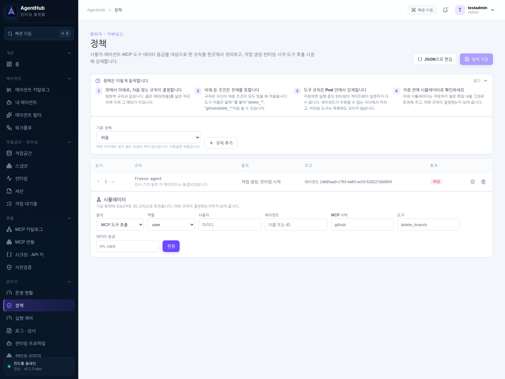

*관리자 ▸ 정책* 에서 사용자·에이전트·MCP 도구·데이터 등급을 대상으로 한 규칙을 한곳에 정의하고, 플랫폼이 직접 강제합니다.

- **없는 대상을 가리키는 규칙은 저장할 때 알려 줍니다.** 효과·동작·역할은 틀리면 거절하지만, **사용자·에이전트·MCP 서버·데이터 종류** 이름은 자유 문자열이라 지금까지 확인하지 않았습니다. 이름 한 글자가 다르면 그 규칙은 **영원히 아무것도 맞히지 못하는데**, 화면에는 그대로 남아 있어 *막고 있는 것처럼* 보입니다 — 차단 규칙에서는 이게 가장 위험합니다. 그래서 저장하면 어느 규칙의 어떤 이름인지와 함께 **그래서 무슨 일이 일어나는지**(아무것도 차단하지 않습니다 / 승인 대기에 걸지 않습니다 / 아무에게도 적용되지 않습니다)를 알려 줍니다.
  - `github/*` 처럼 **별표가 들어간 값은 패턴** 이므로 대상으로 치지 않습니다.
  - **거절하지는 않습니다.** 아직 만들지 않은 에이전트나 초대 전인 사용자를 미리 적어 둘 수 있어야 하고, 어떤 종류를 읽지 못했을 때 *하나도 없다* 고 단정하면 멀쩡한 규칙이 전부 잘못된 것처럼 보이기 때문입니다.
  - 도구 이름은 확인하지 않습니다 — 그 목록은 컨트롤 플레인이 닿지 못할 수도 있는 서버가 갖고 있고, 에이전트별 *MCP 도구 정책* 이 닿는 곳에서 확인합니다.
- **위에서 아래로, 처음 맞는 규칙이 결정합니다**(방화벽과 동일). 좁은 예외(허용)를 넓은 차단 위에 두면 그 예외가 이깁니다. 화면에서 규칙 순서를 위/아래로 옮길 수 있습니다.
- **`agent.update` 규칙이 이제 실제로 동작합니다.** 정책 화면이 제공하는 동작 중 하나였는데 어디서도 평가되지 않아서, "이 역할은 에이전트를 수정할 수 없다"를 저장해도 그 역할이 계속 수정할 수 있었습니다. **엔진에 있지만 아무 코드도 묻지 않는 규칙은 규칙이 없는 것보다 나쁩니다** — 화면은 적용 중이라고 말하니까요.
- **`runtime.start` 규칙과 Runtime Quota가 자동 실행에도 걸립니다.** 작업이 Runtime을 시작하는 경로는 사람이 콘솔에서 시작할 때 적용되는 한도·정책을 하나도 거치지 않았습니다. 세 개까지 허용된 사람이 **예약을 걸면 서른 개**를 띄울 수 있었다는 뜻입니다. 이제 같은 검사를 받고, 거절되면 실행 기록에 이유가 남습니다.
  - **한도가 차 있으면 실패가 아니라 대기입니다.** 다른 Runtime이 멈추면 저절로 풀리는 한도라, 작업은 **재시도 횟수를 쓰지 않고** 큐로 돌아가 자리가 나면 실행됩니다. 목록에는 `대기 사유` 로 표시됩니다.
  ```
  사용자 Runtime Quota(1개)를 초과합니다      ← 대기 (attempts 그대로)
  ```
  - 반대로 **정책이 막은 경우는 기다려도 풀리지 않으므로** 실행이 중단되고 사유가 남습니다.
- **사람이 누른 실행에만 적용되지 않습니다.** `task.create` 규칙은 콘솔에서 등록한 작업뿐 아니라 **예약·Webhook·이벤트·다른 에이전트가 만든 작업, 워크플로 실행**에도 적용됩니다. 예전에는 사람이 큐에 넣을 때만 확인해서, 권한이 나중에 회수된 사람이 만들어 둔 야간 예약이 아무 확인 없이 계속 돌았습니다.
  - 정책에 걸린 작업은 **실패가 아니라 차단(blocked)** 으로 멈춥니다. 규칙을 고친 뒤 목록에서 **다시 실행** 을 누르면 그대로 이어집니다(재시도 횟수도 초기화됩니다). 목록에서는 `차단됨` 으로 표시되고 사유가 옆에 함께 나옵니다 — 승격 게이트에 걸린 작업과 같은 상태를 쓰므로, **무엇이 막고 있는지는 상태가 아니라 사유가 알려 줍니다.** 정책은 관리자가 고칠 수 있는 것이고, 고친 뒤 차단을 풀면 그대로 이어서 실행됩니다 — 실패로 처리하면 손으로 다시 만들어야 합니다.
  - 차단 사유는 규칙에 적어 둔 문구 그대로 소유자에게 알림으로 갑니다.
- **비워 둔 조건은 전체를 뜻합니다.** 규칙은 자신이 채운 조건이 **모두** 맞을 때 적용됩니다. 도구 이름은 끝에 `*`를 붙여 `delete_*`, `github/delete_*`처럼 쓸 수 있습니다(대소문자 무시).
- **강제 지점**: 작업 생성, 런타임 시작은 API에서 즉시 403으로 거절하며 **규칙에 적은 사유와 규칙 ID를 함께** 보여 줍니다. MCP 도구 호출은 Pod 안의 게이트웨이에서 막히므로 에이전트가 우회할 수 없고, 차단된 도구는 도구 목록에도 나타나지 않습니다.
- **차단·승인 규칙에는 사유가 필수**입니다. 거절된 사람이 무엇을 해야 할지 모르는 거절은 결국 문의로 돌아옵니다.
- **시뮬레이터**: 저장하기 전에 "이 사용자가 이 도구를 호출하면?"을 판정해 보고, 어떤 규칙이 결정했는지 확인합니다. 여러 규칙이 해당되면 순서까지 보여 줍니다.
- **JSON으로 편집**: 규칙 전체를 코드로 붙여넣거나 복사할 수 있습니다(형상 관리·리뷰용).
- 저장하면 실행 중인 런타임의 게이트웨이 설정까지 다시 쓰며, 도구 규칙이 바뀐 Pod만 재시작됩니다.
- **자격 증명을 교체하면 실행 중인 Runtime도 새 값을 받습니다.** 모델 API Key나 MCP 자격 증명이 바뀌면 Pod 템플릿의 지문이 달라져 해당 Pod만 다시 시작됩니다. 자격 증명 자체는 CRD에 들어가지 않고 Secret에만 남습니다. **연결을 해제하면 그 자격 증명은 Secret에서 지워집니다** — 남겨 두는 것이 아니라 명시적으로 비웁니다. Secret은 오퍼레이터(라벨·소유권)와 컨트롤 플레인(자격 증명)이 함께 쓰는 하나의 객체이므로, 양쪽 모두 자기 몫만 고쳐 씁니다. 그래서 재조정과 저장이 같은 순간에 겹쳐도 한쪽이 밀려나지 않습니다. 컨트롤 플레인만 올리고 `deploy/kubernetes/crd.yaml` 을 다시 적용하지 않은 클러스터에서는 이 지문이 잘려 나갑니다. 이제 **CRD가 잘라낸 필드는 무엇이든** 서버 로그에 이름과 함께 경고로 남습니다(예: `fields=spec.model.credentialsFingerprint`) — 교체가 성공한 것처럼 보이지만 실행 중인 Runtime은 예전 값을 계속 씁니다. 모든 차단은 감사 로그(`policy.*`)에 규칙 ID와 함께 남습니다.
- 작업을 시작하지 못하게 막는 다른 관문 — **운영 승격 대기**, **예산 초과**, **모델 미연결** — 도 `task.create` 에 `결과: 거절` 로 남고, 어떤 관문이 막았는지(`gate`)와 사유가 함께 기록됩니다. `로그 · 감사` 에서 `task.create` 로 검색하면 시작된 작업과 거절된 요청이 한 줄기로 보입니다.

### 10.9 런타임 설정 주입 (언어·시간대·제품 옵션)
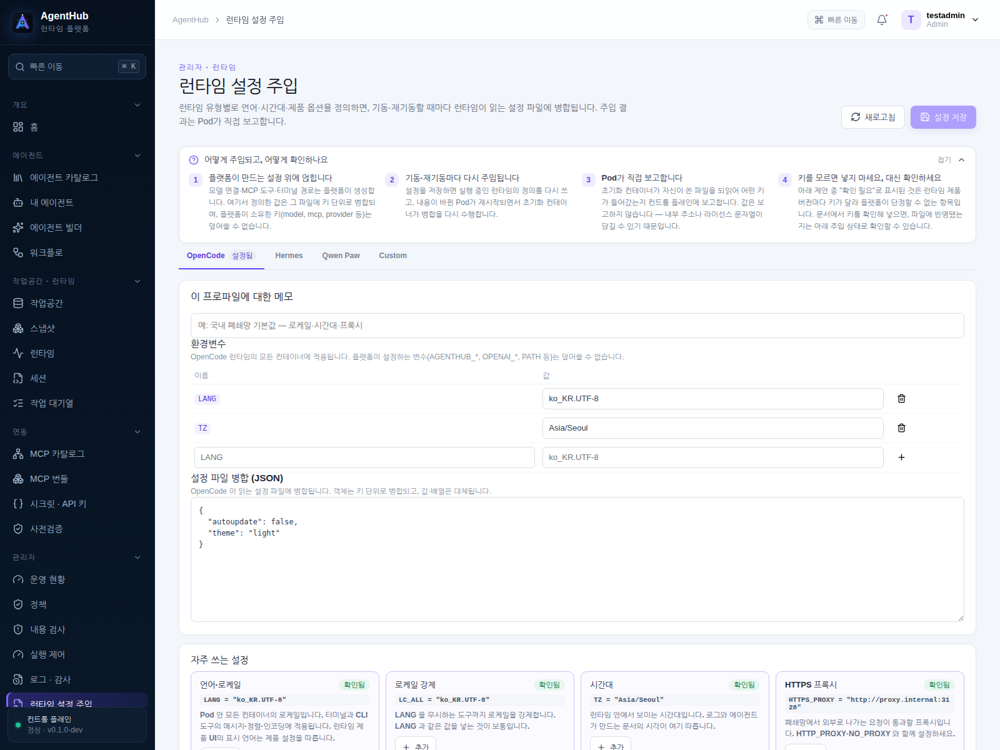

*관리자 ▸ 런타임 설정 주입* 에서 런타임 유형별로 설정을 정의하면, **기동·재기동할 때마다** 그 런타임이 읽는 설정 파일에 병합되고 환경변수로 주입됩니다.

- **환경변수**: 그 유형의 모든 컨테이너에 적용됩니다. 확인된 항목으로 `LANG`·`LC_ALL`(로케일), `TZ`(시간대), `HTTP_PROXY`·`HTTPS_PROXY`·`NO_PROXY`(폐쇄망 프록시)를 한 번에 넣을 수 있습니다. 플랫폼이 설정하는 변수(`AGENTHUB_*`, `OPENAI_*`, `PATH`, `HOME` 등)는 거절됩니다.
- **설정 파일 병합(JSON)**: 런타임이 읽는 파일에 키 단위로 병합됩니다. 객체는 키별로 합쳐지고 값·배열은 대체됩니다. 플랫폼이 만드는 키(`model`, `mcp`, `provider`, `mcp_servers`, Qwen Paw 공급자 설정)는 덮어쓸 수 없습니다 — 모델 연결과 도구 정책이 깨지면 플랫폼 장애처럼 보이기 때문입니다.
- **런타임별 주입 위치**: OpenCode는 `~/.config/opencode/opencode.json`, Hermes는 `~/.hermes/config.yaml`, Qwen Paw는 `qwenpaw init` 이후 `~/.qwenpaw/config.json`, Qwen Code는 `~/.qwen/settings.json` 에 병합됩니다. Qwen Code는 확인된 키를 제공하므로 자동 승인 모드(`tools.approvalMode`)·세션 토큰 상한(`model.sessionTokenLimit`)·OTLP 수집기(`telemetry.otlpEndpoint`)·터미널 테마(`ui.theme`)를 추측 없이 넣을 수 있습니다. **Langflow는 설정 파일이 없습니다** — 모든 설정이 `LANGFLOW_*` 환경변수이므로 이 유형에는 파일 병합 칸이 나오지 않고, 확인된 항목으로 `LANGFLOW_LOG_LEVEL`(기본값 error 라 처음에는 info 권장), `LANGFLOW_WORKERS`, `LANGFLOW_WORKER_TIMEOUT`, `LANGFLOW_DATABASE_URL`(사내 PostgreSQL 사용 시)을 제공합니다.
- **자주 쓰는 설정** 카드는 두 종류입니다.
  - **확인됨**: 플랫폼이 이미 쓰는 키이거나 운영체제가 정의하는 변수입니다. 한 번 클릭으로 추가됩니다.
  - **확인 필요**: 자동 승인(YOLO) 모드, 테마, 스킬 경로처럼 **키 이름이 런타임 제품 버전마다 다른** 항목입니다. 플랫폼이 임의로 키를 만들어 넣으면 "적용된 것처럼 보이지만 아무 일도 하지 않는" 설정이 되므로, 제품 문서에서 키를 확인해 직접 입력하세요. 넣은 뒤 파일에 반영됐는지는 아래 주입 상태로 확인할 수 있습니다.
- **주입 상태**: Pod의 초기화 컨테이너가 **자신이 쓴 파일을 되읽어** 어떤 키가 들어갔는지 컨트롤 플레인에 보고합니다(값은 보고하지 않습니다).
  - `적용됨` — 실행 중인 Pod가 현재 설정 버전으로 시작했습니다.
  - `이전 설정으로 실행 중` — 설정을 바꾼 뒤 아직 재시작되지 않았습니다. 재시작하면 적용됩니다.
  - `확인 안 됨` — 아직 보고가 없습니다(실패가 아닙니다).
  - `적용 실패` — Pod가 파일을 쓰거나 읽지 못했다고 보고했습니다. 상세 메시지가 함께 표시됩니다.
  - `일부만 적용` — 선언한 환경변수 중 일부가 컨테이너에 도달하지 않았습니다. 보고된 키의 `env-missing:` 항목이 어느 변수인지 알려 줍니다. 환경변수로만 설정하는 Langflow에서 특히 중요합니다.

> **저장할 때 실행 중인 런타임에 밀어 넣는 일이 몇 건 실패로 나오던 것은 고쳤습니다.** 런타임 객체는 컨트롤 플레인(설정)과 오퍼레이터(상태)가 함께 쓰는데, 마침 그 순간 Pod의 상태가 바뀌면 설정 쓰기가 거절됐습니다. 그 런타임만 조용히 예전 환경을 계속 쓰게 되므로, 이제 거절되면 다시 읽어서 다시 씁니다. 시작·정지·재시작도 같습니다.

> 보고는 "그 키가 런타임이 읽는 파일에 들어 있다"는 사실까지를 증명합니다. 그 값을 제품이 실제로 존중하는지는 제품의 동작이며, 그래서 키가 확실하지 않은 항목은 "확인 필요"로 구분해 둡니다.

### 10.10 내용 검사 (DLP)
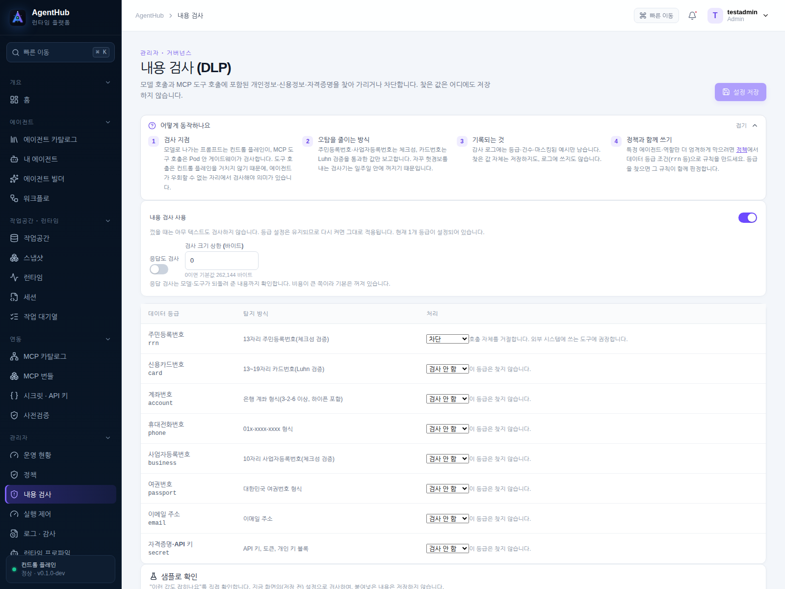

*관리자 ▸ 내용 검사* 에서 모델 호출과 MCP 도구 호출에 섞인 개인정보·신용정보·자격증명을 찾아 가리거나 차단합니다.

- **탐지 등급**: 주민등록번호·사업자등록번호(체크섬 검증), 신용카드번호(Luhn 검증), 휴대전화번호, 계좌번호, 여권번호, 이메일, API 키·개인 키. 체크섬을 통과하지 못한 값은 보고하지 않습니다 — 헛경보를 내는 검사기는 결국 꺼지기 때문입니다.
- **처리 방식**: `검사 안 함` / `기록만`(무엇이 오가는지 파악용) / `가리고 전송`(값을 "[등급 삭제됨]"으로 치환, 모델 호출 권장) / `차단`(호출 거절, 외부 시스템에 쓰는 도구 권장).
- **켜 두고 아무 등급도 고르지 않으면 그렇게 말해 줍니다.** 목록에 없는 등급은 검사하지 않는 것이 규칙입니다 — 새 탐지기가 추가돼도 누구의 트래픽도 갑자기 막지 않기 위해서입니다. 그런데 등급을 **하나도** 고르지 않으면 같은 규칙 때문에 *켜져 있다고 표시되면서 아무것도 검사하지 않는* 상태가 됩니다. 보안 장치로서는 꺼 둔 것보다 나쁜 상태라(화면은 켜졌다고 하니까요), 저장할 때와 *배포 점검* 양쪽에서 알려 줍니다. 모든 등급을 `검사 안 함` 으로 둔 경우도 같습니다.
- **검사 지점**: 모델로 나가는 프롬프트(그리고 선택 시 응답)는 컨트롤 플레인이, MCP 도구 호출의 인자(그리고 선택 시 결과)는 **Pod 안 게이트웨이**가 검사합니다. 도구 호출은 컨트롤 플레인을 거치지 않으므로 에이전트가 우회할 수 없는 자리에서 검사해야 합니다.
- **기록**: 감사 로그에 등급·건수·**마스킹된 예시**만 남습니다. 찾은 값 자체는 저장하지도 로그에 쓰지도 않습니다. `로그 · 감사`에서 `dlp.model`, `dlp.tool` 로 검색하세요.
- **정책과 함께**: 특정 에이전트·역할만 더 엄격하게 하려면 [정책](#108-정책-policy-as-code)에서 데이터 등급(`rrn`, `card` 등)을 조건으로 규칙을 만드세요. 검사에서 등급이 발견되면 그 규칙이 함께 판정합니다.
- **적용 시점**: 모델 호출은 저장 후 5초 안에, 도구 호출은 설정이 Pod로 전달되고 해당 Pod가 재시작된 뒤 적용됩니다. 차단된 작업은 재시도하지 않고 즉시 실패합니다(같은 프롬프트는 같은 결과이므로).
- **샘플로 확인**: 저장 전에 텍스트를 붙여넣어 무엇이 잡히는지, 전송될 내용이 어떻게 바뀌는지 확인할 수 있습니다. 붙여넣은 내용은 저장되지 않습니다.

### 10.11 실행 제어 (관리자)
*관리자 ▸ 실행 제어* 는 실행 플레인을 직접 다루는 화면입니다.

- **실행 중지 · 재개**: 업그레이드나 사고 때 사용합니다. 중지하면 워커는 새 작업을 가져가지 않고, **실행 중인 작업은 끝까지 진행**합니다. 작업 등록은 계속되므로 재개하면 밀린 일이 이어서 실행됩니다(최대 5초 안에 적용). 중지 사유는 모든 사용자의 `작업 대기열` 화면에도 표시됩니다.
- **워커**: 각 워커가 10초마다 보고하며, 45초 이상 조용하면 **응답 없음** 으로 표시됩니다. 정상 종료한 워커는 "중지됨"으로 남아 크래시와 구분됩니다.
- **멈춘 작업 회수**: 워커가 죽으면서 들고 있던 작업은 30초 주기로 자동 회수되어 대기열로 돌아갑니다. **지금 회수** 로 즉시 처리할 수도 있습니다. 이미 소모한 시도 횟수는 그대로 유지됩니다.
- **작업 일괄 재실행**: 원인을 고친 뒤 *처리 불가* 또는 *실패* 작업을 한 번에 되돌립니다. 재시도 횟수는 0으로 초기화되며, 기간과 최대 건수로 범위를 제한합니다. 완료·취소된 작업은 대상이 될 수 없습니다.
- **배달 실패 이벤트 재배달**: 배달을 포기한 이벤트를 다시 큐에 넣습니다. 이미 성공한 구독자에게는 다시 배달되지 않습니다.
- **기록 보관 기간**: 작업·실행 기록·이벤트·감사 로그·알림의 보관 일수를 정하면 워커가 매시간 정리합니다(0이면 보관). **미리보기** 로 삭제될 건수를 먼저 확인하세요. 감사 로그는 최소 30일, 실행 기록·작업·알림은 7일, 이벤트는 3일 미만으로 줄일 수 없습니다.
  - 알림은 **읽은 것만** 지웁니다. 읽지 않은 알림은 아직 처리하지 않은 일이므로 아무리 오래돼도 남기고, 알림함에서도 맨 앞에 둡니다(배달되지 않은 이벤트를 지우지 않는 것과 같은 이유입니다).
  - **정리 대상은 다섯 가지가 아니라 아홉 가지입니다.** 화면은 "운영 기록을 며칠 보관한다"고 말하는데, 워크플로 실행 기록·웹훅 배달 기록·결정이 끝난 승인·만료된 런타임 입장 티켓은 **어떤 정책으로도 지워지지 않고** 배포가 사는 동안 계속 쌓이고 있었습니다. 지금은 각각 실행 기록·이벤트·감사 로그 기간을 따라 함께 정리됩니다.
    - **결정이 끝난 승인만** 지웁니다. 대기 중인 승인은 아직 처리하지 않은 일이라 남습니다 — 읽지 않은 알림과 같은 규칙이고, 결정 자체는 감사 로그에 따로 남아 있습니다.
    - 새 표가 생겼는데 어느 쪽으로도 분류하지 않으면 **빌드가 실패합니다.** 아무도 기억하지 못하는 표가 바로 아무도 기억하지 못하는 표이기 때문입니다.
  - 만료된 로그인 세션은 보관 정책과 상관없이 매시간 정리합니다. 만료된 세션은 기록이 아니라 아무도 인증할 수 없는 행이고, 모든 인증 요청이 읽는 색인에 그대로 쌓이기 때문입니다.

> **켜고 끄는 것처럼 보이지만 아무 동작도 바꾸지 않던 설정 세 가지를 정리했습니다.** 감사 로그 보관 기간은 *실행 제어 ▸ 보관 정책* 한 곳에서만 정하고(Logging 탭의 중복 입력은 제거), Offline Mode와 외부 업데이트 확인은 스위치가 아니라 **이 배포의 성질** 이라 설명 문구로 바뀌었습니다. *Runtime 로그 조회 사용* 은 반대로 **실제로 동작하게** 만들었습니다 — 끄면 로그 조회가 403으로 거절됩니다(설정한 적이 없으면 지금까지처럼 켜진 상태로 봅니다).

### 10.12 보안 및 전역 설정
- **Users & Teams**: RBAC 역할(Admin, Manager, User) 및 팀별 접근 제어
- **Security & Network**: Pod Security Standards, NetworkPolicy, 마스터 키 회전
- **System Settings**: OIDC SSO, 승인 거버넌스, 클러스터 및 Runtime 공통 환경 설정

> **SSO는 켜는 것과 동작하는 것이 다릅니다.** *시스템 설정 ▸ Authentication* 의 **지금 확인** 은 Discovery 문서를 읽어 제공자가 스스로 밝히는 Issuer와 설정값이 **정확히 같은지** 보고(다르면 로그인 시점에 두 설정 중 어느 것도 언급하지 않는 오류로 실패합니다), Client Secret이 저장돼 있으면 제공자가 그 자격을 인정하는지까지 확인합니다.
>
> **로컬 로그인은 이 확인이 통과해야 끌 수 있습니다.** 잘못된 Issuer를 넣고 로컬 로그인을 끄면 아무도 — 방금 저장한 관리자까지 — 들어올 수 없게 됩니다. 그래서 저장하는 길목에서 같은 확인을 한 번 더 하고, 실패하면 이유와 함께 거절합니다.
>
> ```
> 로컬 로그인을 끄기 전에 SSO가 실제로 동작해야 합니다 — Issuer에 연결하지 못했습니다: no such host
> ```
>
> `client_credentials` 를 허용하지 않는 Realm도 **정상으로 봅니다** — 로그인 흐름은 그 grant를 쓰지 않고, 요구했다면 멀쩡한 Realm을 실패로 판정했을 것입니다.

> **클러스터가 거절하면 그렇게 말합니다.** 예전에는 토큰이 만료된 클러스터에서 Runtime을 시작하면 `요청을 처리하지 못했습니다: Unauthorized` 라는 500 오류가 나왔습니다 — 플랫폼이 고장 난 것처럼 보이지만 실제로는 이 배포의 클러스터 자격 증명이 거절된 것입니다. 이제 **자격 증명 거절·권한 부족·주소를 찾지 못함·연결 실패·인증서 확인 실패** 를 각각 구분해 알려 주고, 어디서 점검하는지도 함께 알려 줍니다. Kubernetes를 건드리는 모든 화면이 같은 문구를 씁니다.

> **Kubernetes 설정은 저장하기 전에 물어볼 수 있습니다.** *시스템 설정 ▸ Kubernetes* 아래의 **지금 확인** 은 주소가 응답하는지, 토큰이 받아들여지는지, 네임스페이스와 `AgentRuntime` CRD가 있는지, 그리고 이 계정이 플랫폼이 하는 일(Runtime 정의 생성·조회·삭제, Pod 상태·로그, 런타임 안 명령 실행, Secret 관리, 작업공간 스냅샷)을 **할 수 있는지** 를 클러스터에게 직접 묻습니다. 권한이 없으면 Kubernetes는 세 시에 로그에서 알려 주는데, 같은 답을 지금 받을 수 있습니다.
>
> 권한은 **컨트롤 플레인 계정 기준** 입니다. Pod·볼륨·네트워크 정책은 오퍼레이터가 자기 계정으로 만들고, 클러스터는 물어본 계정에 대해서만 답하기 때문입니다. 화면에도 그렇게 적혀 있습니다.
>
> 스냅샷은 별도로 표시합니다 — 권한이 있어도 클러스터에 **VolumeSnapshot API가 설치돼 있지 않으면** 작업공간 스냅샷은 동작하지 않습니다. 그 사실은 스냅샷 버튼을 누르는 순간이 아니라 여기서 알려 줍니다.

> **이 클러스터가 정말로 막고 있는지 확인하세요.** NetworkPolicy는 API 서버가 아니라 **CNI가 적용**합니다. 정책 컨트롤러가 없는 CNI를 쓰는 클러스터는 정책 객체를 그대로 받아들이고 **아무것도 적용하지 않습니다** — 화면에는 `기본 차단(Egress)` 으로 보이고, 런타임은 인터넷 전체에 나갈 수 있습니다. 배포 어디에도 이상 신호가 없기 때문에 물어보지 않으면 알 수 없습니다.
>
> *관리자 ▸ 보안 · 네트워크 ▸ Network Profiles* 위의 **지금 확인** 을 누르면 실행 중인 런타임 안에서 직접 확인합니다. 프로파일이 허용하지 않는 목적지(클러스터 내부 Kubernetes API)에 연결을 시도하고 결과를 그대로 알려 줍니다.
>
> | 결과 | 뜻 |
> | --- | --- |
> | 적용되지 않음 | **연결에 성공했습니다.** 이 클러스터는 정책을 적용하지 않습니다 — 증명된 사실입니다. |
> | 적용 중으로 보임 | 연결이 막혔습니다. 정책이 적용되는 것과 일치하지만, 다른 이유로 막혔을 가능성까지 배제하지는 못합니다. |
> | 확인 불가 | 런타임 이미지에 확인용 도구가 없습니다. **적용된다는 뜻이 아닙니다.** |
>
> 세 가지 답을 두 가지로 줄이지 않는 이유는, 확인하지 못한 것을 "적용됨"으로 반올림하는 것이 애초에 적용되지 않는 정책을 믿는 것과 같은 실수이기 때문입니다.

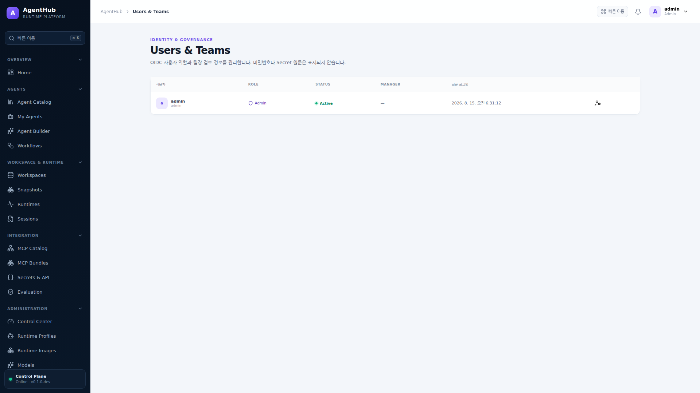

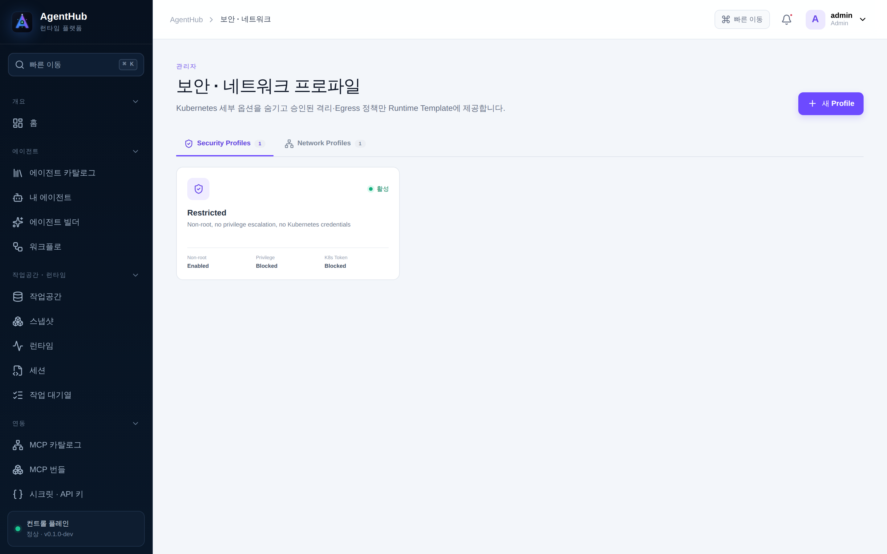

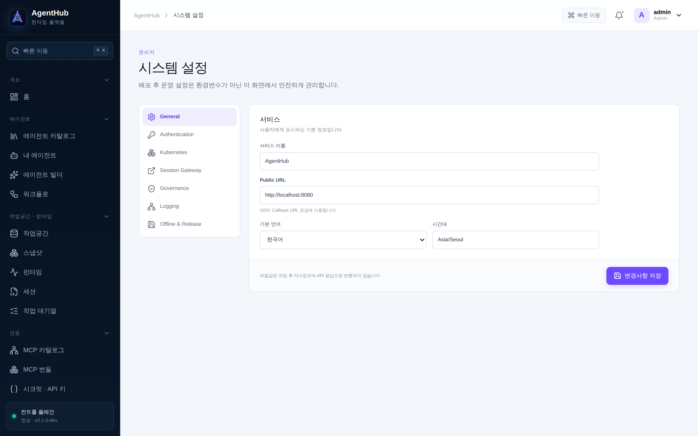
